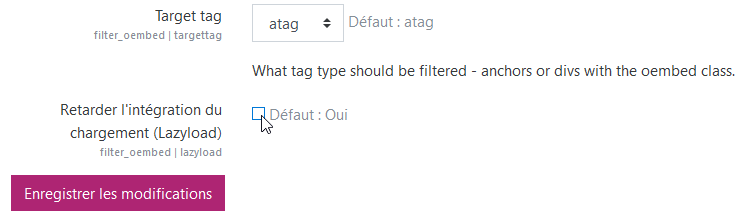
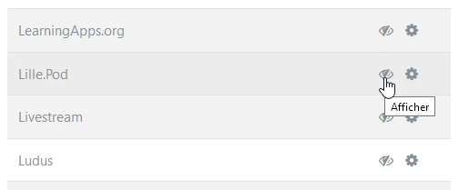
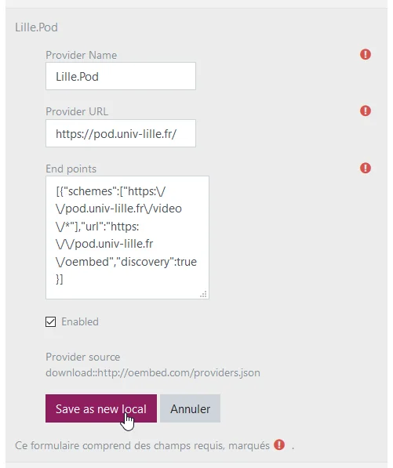
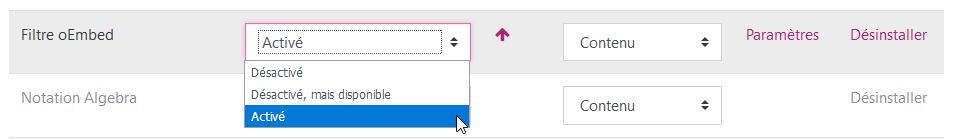
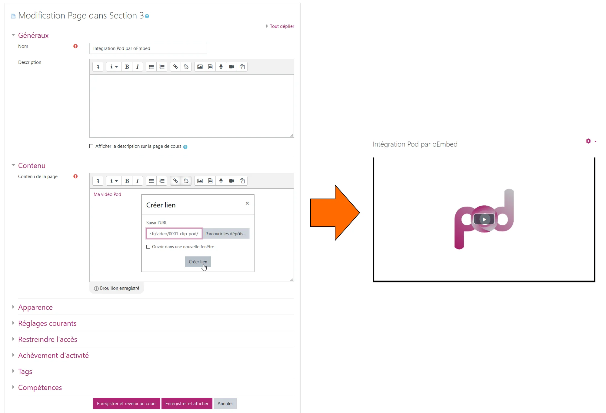
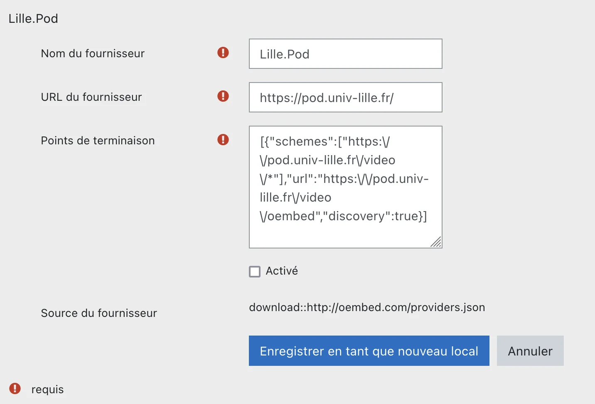

# oEmbed integration in Moodle

This guide provides a summary of how to integrate Pod videos into Moodle using the **oEmbed** protocol.

oEmbed allows multimedia resources to be integrated into a web page by simply pointing to the URL of that resource.

More information on the oEmbed protocol: [https://oembed.com/](https://oembed.com/)

## Pod configuration

### Activating oEmbed

Simply add `OEMBED = True` to the configuration file `pod/custom/settings_local.py`.

### Declaring Pod as an oEmbed provider

The Pod platform must be declared as an oEmbed provider in order for it to appear in the Moodle filter.
To do this, fork the following GitHub repository [https://github.com/iamcal/oembed](https://github.com/iamcal/oembed) and add a YML configuration file to the providers directory.

> This step is optional as the settings can be configured directly in Moodle.

## Moodle configuration

### Installing the oEmbed filter

The oEmbed filter for Moodle is available at this address: [https://moodle.org/plugins/filter_oembed](https://moodle.org/plugins/filter_oembed)

The installation procedure is similar to any plugin installation for Moodle, i.e. via the Moodle.org plugin directory, via the web administration interface or via an FTP repository on the server: [https://docs.moodle.org/3x/fr/Installation_de_plugins#Installation_d.27un_plugin](https://docs.moodle.org/3x/fr/Installation_de_plugins#Installation_d.27un_plugin)

Once the filter is installed, a settings page will appear. You must uncheck the `Delay loading integration (Lazyload)` option, as it is not supported by Pod, then save the changes:

### Configuring the oEmbed filter

You must then enable Pod as a provider in the oEmbed filter.

To do this, go to `Administration / Plugins / Filters / oEmbed filter / Manage providers` and click on the Show icon (crossed-out eye) to the right of the relevant Pod instance under the `Downloaded providers` list:

If the provider has not been previously declared, it can be done here based on the Lille.Pod provider. Click on the `Edit` icon (gear), adjust the settings according to the corresponding Pod platform, tick `Enabled` and click on `Save as new local`:

> **Please note** that you must ensure that the syntax is correct for the End points option, as this can result in a database reading error and, consequently, prevent the editing of oEmbed providers (if this happens, you must uninstall and then reinstall the oEmbed filter).

### Activating the filter

The final step is to activate the oEmbed filter on the filter management page (`Home / Site administration / Plugins / Filters / Filter management`):

This can be forced for all courses on the Moodle site (_Enabled_) or can be done on a case-by-case basis (_Disabled but available_), at the level of each course or each activity.

## Integration example

When the configuration is complete and the filter is activated for the desired Moodle instance (site, course or activity), any hyperlink in a portion of HTML text that links to a Pod page is converted into a video embed (100% width of the parent container):

This works for both public and private links (video in draft mode).

> ⚠️ Please note: since version 3 of POD, the oembed link has changed:
> 
