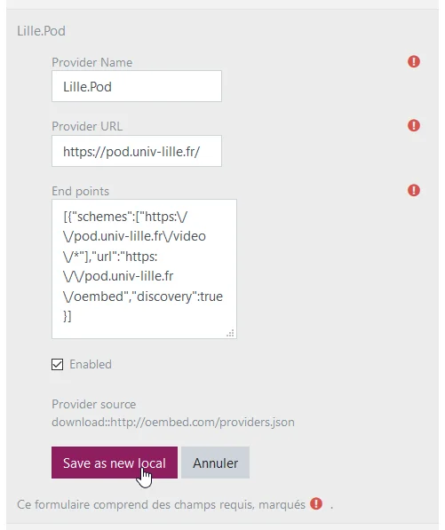
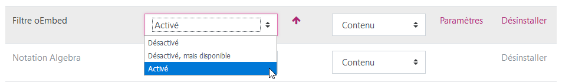
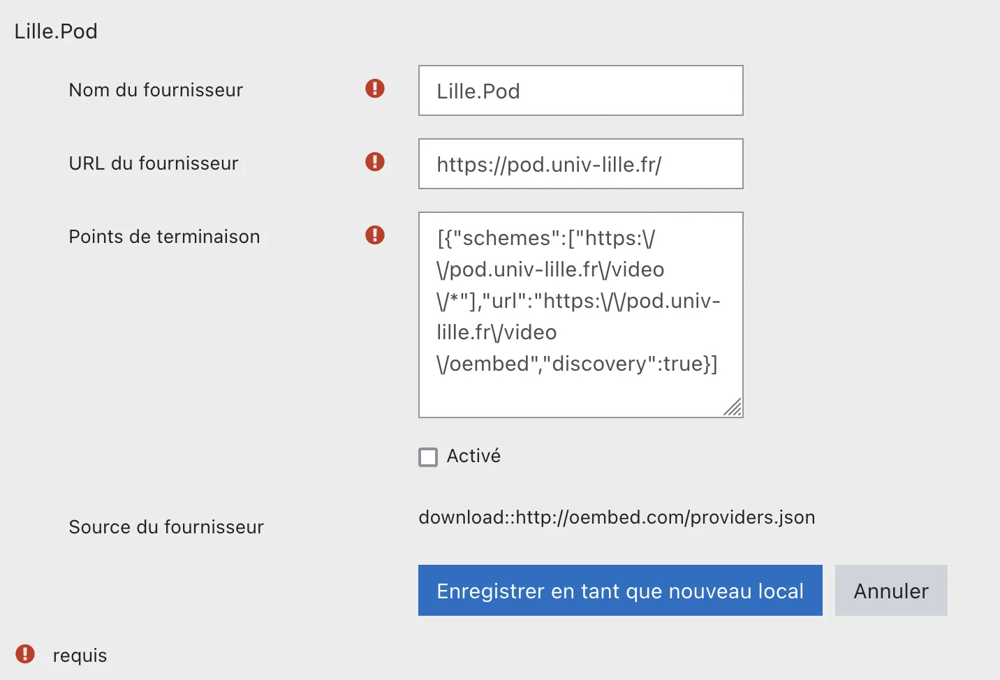

# Intégration oEmbed dans Moodle

Ce guide présente de manière synthétique la mise en place de l’intégration des vidéos Pod dans Moodle par le protocole **oEmbed**.

oEmbed permet l’intégration d’une ressource multimédia dans une page web par le simple pointage vers l’URL de cette ressource.

Plus d’informations sur le protocole oEmbed : [https://oembed.com/](https://oembed.com/)

## Configuration de Pod

### Activation d’oEmbed

Il suffit de rajouter `OEMBED = True` dans le fichier de configuration `pod/custom/settings_local.py`.

### Déclaration de Pod comme fournisseur oEmbed

Il faut déclarer la plateforme Pod comme fournisseur oEmbed afin que celui-ci apparaisse dans le filtre Moodle.
Pour ce faire, il faut forker le dépôt GitHub suivant [https://github.com/iamcal/oembed](https://github.com/iamcal/oembed) et ajouter un fichier de configuration YML dans le répertoire providers.

> Cette étape est optionnelle car les paramètres peuvent se configurer directement dans Moodle.

## Configuration de Moodle

### Installation du filtre oEmbed

Le filtre oEmbed pour Moodle est disponible à cette adresse : [https://moodle.org/plugins/filter_oembed](https://moodle.org/plugins/filter_oembed)

La procédure d’installation est similaire à tout installation de plugin pour Moodle, c’est-à-dire via le répertoire des plugin de Moodle.org, via l’interface web d’administration ou via un dépôt en FTP sur le serveur : [https://docs.moodle.org/3x/fr/Installation_de_plugins#Installation_d.27un_plugin](https://docs.moodle.org/3x/fr/Installation_de_plugins#Installation_d.27un_plugin)

Une fois le filtre installé, une page de paramétrage apparaît. Il faut décocher l’option `Retarder l’intégration du chargement (Lazyload)`, car elle n’est pas prise en charge par Pod, puis enregistrer les modifications :

### Configuration du filtre oEmbed

Il est ensuite nécessaire d’activer Pod comme fournisseur dans le fitlre oEmbed.

Pour cela, il faut se rendre dans `Administration / Plugins / Filtres / Filtre oEmbed / Manager providers` et cliquer sur l’icône Afficher (oeil barré) à droite de l’instance Pod concernée sous la liste `Downloaded providers` :

Si le fournisseur n’a pas été déclaré précédemment, il est possible de le faire ici en se basant sur le fournisseur Lille.Pod. Il faut cliquer sur l’icône `Modifier` (engrenage), adapter les paramètres en accord avec la plateforme Pod correspondante, cocher `Enabled` et cliquer sur `Save as new local` :

> **Attention**, il faut faire bien attention à ce que la syntaxe soit respectée pour l’option End points car cela peut résulter en une erreur de lecture en base de données et, par conséquent, empêcher l’édition des founrisseurs oEmbed (en cas de blocage, il faut désinstaller puis réinstaller le fitlre oEmbed).

### Activation du filtre

L’étape finale consiste à activer le filtre oEmbed sur la page de gestion des filtres (`Accueil / Administration du site / Plugins / Filtres / Gestion des filtres`) :

Cela peut être forcé pour tous les cours du site Moodle (_Activé_) ou peut se faire au cas par cas (_Désactivé mais disponible_), au niveau de chaque cours ou de chaque activité.

## Exemple d’intégration

Quand la configuration est terminée et le filtre activé pour l’instance Moodle souhaitée (site, cours ou activité), toute hyperlien dans une portion de texte HTML renvoyant vers une page Pod est convertie en intégration vidéo (largeur de 100% du conteneur parent) :

Cela fonctionne aussi bien pour les liens publics que privés (vidéo en mode brouillon).

> ⚠️ Attention : depuis la version 3 de POD, le lien oembed a changé :
> 
