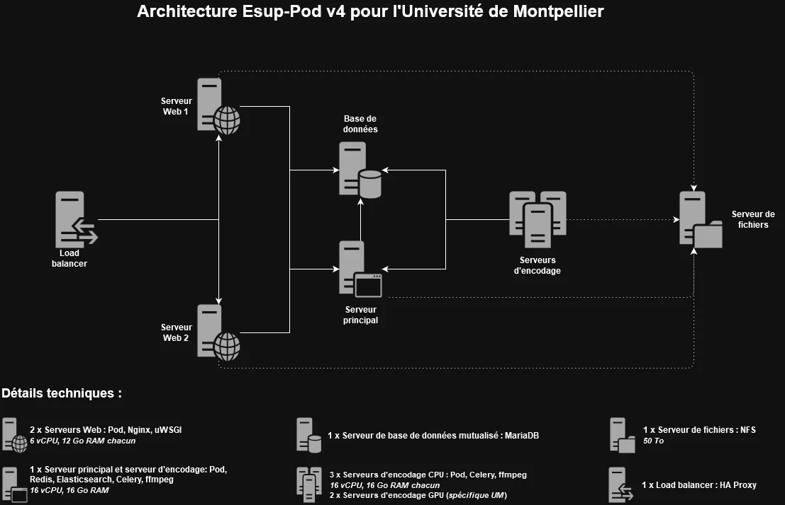

# Pod v4 Infrastructure at the University of Montpellier (UM)

## Context

|                         | Comments              |
|-------------------------|-----------------------|
| **Completion date**     | July 2025             |
| **Pod version**         | Pod v4.0.0            |
| **Author**              | Loïc Bonavent         |
{: .table .table-striped}

This document presents the work carried out by the University of Montpellier to deploy a **dedicated infrastructure for Pod v4**, thus replacing an older Pod v3 infrastructure, which had become obsolete and potentially vulnerable from a security standpoint.

> 💡The Pod v4 infrastructure was set up in **parallel** with the existing production Pod v3 infrastructure.
> The idea is not to perform a simple upgrade from Pod v3 to Pod v4, but rather a _transition from a Pod v3 architecture to a new Pod v4 infrastructure_.
{: .alert .alert-primary}

## Presentation of the production infrastructure



This infrastructure relies on the use of:

- **1 HAProxy load balancer**: this load balancer is used at the university for almost all websites.
- **2 Web servers**: using two front-end web servers enhances security and availability by distributing the load and avoiding single points of failure.<br>
  _Components installed on these web servers: Pod, Nginx, uWSGI._
- **1 main server**: this server – referred to as "main" to differentiate it from the others – acts as a remote encoding server where REDIS and Elasticsearch are installed.<br>
  _Components installed on this server: Pod, REDIS, Elasticsearch, Celery (1 worker), ffmpeg, Whisper._
- **3 encoding servers**: pure remote encoding servers, mainly used for transcription (which cannot yet be done on GPU servers – since 2025, ~17% of videos are transcribed) and for encoding videos whose format is not supported by the GPU servers.<br>
  _Components installed on these servers: Pod, Celery (1 worker), ffmpeg, Whisper._
- **1 database**: shared MariaDB database.
- **1 file server**: shared NFS file server with a size of 50TB, of which 40TB is currently occupied.

_All servers run on Debian 12._

> 💡 This infrastructure does not include the Nginx RTMP servers for live stream management (see documentation for live setup), nor the GPU encoding servers that are specific to UM.
>
> Each encoding server uses 16 GB RAM and 16 vCPU because I use transcription via **Whisper** and its **Medium** model, which is very efficient but still consumes some resources.
>
> For the main server, these resources are necessary to run REDIS, Elasticsearch, and Whisper simultaneously and avoid any issues (like Out Of Memory...).
>
> For the other encoding servers, this might be somewhat oversized (8/12 GB RAM and 8/12 vCPU should be sufficient).
{: .alert .alert-warning}

## Installation

> As we still do not use container orchestrators at the university, I performed the installation "the old-fashioned way", mainly using the [Stand Alone mode documentation](../install_standalone_fr)
>
> With this documentation and others, if the infrastructure is ready and there are no _environment issues_ (firewall, database privileges, etc.), it only takes a few hours.
>
> Personally, I use **SuperPutty** to execute commands on multiple servers at once (typically the Pod v4 installation on all encoding servers).
>
> Some steps in the following procedure can be done in parallel or in a different order, depending on your preferences.

---

### Step 1: Installing Pod v4

|                        | Comments                                          |
|------------------------|---------------------------------------------------|
| **Target servers**     | All Pod servers (Web, main, encoding)            |
| **Reference documentation** | [Stand Alone Mode / Environment Documentation](../install_standalone_fr#environnement) |
{: .table .table-striped}

I strictly followed the **[Installation of Esup-Pod in Stand Alone Mode / Environment](../install_standalone_fr#environnement)** documentation.

> UM Specificity:
> Compared to the old infrastructure, I kept the same **Linux user ID** for the `pod` user, using the following command:
>
> ```sh
> user@pod:~$ usermod -u 1313 pod
> ```

Regarding the `settings_local.py` configuration file, a final version is available at the end of this documentation.

🎯 At the end of this step, Pod v4 is installed on all Pod servers, with all its Python libraries.
{: .alert .alert-primary}

### Step 2: Configuration and use of a MySQL/MariaDB database

|                        | Comments                                          |
|------------------------|---------------------------------------------------|
| **Target servers**     | All Pod servers (Web, main, encoding)            |
| **Reference documentation** | [Configuration and use of a MySQL/MariaDB database](../mariadb_fr) |
{: .table .table-striped}

To configure and use a MySQL/MariaDB database on all Pod servers, I followed the **[documentation for configuring and using a MySQL/MariaDB database](../mariadb_fr)**.

Given the architecture, I replaced `<my_database_host>` with **the IP address of the database server**, and the other `<my_database_*>` variables with the values from my environment.

> 💡 If you wish to install a MySQL/MariaDB server, you need to follow the documentation on **[installation, configuration, and use of a MySQL/MariaDB database](../production-mode_fr#base-de-données-mysqlmariadb)**.

🎯 At the end of this step, all Pod servers can use the MySQL/MariaDB database.
{: .alert .alert-primary}

### Step 3: Installing REDIS

|                        | Comments                                          |
|------------------------|---------------------------------------------------|
| **Target servers**     | Main server                                       |
| **Reference documentation** | [Stand Alone Mode / Redis Documentation](../install_standalone_fr#redis) |
{: .table .table-striped}

To install REDIS on the main server, I followed the **[Stand Alone Mode / Redis documentation](../install_standalone_fr#redis)**.

Given the architecture, I replaced `<my_redis_host>` everywhere with **the IP address of the REDIS server**, obtained via `hostname -I` on the main server, and I edited the file _/etc/redis/redis.conf_ with this information:

```sh
bind <my_redis_host>
protected-mode no
```

🎯 At the end of this step, REDIS is installed on the main Pod server.
{: .alert .alert-primary}

### Step 4: Configuration and Use of REDIS

|                             | Comments                                      |
| --------------------------- | --------------------------------------------- |
| **Concerned Servers**       | All Pod servers (Web, main, encoding)         |
| **Reference Documentation** | [Configuration and use of REDIS](../redis_fr) |
| {: .table .table-striped}   |                                               |

To configure and use REDIS on all Pod servers, I followed the documentation concerning the **[configuration and use of REDIS](../redis_fr)**.

🎯 At the end of this step, REDIS can be used by all Pod servers.
{: .alert .alert-primary}

### Step 5: Installation of Elasticsearch

|                             | Comments                                                                                 |
| --------------------------- | ---------------------------------------------------------------------------------------- |
| **Concerned Servers**       | Main server                                                                              |
| **Reference Documentation** | [Stand Alone Mode / Elasticsearch Documentation](../install_standalone_fr#elasticsearch) |
| {: .table .table-striped}   |                                                                                          |

To install Elasticsearch on the main server, I followed the **[Stand Alone Mode / Elasticsearch Documentation](../install_standalone_fr#elasticsearch)** with the ES8 _Security mode_ enabled.

Given the architecture, I replaced `<my_es_host>` with **the IP address of the Elasticsearch server**, obtained via `hostname -I` on the main server, and edited the file `/etc/elasticsearch/elasticsearch.yml` with the following information:

```yml
cluster.name: pod-application
node.name: pod-1
network.host: <my_es_host>
discovery.seed_hosts: ["<my_es_host>"]
cluster.initial_master_nodes: ["pod-1"]

xpack.security.enabled: true
xpack.security.enrollment.enabled: true
xpack.security.transport.ssl:
  enabled: true
  verification_mode: certificate
  keystore.path: certs/transport.p12
  truststore.path: certs/transport.p12
http.host: 0.0.0.0
xpack.security.http.ssl.enabled: true
xpack.security.http.ssl.verification_mode: certificate
xpack.security.http.ssl.keystore.path: /etc/elasticsearch/elastic-certificates.p12
xpack.security.http.ssl.truststore.path: /etc/elasticsearch/elastic-certificates.p12
```

🎯 At the end of this step, Elasticsearch is installed on Pod’s main server.
{: .alert .alert-primary}

### Step 6: Installation of Dependencies

|                             | Comments                                                                                                          |
| --------------------------- | ----------------------------------------------------------------------------------------------------------------- |
| **Concerned Servers**       | All Pod servers (Web, main, encoding)                                                                             |
| **Reference Documentation** | [Stand Alone Mode / Dependency Installation Documentation](../install_standalone_fr#installation-des-dépendances) |
| {: .table .table-striped}   |                                                                                                                   |

To install dependencies on all Pod servers, I followed the **[Stand Alone Mode / Dependency Installation Documentation](../install_standalone_fr#installation-des-dépendances)**.

> Logically, these dependencies only concern web servers, but I prefer to install them on all servers just in case.
> {: .alert .alert-secondary}

🎯 At the end of this step, Pod’s dependencies are installed on all Pod servers.
{: .alert .alert-primary}

### Step 7: Installation of the Web System based on NGINX/uWSGI and Configuration

|                             | Comments                                                                                                         |
| --------------------------- | ---------------------------------------------------------------------------------------------------------------- |
| **Concerned Servers**       | Web servers                                                                                                      |
| **Reference Documentation** | [Web Front Nginx / uWSGI and Static Files](../production-mode_fr#frontal-web-nginx--uwsgi-et-fichiers-statiques) |
| {: .table .table-striped}   |                                                                                                                  |

To install, configure and use Nginx/uWSGI on all web servers, I followed the documentation for setting up **[Web Front Nginx / UWSGI and Static Files](../production-mode_fr#frontal-web-nginx--uwsgi-et-fichiers-statiques)**.

> UM Specificity:
> Compared to the old infrastructure, I kept the same **Linux group ID** for the `www-data` group as that of the `nginx` group, and I added the `pod` user to this group using the commands:
>
> ```sh
> user@pod:~$ sudo groupmod -g 989 www-data
> user@pod:~$ sudo usermod -g www-data pod
> ```

🎯 At the end of this step, the web servers using Nginx / UWSGI are operational.
{: .alert .alert-primary}

### Step 8: Installation of the Encoding System

|                             | Comments                                                                              |
| --------------------------- | ------------------------------------------------------------------------------------- |
| **Concerned Servers**       | Encoding servers, main server                                                         |
| **Reference Documentation** | [Documentation for Offloading Encoding to One or More Servers](../remote-encoding_fr) |
| {: .table .table-striped}   |                                                                                       |

> Encoding can be done in different ways; as of now, I use the offloaded encoding system, without using microservices.
> {: .alert .alert-light}

To install this encoding system, I followed the **[documentation for offloading encoding to one or more servers](../remote-encoding_fr)**.

This involves using REDIS on the main server and Celery on the encoding servers.

🎯 At the end of this step, the encoding servers, based on **REDIS** and **Celery**, are functional.
{: .alert .alert-primary}

### Step 9: Installation of the Transcription System

|                             | Comments                                                                                    |
| --------------------------- | ------------------------------------------------------------------------------------------- |
| **Concerned Servers**       | Encoding servers                                                                            |
| **Reference Documentation** | [Documentation for Installing Autotranscription](../optional/auto-transcription-install_fr) |
| {: .table .table-striped}   |                                                                                             |

> Autotranscription can be done in different ways; as of now, I use the offloaded autotranscription system, without using microservices.
> {: .alert .alert-light}

To install this autotranscription system, I followed the **[documentation for installing autotranscription](../optional/auto-transcription-install_fr)** and used **Whisper** with the `medium` model.

🎯 At the end of this step, the encoding servers can perform transcriptions.
{: .alert .alert-primary}

### Step 10: Visual Customization

|                             | Comments                                                            |
| --------------------------- | ------------------------------------------------------------------- |
| **Concerned Servers**       | Web servers                                                         |
| **Reference Documentation** | [Documentation on Visual Customization](../visual-customisation_fr) |
| {: .table .table-striped}   |                                                                     |

To perform the visual customization for my institution, I followed the **[documentation on visual customization](../visual-customisation_fr)**.

> At the University of Montpellier, I reused elements already created for Pod v3.

🎯 At the end of this step, the Pod v4 website will follow your institution’s visual identity.
{: .alert .alert-primary}

### Step 11: Migration of Data Between Version 3 and Version 4

|                             | Comments                                                                                                  |
| --------------------------- | --------------------------------------------------------------------------------------------------------- |
| **Concerned Servers**       | Main server                                                                                               |
| **Reference Documentation** | [Documentation on the Data Migration System Between Version 3 and Version 4](../migrate_from_v3_to_v4_fr) |
| {: .table .table-striped}   |                                                                                                           |

To migrate data from Pod v3 to Pod v4, I followed the **[documentation on the data migration system between version 3 and version 4](../migrate_from_v3_to_v4_fr)**.

> 💡 This data migration can be done as many times as needed. Personally, I ran several tests beforehand by **deleting all the tables** in the database and executing the command **`python manage.py import_data_from_v3_to_v4 --createDB`**.
>
> 💡 Make sure that the file server containing the `MEDIA_ROOT` directory is accessible by all Pod servers.

⚠️ Do not perform encoding tests on the **production** Pod v4 environment as long as the infrastructure switch from Pod v3 to Pod v4 has not been completed. The encoded files would end up on the shared file server.
{: .alert .alert-danger}

🎯 At the end of this step, the Pod v4 website is truly in production, with all existing data.
{: .alert .alert-primary}

Voici la traduction en anglais, sans autre modification que la traduction elle-même :

---

### Appendices

Below are the various configuration elements for this Pod v4 infrastructure for the UM (_configuration as of the date this documentation was created_).

#### File `/usr/local/django_projects/podv4/pod/custom/settings_local.py`

> 💡Remember to keep the same SECRET_KEY as the Pod v3 environment.

```sh
# -*- coding: utf-8 -*-
from django.utils.translation import gettext_lazy as _

SECRET_KEY = '<my_secret_key>'

# DEBUG mode activation
DEBUG = False

# Permissions of uploaded files
FILE_UPLOAD_PERMISSIONS = 0o644

# Domain/host names
ALLOWED_HOSTS = ['pod.univ.fr']

# List of administrators
ADMINS = (
    ('Name', 'pod@univ.fr'),
)
# List of managers (recipients of encoding completion emails)
MANAGERS = ADMINS

# Database
DATABASES = {
    'default': {
        'ENGINE': 'django.db.backends.mysql',
        'NAME': '<my_bd_name>',
        'USER': '<my_bd_user>',
        'PASSWORD': '<my_bd_password>',
        'HOST': '<my_bd_host>',
        'PORT': '',
        'OPTIONS': {'init_command': "SET storage_engine=INNODB, sql_mode='STRICT_TRANS_TABLES', innodb_strict_mode=1, foreign_key_checks=0;"}
    }
}

# Useful for recording reception
RECORDER_BASE_URL = "https://pod.univ.fr"

# Only staff members can upload videos
RESTRICT_EDIT_VIDEO_ACCESS_TO_STAFF_ONLY = True

# 4GB maximum upload size
VIDEO_MAX_UPLOAD_SIZE = 4

# Useful for file management
FILE_ALLOWED_EXTENSIONS = ('doc', 'docx', 'odt', 'pdf', 'xls', 'xlsx', 'ods', 'ppt', 'pptx', 'txt', 'html', 'htm', 'vtt', 'srt', 'webm', 'ts',)
IMAGE_ALLOWED_EXTENSIONS = ('jpg', 'jpeg', 'bmp', 'png', 'gif', 'tiff',)
FILE_MAX_UPLOAD_SIZE = 20

# Use Pod file manager
USE_PODFILE = True

# List of accessible third-party applications
THIRD_PARTY_APPS = ['live', 'enrichment']

# Authentication
AUTH_TYPE = (('local', _('local')), ('CAS', 'CAS'))

# CAS Authentication
USE_CAS = True
CAS_SERVER_URL = 'https://cas.univ.fr/cas/'
CAS_GATEWAY = False
POPULATE_USER = 'LDAP'
AUTH_CAS_USER_SEARCH = 'user'
CREATE_GROUP_FROM_AFFILIATION = True
CREATE_GROUP_FROM_GROUPS = True
AFFILIATION_STAFF = ('faculty', 'employee', 'researcher', 'affiliate')

# LDAP Directory
LDAP_SERVER = {'url': 'ldap://ldap.univ.fr', 'port': 389, 'use_ssl': False}
AUTH_LDAP_BIND_DN = 'cn=admin, ou=system, dc=univ, dc=fr'
AUTH_LDAP_BIND_PASSWORD = '<my_ldap_password>'
AUTH_LDAP_BASE_DN = 'ou=people,dc=univ,dc=fr'
AUTH_LDAP_USER_SEARCH = (AUTH_LDAP_BASE_DN, "(uid=%(uid)s)")

# Mapping between Pod account fields and LDAP returned fields
USER_LDAP_MAPPING_ATTRIBUTES = {
    "uid": "uid",
    "mail": "mail",
    "last_name": "sn",
    "first_name": "givenname",
    "primaryAffiliation": "eduPersonPrimaryAffiliation",
    "affiliations": "eduPersonAffiliation",
    "groups": "isMemberOf"
}

# Internationalization and localization
LANGUAGE_CODE = 'fr'
LANGUAGES = (
    ('fr', 'French'),
    ('en', 'English')
)
MODELTRANSLATION_DEFAULT_LANGUAGE = 'fr'
MODELTRANSLATION_FALLBACK_LANGUAGES = ('fr', 'en')

# Time zone
TIME_ZONE = 'Europe/Paris'

# URL prefix used to access media files
MEDIA_URL = '/media/'

# Absolute path to the media directory
MEDIA_ROOT = '<my_nfs_dir>/pod/media'

# Temporary directory
FILE_UPLOAD_TEMP_DIR = '/var/tmp'

# Base directory, useful for the recorder
BASE_DIR = '/usr/local/django_projects/podv4/pod'

# Default type
DEFAULT_TYPE_ID = 4

# Email sending configuration
EMAIL_HOST = 'smtp.univ.fr'
EMAIL_PORT = 25
DEFAULT_FROM_EMAIL = 'pod@univ.fr'
SERVER_EMAIL = 'pod@univ.fr'

# An email is sent to managers and the author at the end of encoding
EMAIL_ON_ENCODING_COMPLETION = True

# Non-staff users are no longer shown in the user menu bar
MENUBAR_SHOW_STAFF_OWNERS_ONLY = True

# Display videos with access protected by authentication on the homepage
HOMEPAGE_SHOWS_RESTRICTED = True

### Elasticsearch
# Elasticsearch URLs
ES_URL = ['https://<my_es_host>:9200/']
ES_VERSION = 8
ES_OPTIONS = {'verify_certs' : False, 'basic_auth' : ('pod', '<my_es_password>')}

# Encoding still via Celery
CELERY_TO_ENCODE = True
CELERY_BROKER_URL = "redis://<my_redis_host>:6379/5"
CELERY_TASK_ACKS_LATE = True

# Institution template configuration
TEMPLATE_VISIBLE_SETTINGS = {
    'TITLE_SITE': 'Pod',
    'TITLE_ETB': 'Institution',
    'LOGO_SITE': 'custom/img/logo-pod.svg',
    'LOGO_COMPACT_SITE': 'custom/img/logo-pod.svg',
    'LOGO_ETB': 'custom/img/logo-etab.svg',
    'LOGO_PLAYER': 'custom/img/logo-player.png',
    'FOOTER_TEXT': (
        'ADDRESS',
        'ZIP CITY',
        (
            'maps'
        )
    ),
    'LINK_PLAYER': 'https://www.univ.fr',
    'CSS_OVERRIDE': 'custom/custom-etab.css',
    'FAVICON': 'custom/img/favicon.png',
    # If Matomo needed
    # 'TRACKING_TEMPLATE' : 'custom/tracking.html'
    # If you need specific
    # 'PRE_HEADER_TEMPLATE': 'preheader.html'
}

# List of possible CONTACT_US subjects
SUBJECT_CHOICES = (
    ('', '-----'),
    ('info', _('Request more information')),
    ('request_password', _('Password request for a video')),
    ('inappropriate_content', _('Report inappropriate content')),
    ('bug', _('Correction or bug report')),
    ('other', _('Other (please specify)'))
)

# Default image displayed as poster or thumbnail
DEFAULT_THUMBNAIL = 'custom/img/default.svg'

# Captcha configuration
CAPTCHA_CHALLENGE_FUNCT = 'captcha.helpers.math_challenge'
CAPTCHA_NOISE_FUNCTIONS = ('captcha.helpers.noise_arcs', 'captcha.helpers.noise_dots',)

# GDPR
USE_RGPD = True

# Obsolescence
DEFAULT_YEAR_DATE_DELETE = 48
MAX_DURATION_DATE_DELETE = 64

# Recorder (FTP)
DEFAULT_RECORDER_PATH = 'NFS/media/uploads/'
DEFAULT_RECORDER_USER_ID = 2
DEFAULT_RECORDER_ID = 1
DEFAULT_RECORDER_TYPE_ID = 4
ALLOW_MANUAL_RECORDING_CLAIMING = False
ALLOW_RECORDER_MANAGER_CHOICE_VID_OWNER = True
RECORDER_SKIP_FIRST_IMAGE = True

### Transcription
# Transcription use
# * STT
# * VOSK
# * WHISPER
USE_TRANSCRIPTION = True
TRANSCRIPTION_TYPE = "WHISPER"
TRANSCRIPTION_MODEL_PARAM = {
    'WHISPER': {
        'fr': {
            'model': "medium",
            'download_root': "/usr/local/django_projects/transcription/whisper/",
        },
        'en': {
            'model': "medium",
            'download_root': "/usr/local/django_projects/transcription/whisper/",
        }
    }
}

# Statistics
USE_STATS_VIEW = True
VIEW_STATS_AUTH = True

# Display only first-level themes in the "Channel" tab
SHOW_ONLY_PARENT_THEMES = True
ORGANIZE_BY_THEME = True

# CSS Theme
USE_THEME = 'default'
BOOTSTRAP_CUSTOM = 'custom/bootstrap-default.min.css'

# Enable platform-level comments
ACTIVE_VIDEO_COMMENT = False

# Allow use of categories for user videos
USER_VIDEO_CATEGORY = True

# Enable dark mode
DARKMODE_ENABLED = True

# Enable dyslexia mode
DYSLEXIAMODE_ENABLED = True

# Cookie information
COOKIE_LEARN_MORE = "/mentions-legales/"

### Recorder
USE_OPENCAST_STUDIO = True
OPENCAST_DEFAULT_PRESENTER = "piph"
FFMPEG_STUDIO_COMMAND = (
    " -hide_banner -threads %(nb_threads)s %(input)s %(subtime)s"
    + " -c:a aac -ar 48000 -c:v h264 -profile:v high -pix_fmt yuv420p"
    + " -crf %(crf)s -sc_threshold 0 -force_key_frames"
    + ' "expr:gte(t,n_forced*1)" -max_muxing_queue_size 4000 '
)

# Function used to launch video encoding
ENCODE_VIDEO = "start_encode"
# Function used to launch video transcription
TRANSCRIPT_VIDEO = "start_transcript"

### Meeting application management
# Meeting application for managing meetings with BBB
USE_MEETING = True
BBB_API_URL = "https://<my_bbb_host>/bigbluebutton/api"
BBB_SECRET_KEY = "<my_bbb_password>"
# Optional
BBB_LOGOUT_URL = ""
RESTRICT_EDIT_MEETING_ACCESS_TO_STAFF_ONLY = False
# Disable meeting recordings
MEETING_DISABLE_RECORD = False
# Fields to hide if `MEETING_DISABLE_RECORD` is set to true
MEETING_RECORD_FIELDS = (
    "record",
    "auto_start_recording",
    "allow_start_stop_recording"
)

### Redis caches
CACHES = {
    "default": {
        "BACKEND": "django_redis.cache.RedisCache",
        "LOCATION": "redis://<my_redis_host>:6379/3",
        "OPTIONS": {
            "CLIENT_CLASS": "django_redis.client.DefaultClient",
        },
        "KEY_PREFIX": "pod",
    },
    # Persistent cache setup for select2 (NOT DummyCache or LocMemCache).
    "select2": {
        "BACKEND": "django_redis.cache.RedisCache",
        "LOCATION": "redis://<my_redis_host>:6379/2",
        "OPTIONS": {
            "CLIENT_CLASS": "django_redis.client.DefaultClient",
        }
    },
}

# REDIS
SESSION_ENGINE = "redis_sessions.session"
SESSION_REDIS = {
    "host": "<my_redis_host>",
    "port": 6379,
    "db": 4,
    "prefix": "session",
    "socket_timeout": 1,
    "retry_on_timeout": False,
}
SELECT2_CACHE_BACKEND = "select2"

### Live management
# Groups or affiliations of people authorized to create an event
AFFILIATION_EVENT = ['staff']
# For Matomo
USE_VIDEO_EVENT_TRACKING = True
# Display events on homepage
SHOW_EVENTS_ON_HOMEPAGE = False
# Image in the static directory
DEFAULT_EVENT_THUMBNAIL = "custom/img/default-event.svg"
# Default 'course' type
DEFAULT_EVENT_TYPE_ID = 4
# Group of event administrators
EVENT_GROUP_ADMIN = "<my_live_managers_group>"
# Do not send email to users
EMAIL_ON_EVENT_SCHEDULING = False
# Send an email to the admin
EMAIL_ADMIN_ON_EVENT_SCHEDULING = True
# Number of days to count recent views
VIDEO_RECENT_VIEWCOUNT = 180
# Live transcription
USE_LIVE_TRANSCRIPTION = False
# The list of users watching the live is restricted to staff
VIEWERS_ONLY_FOR_STAFF = False
# Time (in seconds) between heartbeats sent to the server to indicate live presence
# Can be increased if performance drops, but at the cost of less accurate view counting
HEARTBEAT_DELAY = 90
# Time (in seconds) after which a view is considered expired if no heartbeat is received
VIEW_EXPIRATION_DELAY = 120

### Video import management
# Video import module
USE_IMPORT_VIDEO = True
# Only staff users can import videos
RESTRICT_EDIT_IMPORT_VIDEO_ACCESS_TO_STAFF_ONLY = True
# No maximum size for uploads
MAX_UPLOAD_SIZE_ON_IMPORT = 0
# Use the bbb-recorder plugin for the import-video module;
# useful to convert a BigBlueButton presentation into a video file.
USE_IMPORT_VIDEO_BBB_RECORDER = False
# Directory of the bbb-recorder plugin (see documentation https://github.com/jibon57/bbb-recorder).
# bbb-recorder must be installed in this directory on all encoding servers.
# bbb-recorder creates a Downloads directory at the same level, which requires disk space.
IMPORT_VIDEO_BBB_RECORDER_PLUGIN = '/home/pod/bbb-recorder/'
# Directory that will contain video files generated by bbb-recorder.
IMPORT_VIDEO_BBB_RECORDER_PATH = '<my_nfs_dir>/bbb-recorder/'

# Favorites and playlists management
USE_FAVORITES = True
USE_PLAYLIST = True

### PWA and Notifications Management
# PWA
PWA_APP_NAME = "Pod"
PWA_APP_DESCRIPTION = _(
    "University video platform"
)
PWA_APP_THEME_COLOR = "#34495E"
PWA_APP_BACKGROUND_COLOR = "#ffffff"
PWA_APP_ICONS = [
    {
        "src": f"/static/custom/img/pwa/icon_x{size}.png",
        "sizes": f"{size}x{size}",
        "purpose": "any maskable",
    }
    for size in (1024, 512, 384, 192, 128, 96, 72, 48)
]
PWA_APP_ICONS_APPLE = [
    {
        "src": f"/static/custom/img/pwa/icon_x{size}.png",
        "sizes": f"{size}x{size}",
    }
    for size in (1024, 512, 384, 192, 128, 96, 72, 48)
]
PWA_APP_SPLASH_SCREEN = [
    {
        "src": "/static/custom/img/pwa/splash-512.png",
        "media": (
            "(device-width: 320px) "
            "and (device-height: 568px) "
            "and (-webkit-device-pixel-ratio: 2)"
        ),
    }
]
PWA_APP_SCREENSHOTS = [
    {"src": "/static/custom/img/pwa/screenshot1.png", "sizes": "675x1334", "type": "image/png"}
]

### NOTIFICATIONS
USE_NOTIFICATIONS = True
# Keys generated via https://web-push-codelab.glitch.me/
WEBPUSH_SETTINGS = {
    "VAPID_PUBLIC_KEY": "<my_public_key>",
    "VAPID_PRIVATE_KEY": "<my_private_key>",
    "VAPID_ADMIN_EMAIL": "pod@univ.fr"
}

# Enable the Cut application
USE_CUT = True

# Enable dressing. Allows users to customize a video with a watermark and credits.
USE_DRESSING = True

# Still using traditional encoding
USE_REMOTE_ENCODING_TRANSCODING = False

# Dev environment without Docker (see main/test_settings.py)
USE_DOCKER = False
# For debugging in development
USE_DEBUG_TOOLBAR = False

### Aristote
USE_AI_ENHANCEMENT = True
AI_ENHANCEMENT_API_URL = "https://api.aristote.education/api"
AI_ENHANCEMENT_API_VERSION = "v1"
AI_ENHANCEMENT_CLIENT_ID = "<my_aristote_id>"
AI_ENHANCEMENT_CLIENT_SECRET = "<my_aristote_secret>"
AI_ENHANCEMENT_CGU_URL = "https://disi.pages.centralesupelec.fr/innovation/aristote/aristote-website/utilisation_service"
AI_ENHANCEMENT_TO_STAFF_ONLY = True

# Send email to sender?
NOTIFY_SENDER = False

# Quiz module not used
USE_QUIZ = False

# Hide UIDs
HIDE_USERNAME = True

# Disable hyperlinks
USE_HYPERLINKS = False
```

#### File /usr/local/django_projects/podv4/pod/custom/pod_nginx.conf

```sh
# mysite_nginx.conf
# Add this line in /etc/nginx/nginx.conf
#http {
#    [...]
#    # reserve 1MB under the name 'uploads' to track uploads
#    upload_progress uploadp 1m;
#    [...]
#}
# the upstream component nginx needs to connect to
upstream django {
  # server unix:///path/to/your/mysite/mysite.sock; # for a file socket
  server unix:///usr/local/django_projects/podv4/podv4.sock;
  # server 127.0.0.1:8001; # for a web port socket (we’ll use this first)
}

# configuration of the server
server {
  ## Deny illegal Host headers
  if ($host !~* ^(pod-prep.univ.fr|pod.univ.fr)$ ) {
    return 444;
  }

  # IF NEEDED - Useful configuration so that HAProxy correctly detects the server as online
  error_page 404 =200 /static/custom/healthcheck.html;

  # the port your site will be served on
  listen      80;
  # the domain name it will serve for
  server_name pod.univ.fr; # substitute your machine’s IP address or FQDN
  charset     utf-8;

  # max upload size
  client_max_body_size 4G;   # adjust to taste
  # Allow to download large files
  uwsgi_max_temp_file_size 0;

  location ^~ /progressbarupload/upload_progress {
    # JSON document rather than JSONP callback, pls
    upload_progress_json_output;
    report_uploads uploadp;
  }

  location "/media/records" {
    alias <my_nfs_dir>/media/uploads;
  }

  # Django media
  location /media  {
    expires 1y;
    add_header Cache-Control "public";
    gzip on;
    # gzip_types text/vtt;
    # alias /usr/local/django_projects/podv4/pod/media;  # your Django project’s media files - amend as required
    gzip_types text/vtt text/plain application/javascript text/javascript text/css image/svg+xml image/png image/jpeg;
    alias /data/www/pod/media;
  }

  location /static {
    expires 1y;
    add_header Cache-Control "public";
    gzip_static  on;
    # gzip_types text/plain application/xml text/css text/javascript application/javascript image/svg+xml;
    gzip_types text/plain application/xml application/javascript text/javascript text/css image/svg+xml image/png image/jpeg;
    alias /usr/local/django_projects/podv4/pod/static; # your Django project’s static files - amend as required
  }

  # Finally, send all non-media requests to the Django server.
  location / {
    # If needed, uWsgi timeout set to 10min
    uwsgi_read_timeout 600;

    uwsgi_pass  django;
    include     /usr/local/django_projects/podv4/uwsgi_params;
    track_uploads uploadp 30s;
  }

  # Robot blocking
  # Add other bots if needed | example (bingbot|GoogleBot|...)
  if ($http_user_agent ~ (bingbot) ) {
      return 403;
  }

  # Default favicon
  location = /favicon.ico {
    alias /usr/local/django_projects/podv4/pod/static/custom/favicon.ico;
  }
}
```

#### File /usr/local/django_projects/podv4/pod/custom/pod_uwsgi.ini

```ini
# pod_uwsgi.ini file
[uwsgi]

# Django-related settings
# the base directory (full path)
chdir           = /usr/local/django_projects/podv4
# Django’s wsgi file
module          = pod.wsgi
# the virtualenv (full path)
home            = /home/pod/.virtualenvs/django_pod4
# process-related settings
# master
master          = true
# maximum number of worker processes
processes       = 10
# the socket (use the full path to be safe
socket          = /usr/local/django_projects/podv4/podv4.sock
# http          = :8000
# ... with appropriate permissions - may be needed
chmod-socket    = 666
# clear environment on exit
vacuum          = true
# In case of numerous/long cookies and/or long query string, the HTTP header may exceed default 4k.
# When it occurs, uwsgi rejects those rejects with error "invalid request block size" and nginx returns HTTP 502.
# Allowing 8k is a safe value that still allows weird long cookies set on .univ-xxx.fr
buffer-size     = 8192


# To log to files instead of stdout/stderr, use 'logto',
# or to simultaneously daemonize uWSGI, 'daemonize'.
# daemonize       = /usr/local/django_projects/podv4/pod/log/uwsgi-pod.log
# logto           = /usr/local/django_projects/podv4/pod/log/uwsgi-pod.log
logto           = /usr/local/django_projects/podv4/pod/log/uwsgi-pod.log

# recommended params by https://www.techatbloomberg.com/blog/configuring-uwsgi-production-deployment/
strict          = true  ; This option tells uWSGI to fail to start if any parameter in the configuration file isn’t explicitly understood.
die-on-term     = true  ; Shutdown when receiving SIGTERM (default is respawn)
need-app        = true  ; This parameter prevents uWSGI from starting if it is unable to find or load your application module.
```

#### File /ect/default/celeryd

```sh
CELERYD_NODES="worker1"                                        # Name of the worker(s). Add as many workers as tasks to be executed in parallel.
DJANGO_SETTINGS_MODULE="pod.settings"                          # settings of your Pod
CELERY_BIN="/home/pod/.virtualenvs/django_pod4/bin/celery"     # source directory of celery
CELERY_APP="pod.main"                                          # application where celery is located
CELERYD_CHDIR="/usr/local/django_projects/podv4"               # Pod project directory (where manage.py is located)
CELERYD_OPTS="--time-limit=86400 --concurrency=1 --max-tasks-per-child=1  --prefetch-multiplier=1" # additional options for worker(s) behavior
CELERYD_LOG_FILE="/var/log/celery/%N.log"                      # log file
CELERYD_PID_FILE="/var/run/celery/%N.pid"                      # pid file
CELERYD_USER="pod"                                             # system user running celery
CELERYD_GROUP="www-data"                                       # system group using celery
CELERY_CREATE_DIRS=1                                           # if celery has rights to create directories
CELERYD_LOG_LEVEL="INFO"                                       # log verbosity level
```

#### CSS File for UM

Here is the direct link to the latest version of the UM CSS: [https://video.umontpellier.fr/static/custom/custom-um.css](https://video.umontpellier.fr/static/custom/custom-um.css)
