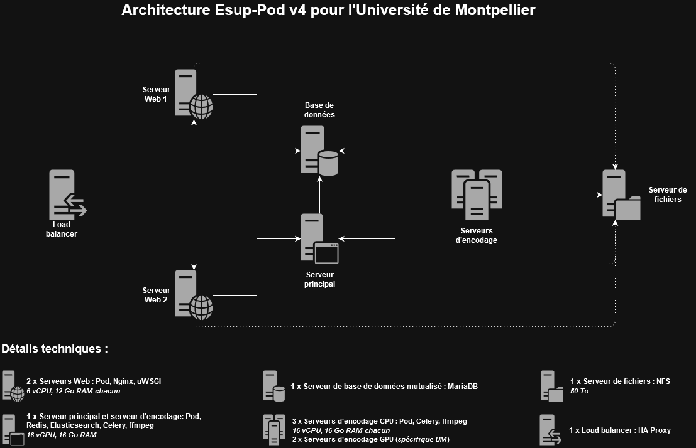

# Infrastructure Pod v4 à l'Université de Montpellier (UM)

## Contexte

|                         | Commentaires          |
|-------------------------|-----------------------|
| **Date de réalisation** | Juillet 2025          |
| **Version de Pod**      | Pod v4.0.0            |
| **Auteur**              | Loïc Bonavent         |

## Présentation de l'infrastructure de production



Cette infrastructure repose sur l'utilisation de :

- **1 load balancer HAProxy** : ce load balancer est utilisé à l'université pour quasiment l'ensemble des sites Web.
- **2 serveurs Web** : utiliser deux serveurs web en frontal renforce la sécurité et la disponibilité, en répartissant la charge et en évitant les points de défaillance uniques.<br>
  _Briques installées sur ces serveurs Web : Pod, Nginx, uWSGI._
- **1 serveur principal** : ce serveur - nommé principal pour le différencier des autres - correspond à un serveur d'encodage déporté pour lequel REDIS et Elasticsearch sont installés.<br>
  _Briques installées sur ces serveurs Web : Pod, REDIS, Elasticsearch, Celery (1 worker), ffmpeg, Whisper._
- **3 serveurs d'encodage** : serveurs d'encodage déportés purs, principalement utilisés pour la transcription (qui ne peut encore être réalisée sur les serveurs GPU - depuis 2025, ~17% des vidéos sont transcrites) et pour l'encodage des vidéos dont le format n'est pas géré par les serveurs GPU.<br>
  _Briques installées sur ces serveurs Web : Pod, Celery (1 worker), ffmpeg, Whisper._
- **1 base de données** : base de données MariaDB mutualisée.
- **1 serveur de fichiers** : serveur de fichiers partagé NFS d'une taille de 50To, dont 40To est occupé actuellement.

_Tous les serveurs tournent sur Debian 12._

> 💡 Cette infrastructure ne tient pas compte des serveurs RTMP Nginx, pour la gestion des directs (cf. documentation pour la mise en place du direct live), et des serveurs d'encodage GPU qui reposent sur du spécifique UM.

> Chaque serveur d'encodage utilise 16 Go RAM et 16 vCPU car j'utilise la transcription via **Whisper** et son modèle **Medium**, qui est très performant mais qui consomme quand même quelques ressources.
>
> Pour le serveur principal, ces ressources sont nécessaires pour faire tourner REDIS, Elasticsearch et Whisper en même temps, et éviter tout problème (style Out Of Memory...).
>
> Pour les autres serveurs d'encodage, c'est peut-être quelque peu surdimensionné (8/12 Go RAM et 8/12 vCPU devraient être suffisants).
{: .alert .alert-warning}

## Installation

> N'ayant toujours pas d'orchestrateurs de conteneurs à l'université, j'ai réalisé l'installation "à l'ancienne", en utilisant principalement la [documentation du mode Stand Alone](../install_standalone_fr)
>
> Avec cette documentation et les autres, si l'infrastructure est présente et s'il n'y a pas de _problèmes d'environnement_ (firewall, privilèges sur la base de données...), cela ne nécessite que quelques heures.
>
> Personnellement, j'utilise **SuperPutty** pour exécuter des commandes sur plusieurs serveurs à la fois (typiquement l'installation de Pod v4 sur tous les serveurs d'encodage).
>
> Certaines étapes de la procédure suivante peuvent être réalisées en parallèle ou dan un ordre différent, selon votre convenance.

---

### Etape 1 : Installation de Pod v4

|                        | Commentaires                                      |
|------------------------|---------------------------------------------------|
| **Serveurs concernés** | Tous les serveurs Pod (Web, principal, d'encodage)|
| **Documentations de référence** | [Documentation du mode Stand Alone / Environnement](../install_standalone_fr#environnement)|
{: .table .table-striped}

J'ai suivi rigoureusement la documentation **[Installation d’Esup-Pod en mode Stand Alone / Environnement](../install_standalone_fr#environnement)**.

> Spécificité UM :
> Vis-à-vis de l'ancienne infrastructure, j'ai conservé le même **identifiant Linux** pour le user `pod`, via la commande :
>
> ```sh
> user@pod:~$ usermod -u 1313 pod
> ```

Concernant le fichier de configuration `settings_local.py`, une version finale est disponible en fin de cette documentation.

🎯 A la fin de cette étape, Pod v4 est installé sur tous les serveurs Pod, avec toutes ses librairies Python.
{: .alert .alert-primary}

### Etape 2 : Configuration et utilisation d'une base de données MySQL/MariaDB

|                        | Commentaires                                      |
|------------------------|---------------------------------------------------|
| **Serveurs concernés** | Tous serveurs Pod (Web, principal, d'encodage) |
| **Documentations de référence** | [Configuration et utilisation d'une base de données MySQL/MariaDB](../mariadb_fr)|
{: .table .table-striped}

Pour configurer et utiliser une base de données MySQL/MariaDB sur tous les serveurs Pod, j'ai suivi la documentation concernant la **[configuration et utilisation d'une base de données MySQL/MariaDB](../mariadb_fr)**.

Au vue de l'architecture, j'ai remplacé `<my_database_host>` par **l'adresse IP du serveur de base de données** et les autres variables `<my_database_*>` par les valeurs de mon environnement.

> 💡 Si vous souhaitez installer un serveur MySQL/MariaDB, il faut suivre la documentation concernant **[l'installation, la configuration et utilisation d'une base de données MySQL/MariaDB](../production-mode_fr#base-de-données-mysqlmariadb)**.

🎯 A la fin de cette étape, tous les serveurs Pod peuvent utiliser la base de données de type MySQL/MariaDB.
{: .alert .alert-primary}

### Etape 3 : Installation de REDIS

|                        | Commentaires                                      |
|------------------------|---------------------------------------------------|
| **Serveurs concernés** | Serveur principal |
| **Documentations de référence** | [Documentation du mode Stand Alone / Redis](../install_standalone_fr#redis)|
{: .table .table-striped}

Pour installer REDIS sur le serveur principal, j'ai suivi la **[documentation du mode Stand Alone / Redis](../install_standalone_fr#redis)**.

Au vue de l'architecture, j'ai remplacé partout `<my_redis_host>` par **l'adresse IP du serveur REDIS**, obtenu par `hostname -I` sur le serveur principal et j'ai édité le fichier _/etc/redis/redis.conf_ avec ces informations :

```sh
bind <my_redis_host>
protected-mode no
```

🎯 A la fin de cette étape, REDIS est installé sur le serveur principal de Pod.
{: .alert .alert-primary}

### Etape 4 : Configuration et utilisation de REDIS

|                        | Commentaires                                      |
|------------------------|---------------------------------------------------|
| **Serveurs concernés** | Tous serveurs Pod (Web, principal, d'encodage) |
| **Documentations de référence** | [Configuration et usage de REDIS](../redis_fr)|
{: .table .table-striped}

Pour configurer et utiliser REDIS sur tous les serveurs Pod, j'ai suivi la documentation concernant la **[configuration et usage de REDIS](../redis_fr)**.

🎯 A la fin de cette étape, REDIS peut être utilisé par l'ensemble des serveurs Pod.
{: .alert .alert-primary}

### Etape 5 : Installation d'Elasticsearch

|                        | Commentaires                                      |
|------------------------|---------------------------------------------------|
| **Serveurs concernés** | Serveur principal |
| **Documentations de référence** | [Documentation du mode Stand Alone / Elasticsearch](../install_standalone_fr#elasticsearch)|
{: .table .table-striped}

Pour installer Elasticsearch sur le serveur principal, j'ai suivi la **[documentation du mode Stand Alone / Elasticsearch](../install_standalone_fr#elasticsearch)** avec le _mode Security d'ES8_ activé.

Au vue de l'architecture, j'ai remplacé partout `<my_es_host>` par **l'adresse IP du serveur Elasticsearch**, obtenu par `hostname -I` sur le serveur principal et j'ai édité le fichier _/etc/elasticsearch/elasticsearch.yml_ avec ces informations :

```yml
cluster.name: pod-application
node.name: pod-1
network.host: <my_es_host>
discovery.seed_hosts: ["<my_es_host>"]
cluster.initial_master_nodes: ["pod-1"]

xpack.security.enabled: true
xpack.security.enrollment.enabled: true
xpack.security.transport.ssl:
  enabled: true
  verification_mode: certificate
  keystore.path: certs/transport.p12
  truststore.path: certs/transport.p12
http.host: 0.0.0.0
xpack.security.http.ssl.enabled: true
xpack.security.http.ssl.verification_mode: certificate
xpack.security.http.ssl.keystore.path: /etc/elasticsearch/elastic-certificates.p12
xpack.security.http.ssl.truststore.path: /etc/elasticsearch/elastic-certificates.p12
```

🎯 A la fin de cette étape, Elasticsearch est installé sur le serveur principal de Pod.
{: .alert .alert-primary}

### Etape 6 : Installation des dépendances

|                        | Commentaires                                      |
|------------------------|---------------------------------------------------|
| **Serveurs concernés** | Tous serveurs Pod (Web, principal, d'encodage) |
| **Documentations de référence** | [Documentation du mode Stand Alone / Installation des dépendances](../install_standalone_fr#installation-des-dépendances)|
{: .table .table-striped}

Pour installer les dépendances sur tous les serveurs Pod, j'ai suivi la **[documentation du mode Stand Alone / Installation des dépendances](../install_standalone_fr#installation-des-dépendances)**.

> Logiquement, ces dépendances ne concernent que les serveurs Web, mais je préfère les installer sur l'ensemble des serveurs au cas où.
{: .alert .alert-secondary}

🎯 A la fin de cette étape, les dépendances de Pod sont installés sur tous les serveurs Pod.
{: .alert .alert-primary}

### Etape 7 : Installation du système Web reposant sur NGINX/uWSGI et paramétrage

|                        | Commentaires                                      |
|------------------------|---------------------------------------------------|
| **Serveurs concernés** | Serveurs Web |
| **Documentations de référence** | [Frontal Web Nginx / uWSGI et fichiers statiques](../production-mode_fr#frontal-web-nginx--uwsgi-et-fichiers-statiques)|
{: .table .table-striped}

Pour installer, configurer et utiliser Nginx/uWSGI sur tous les serveurs Web, j'ai suivi la documentation concernant la mise en place de **[Frontal Web Nginx / UWSGI et fichiers statiques](../production-mode_fr#frontal-web-nginx--uwsgi-et-fichiers-statiques)**.

> Spécificité UM :
> Vis-à-vis de l'ancienne infrastructure, j'ai conservé le même **identifiant Linux** pour le groupe `www-data` que celui du groupe `nginx`, et j'ai ajouté le user `pod` à ce groupe via les commandes :
>
> ```sh
> user@pod:~$ sudo groupmod -g 989 www-data
> user@pod:~$ sudo usermod -g www-data pod
> ```

🎯 A la fin de cette étape, les serveurs Web reposant sur Nginx / UWSGI sont opérationnels.
{: .alert .alert-primary}

### Etape 8 : Installation du système d'encodage

|                        | Commentaires                                      |
|------------------------|---------------------------------------------------|
| **Serveurs concernés** | Serveurs d'encodage, serveur principal |
| **Documentations de référence** | [Documentation pour déporter l’encodage sur un ou plusieurs serveurs](../remote-encoding_fr)|
{: .table .table-striped}

> L'encodage peut se réaliser de différentes manières; pour ma part, à l'heure actuelle, j'utilise le système d'encodage déporté, sans utilisation de microservices.
{: .alert .alert-light}

Pour installer ce système d'encodage, j'ai suivi la **[documentation pour déporter l’encodage sur un ou plusieurs serveurs](../remote-encoding_fr)**.

Cela implique l'utilisation de REDIS du serveur principal et de Celery sur les serveurs d'encodage.

🎯 A la fin de cette étape, les serveurs d'encodage, reposant sur **REDIS** et du **Celery**, sont fonctionnels.
{: .alert .alert-primary}

### Etape 9 : Installation du système de transcription

|                        | Commentaires                                      |
|------------------------|---------------------------------------------------|
| **Serveurs concernés** | Serveurs d'encodage |
| **Documentations de référence** | [Documentation concernant l'installation de l'autotranscription](../optional/auto-transcription-install_fr)|
{: .table .table-striped}

> L'autotranscription peut se réaliser de différentes manières; pour ma part, à l'heure actuelle, j'utilise le système d'autotranscription déporté, sans utilisation de microservices.
{: .alert .alert-light}

Pour installer ce système d'autotranscription, j'ai suivi la **[documentation concernant l'installation de l'autotranscription](../optional/auto-transcription-install_fr)** et utiliser **Whisper** avec le modèle `medium`.

🎯 A la fin de cette étape, les serveurs d'encodage peuvent réaliser des transcriptions.
{: .alert .alert-primary}

### Etape 10 : Personnalisation visuelle

|                        | Commentaires                                      |
|------------------------|---------------------------------------------------|
| **Serveurs concernés** | Serveurs Web |
| **Documentations de référence** | [Documentation concernant la personnalisation visuelle](../visual-customisation_fr)|
{: .table .table-striped}

Pour réaliser la personnalisation visuelle pour mon établissement, j'ai suivi la **[documentation concernant la personnalisation visuelle](../visual-customisation_fr)**.

> A l'université de Montpellier, j'ai repris les élements déjà réalisés pour Pod v3.

🎯 A la fin de cette étape, le site Web Pod v4 sera à la charte graphique de votre établissement.
{: .alert .alert-primary}

---

Après avoir suivi ces étapes, l'environnement Pod de production est installé.
