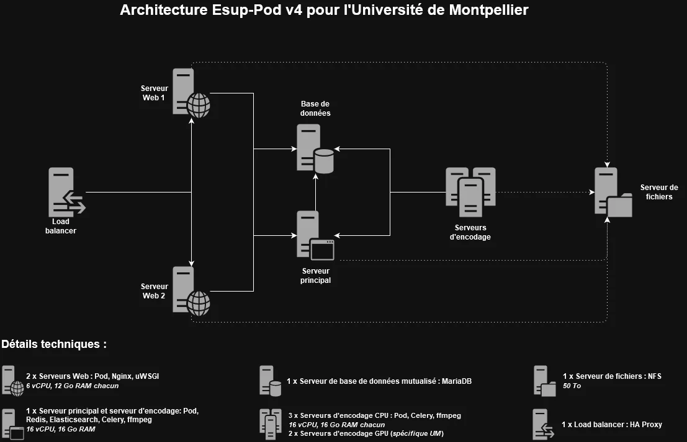

# Infrastructure Pod v4 à l’Université de Montpellier (UM)

## Contexte

|                         | Commentaires          |
|-------------------------|-----------------------|
| **Date de réalisation** | Juillet 2025          |
| **Version de Pod**      | Pod v4.0.0            |
| **Auteur**              | Loïc Bonavent         |
{: .table .table-striped}

Ce document présente les travaux réalisés par l’Université de Montpellier pour déployer une **infrastructure dédiée à Pod v4**, remplaçant ainsi une ancienne infrastructure Pod v3, devenue obsolète et potentiellement vulnérable sur le plan de la sécurité.

> 💡L’infrastructure Pod v4 a été montée en **parallèle** de l’infrastructure Pod v3, de production, existante.
> L’idée n’est pas de réaliser une simple mise à jour de Pod v3 vers Pod v4, mais il s’agit véritablement d’_une bascule d’une architecture Pod v3 vers une nouvelle infrastructure Pod v4_.
{: .alert .alert-primary}

## Présentation de l’infrastructure de production



Cette infrastructure repose sur l’utilisation de :

- **1 load balancer HAProxy** : ce load balancer est utilisé à l’université pour quasiment l’ensemble des sites Web.
- **2 serveurs Web** : utiliser deux serveurs web en frontal renforce la sécurité et la disponibilité, en répartissant la charge et en évitant les points de défaillance uniques.<br>
  _Briques installées sur ces serveurs Web : Pod, Nginx, uWSGI._
- **1 serveur principal** : ce serveur - nommé principal pour le différencier des autres - correspond à un serveur d’encodage déporté pour lequel REDIS et Elasticsearch sont installés.<br>
  _Briques installées sur ces serveurs Web : Pod, REDIS, Elasticsearch, Celery (1 worker), ffmpeg, Whisper._
- **3 serveurs d’encodage** : serveurs d’encodage déportés purs, principalement utilisés pour la transcription (qui ne peut encore être réalisée sur les serveurs GPU - depuis 2025, ~17% des vidéos sont transcrites) et pour l’encodage des vidéos dont le format n’est pas géré par les serveurs GPU.<br>
  _Briques installées sur ces serveurs Web : Pod, Celery (1 worker), ffmpeg, Whisper._
- **1 base de données** : base de données MariaDB mutualisée.
- **1 serveur de fichiers** : serveur de fichiers partagé NFS d’une taille de 50To, dont 40To est occupé actuellement.

_Tous les serveurs tournent sur Debian 12._

> 💡 Cette infrastructure ne tient pas compte des serveurs RTMP Nginx, pour la gestion des directs (cf. documentation pour la mise en place du direct live), et des serveurs d’encodage GPU qui reposent sur du spécifique UM.
>
> Chaque serveur d’encodage utilise 16 Go RAM et 16 vCPU car j’utilise la transcription via **Whisper** et son modèle **Medium**, qui est très performant mais qui consomme quand même quelques ressources.
>
> Pour le serveur principal, ces ressources sont nécessaires pour faire tourner REDIS, Elasticsearch et Whisper en même temps, et éviter tout problème (style Out Of Memory...).
>
> Pour les autres serveurs d’encodage, c’est peut-être quelque peu surdimensionné (8/12 Go RAM et 8/12 vCPU devraient être suffisants).
{: .alert .alert-warning}

## Installation

> N’ayant toujours pas d’orchestrateurs de conteneurs à l’université, j’ai réalisé l’installation "à l’ancienne", en utilisant principalement la [documentation du mode Stand Alone](../install_standalone_fr)
>
> Avec cette documentation et les autres, si l’infrastructure est présente et s’il n’y a pas de _problèmes d’environnement_ (firewall, privilèges sur la base de données...), cela ne nécessite que quelques heures.
>
> Personnellement, j’utilise **SuperPutty** pour exécuter des commandes sur plusieurs serveurs à la fois (typiquement l’installation de Pod v4 sur tous les serveurs d’encodage).
>
> Certaines étapes de la procédure suivante peuvent être réalisées en parallèle ou dan un ordre différent, selon votre convenance.

---

### Étape 1 : Installation de Pod v4

|                        | Commentaires                                      |
|------------------------|---------------------------------------------------|
| **Serveurs concernés** | Tous les serveurs Pod (Web, principal, d’encodage)|
| **Documentations de référence** | [Documentation du mode Stand Alone / Environnement](../install_standalone_fr#environnement)|
{: .table .table-striped}

J’ai suivi rigoureusement la documentation **[Installation d’Esup-Pod en mode Stand Alone / Environnement](../install_standalone_fr#environnement)**.

> Spécificité UM :
> Vis-à-vis de l’ancienne infrastructure, j’ai conservé le même **identifiant Linux** pour le user `pod`, via la commande :
>
> ```sh
> user@pod:~$ usermod -u 1313 pod
> ```

Concernant le fichier de configuration `settings_local.py`, une version finale est disponible en fin de cette documentation.

🎯 A la fin de cette étape, Pod v4 est installé sur tous les serveurs Pod, avec toutes ses librairies Python.
{: .alert .alert-primary}

### Étape 2 : Configuration et utilisation d’une base de données MySQL/MariaDB

|                        | Commentaires                                      |
|------------------------|---------------------------------------------------|
| **Serveurs concernés** | Tous serveurs Pod (Web, principal, d’encodage) |
| **Documentations de référence** | [Configuration et utilisation d’une base de données MySQL/MariaDB](../mariadb_fr)|
{: .table .table-striped}

Pour configurer et utiliser une base de données MySQL/MariaDB sur tous les serveurs Pod, j’ai suivi la documentation concernant la **[configuration et utilisation d’une base de données MySQL/MariaDB](../mariadb_fr)**.

Au vue de l’architecture, j’ai remplacé `<my_database_host>` par **l’adresse IP du serveur de base de données** et les autres variables `<my_database_*>` par les valeurs de mon environnement.

> 💡 Si vous souhaitez installer un serveur MySQL/MariaDB, il faut suivre la documentation concernant **[l’installation, la configuration et utilisation d’une base de données MySQL/MariaDB](../production-mode_fr#base-de-données-mysqlmariadb)**.

🎯 A la fin de cette étape, tous les serveurs Pod peuvent utiliser la base de données de type MySQL/MariaDB.
{: .alert .alert-primary}

### Étape 3 : Installation de REDIS

|                        | Commentaires                                      |
|------------------------|---------------------------------------------------|
| **Serveurs concernés** | Serveur principal |
| **Documentations de référence** | [Documentation du mode Stand Alone / Redis](../install_standalone_fr#redis)|
{: .table .table-striped}

Pour installer REDIS sur le serveur principal, j’ai suivi la **[documentation du mode Stand Alone / Redis](../install_standalone_fr#redis)**.

Au vue de l’architecture, j’ai remplacé partout `<my_redis_host>` par **l’adresse IP du serveur REDIS**, obtenu par `hostname -I` sur le serveur principal et j’ai édité le fichier _/etc/redis/redis.conf_ avec ces informations :

```sh
bind <my_redis_host>
protected-mode no
```

🎯 A la fin de cette étape, REDIS est installé sur le serveur principal de Pod.
{: .alert .alert-primary}

### Étape 4 : Configuration et utilisation de REDIS

|                        | Commentaires                                      |
|------------------------|---------------------------------------------------|
| **Serveurs concernés** | Tous serveurs Pod (Web, principal, d’encodage) |
| **Documentations de référence** | [Configuration et usage de REDIS](../redis_fr)|
{: .table .table-striped}

Pour configurer et utiliser REDIS sur tous les serveurs Pod, j’ai suivi la documentation concernant la **[configuration et usage de REDIS](../redis_fr)**.

🎯 A la fin de cette étape, REDIS peut être utilisé par l’ensemble des serveurs Pod.
{: .alert .alert-primary}

### Étape 5 : Installation d’Elasticsearch

|                        | Commentaires                                      |
|------------------------|---------------------------------------------------|
| **Serveurs concernés** | Serveur principal |
| **Documentations de référence** | [Documentation du mode Stand Alone / Elasticsearch](../install_standalone_fr#elasticsearch)|
{: .table .table-striped}

Pour installer Elasticsearch sur le serveur principal, j’ai suivi la **[documentation du mode Stand Alone / Elasticsearch](../install_standalone_fr#elasticsearch)** avec le _mode Security d’ES8_ activé.

Au vue de l’architecture, j’ai remplacé partout `<my_es_host>` par **l’adresse IP du serveur Elasticsearch**, obtenu par `hostname -I` sur le serveur principal et j’ai édité le fichier _/etc/elasticsearch/elasticsearch.yml_ avec ces informations :

```yml
cluster.name: pod-application
node.name: pod-1
network.host: <my_es_host>
discovery.seed_hosts: ["<my_es_host>"]
cluster.initial_master_nodes: ["pod-1"]

xpack.security.enabled: true
xpack.security.enrollment.enabled: true
xpack.security.transport.ssl:
  enabled: true
  verification_mode: certificate
  keystore.path: certs/transport.p12
  truststore.path: certs/transport.p12
http.host: 0.0.0.0
xpack.security.http.ssl.enabled: true
xpack.security.http.ssl.verification_mode: certificate
xpack.security.http.ssl.keystore.path: /etc/elasticsearch/elastic-certificates.p12
xpack.security.http.ssl.truststore.path: /etc/elasticsearch/elastic-certificates.p12
```

🎯 A la fin de cette étape, Elasticsearch est installé sur le serveur principal de Pod.
{: .alert .alert-primary}

### Étape 6 : Installation des dépendances

|                        | Commentaires                                      |
|------------------------|---------------------------------------------------|
| **Serveurs concernés** | Tous serveurs Pod (Web, principal, d’encodage) |
| **Documentations de référence** | [Documentation du mode Stand Alone / Installation des dépendances](../install_standalone_fr#installation-des-dépendances)|
{: .table .table-striped}

Pour installer les dépendances sur tous les serveurs Pod, j’ai suivi la **[documentation du mode Stand Alone / Installation des dépendances](../install_standalone_fr#installation-des-dépendances)**.

> Logiquement, ces dépendances ne concernent que les serveurs Web, mais je préfère les installer sur l’ensemble des serveurs au cas où.
{: .alert .alert-secondary}

🎯 A la fin de cette étape, les dépendances de Pod sont installés sur tous les serveurs Pod.
{: .alert .alert-primary}

### Étape 7 : Installation du système Web reposant sur NGINX/uWSGI et paramétrage

|                        | Commentaires                                      |
|------------------------|---------------------------------------------------|
| **Serveurs concernés** | Serveurs Web |
| **Documentations de référence** | [Frontal Web Nginx / uWSGI et fichiers statiques](../production-mode_fr#frontal-web-nginx--uwsgi-et-fichiers-statiques)|
{: .table .table-striped}

Pour installer, configurer et utiliser Nginx/uWSGI sur tous les serveurs Web, j’ai suivi la documentation concernant la mise en place de **[Frontal Web Nginx / UWSGI et fichiers statiques](../production-mode_fr#frontal-web-nginx--uwsgi-et-fichiers-statiques)**.

> Spécificité UM :
> Vis-à-vis de l’ancienne infrastructure, j’ai conservé le même **identifiant Linux** pour le groupe `www-data` que celui du groupe `nginx`, et j’ai ajouté le user `pod` à ce groupe via les commandes :
>
> ```sh
> user@pod:~$ sudo groupmod -g 989 www-data
> user@pod:~$ sudo usermod -g www-data pod
> ```

🎯 A la fin de cette étape, les serveurs Web reposant sur Nginx / UWSGI sont opérationnels.
{: .alert .alert-primary}

### Étape 8 : Installation du système d’encodage

|                        | Commentaires                                      |
|------------------------|---------------------------------------------------|
| **Serveurs concernés** | Serveurs d’encodage, serveur principal |
| **Documentations de référence** | [Documentation pour déporter l’encodage sur un ou plusieurs serveurs](../remote-encoding_fr)|
{: .table .table-striped}

> L’encodage peut se réaliser de différentes manières; pour ma part, à l’heure actuelle, j’utilise le système d’encodage déporté, sans utilisation de microservices.
{: .alert .alert-light}

Pour installer ce système d’encodage, j’ai suivi la **[documentation pour déporter l’encodage sur un ou plusieurs serveurs](../remote-encoding_fr)**.

Cela implique l’utilisation de REDIS du serveur principal et de Celery sur les serveurs d’encodage.

🎯 A la fin de cette étape, les serveurs d’encodage, reposant sur **REDIS** et du **Celery**, sont fonctionnels.
{: .alert .alert-primary}

### Étape 9 : Installation du système de transcription

|                        | Commentaires                                      |
|------------------------|---------------------------------------------------|
| **Serveurs concernés** | Serveurs d’encodage |
| **Documentations de référence** | [Documentation concernant l’installation de l’autotranscription](../optional/auto-transcription-install_fr)|
{: .table .table-striped}

> L’autotranscription peut se réaliser de différentes manières; pour ma part, à l’heure actuelle, j’utilise le système d’autotranscription déporté, sans utilisation de microservices.
{: .alert .alert-light}

Pour installer ce système d’autotranscription, j’ai suivi la **[documentation concernant l’installation de l’autotranscription](../optional/auto-transcription-install_fr)** et utiliser **Whisper** avec le modèle `medium`.

🎯 A la fin de cette étape, les serveurs d’encodage peuvent réaliser des transcriptions.
{: .alert .alert-primary}

### Étape 10 : Personnalisation visuelle

|                        | Commentaires                                      |
|------------------------|---------------------------------------------------|
| **Serveurs concernés** | Serveurs Web |
| **Documentations de référence** | [Documentation concernant la personnalisation visuelle](../visual-customisation_fr)|
{: .table .table-striped}

Pour réaliser la personnalisation visuelle pour mon établissement, j’ai suivi la **[documentation concernant la personnalisation visuelle](../visual-customisation_fr)**.

> A l’université de Montpellier, j’ai repris les élements déjà réalisés pour Pod v3.

🎯 A la fin de cette étape, le site Web Pod v4 sera à la charte graphique de votre établissement.
{: .alert .alert-primary}

### Étape 11 : Migration des données entre la version 3  et la version 4

|                        | Commentaires                                      |
|------------------------|---------------------------------------------------|
| **Serveurs concernés** | Serveur principal |
| **Documentations de référence** | [Documentation concernant le système de migration des données entre la version 3 et la version 4](../migrate_from_v3_to_v4_fr)|
{: .table .table-striped}

Pour réaliser la migration des données de Pod v3 vers Pod v4, j’ai suivi la **[documentation concernant le système de migration des données entre la version 3 et la version 4](../migrate_from_v3_to_v4_fr)**.

> 💡 Cette migration des données peut-être réalisée autant de fois que nécessaire. Personnellement, j’ai réalisé plusieurs tests en amont en **supprimant l’ensemble des tables** de la base de données et en exécutant la commande **`python manage.py import_data_from_v3_to_v4 --createDB`**.
>
> 💡 Vérifier bien que le serveur de fichiers, contenant le répertoire `MEDIA_ROOT`, soit bien accessible par l’ensemble de serveurs Pod.

_Attention à ne pas réaliser de tests d’encodage sur l’environnement de **production** Pod v4 tant que la bascule d’infrastructure Pod v3 vers Pod v4 n’a pas été réalisée. Les fichiers encodées se retrouveraient sur le serveur de fichiers partagés._
{: .alert .alert-danger}

🎯 A la fin de cette étape, le site Web Pod v4 est réellement en production, avec l’ensemble des données existantes.
{: .alert .alert-primary}

### Annexes

Ci-dessous, les différents éléments de configuration pour cette infrastructure Pod v4 pour l’UM (_configuration au jour de la date de réalisation de cette documentation_).

#### Fichier `/usr/local/django_projects/podv4/pod/custom/settings_local.py`

> 💡Penser à garder le même SECRET_KEY que l’environnement Pod v3.

```sh
# -*- coding: utf-8 -*-
from django.utils.translation import gettext_lazy as _

SECRET_KEY = '<my_secret_key>'

# DEBUG mode activation
DEBUG = False

# Droit des fichiers uploadés
FILE_UPLOAD_PERMISSIONS = 0o644

# Noms de domaine/d'hôte
ALLOWED_HOSTS = ['pod.univ.fr']

# Liste des administrateurs
ADMINS = (
    ('Name', 'pod@univ.fr'),
)
# Liste des managers (destinataires des courriels de fin d’encodage)
MANAGERS = ADMINS

# Base de données
DATABASES = {
    'default': {
        'ENGINE': 'django.db.backends.mysql',
        'NAME': '<my_bd_name>',
        'USER': '<my_bd_user>',
        'PASSWORD': '<my_bd_password>',
        'HOST': '<my_bd_host>',
        'PORT': '',
        'OPTIONS': {'init_command': "SET storage_engine=INNODB, sql_mode='STRICT_TRANS_TABLES', innodb_strict_mode=1, foreign_key_checks=0;"}
    }
}

# Utile pour la réception d'enregistrement
RECORDER_BASE_URL = "https://pod.univ.fr"

# Seules les personnes staff peuvent déposer des vidéos
RESTRICT_EDIT_VIDEO_ACCESS_TO_STAFF_ONLY = True

# 4Go maximum pour l'upload
VIDEO_MAX_UPLOAD_SIZE = 4

# Utile pour la gestion des fichiers
FILE_ALLOWED_EXTENSIONS = ('doc', 'docx', 'odt', 'pdf', 'xls', 'xlsx', 'ods', 'ppt', 'pptx', 'txt', 'html', 'htm', 'vtt', 'srt', 'webm', 'ts',)
IMAGE_ALLOWED_EXTENSIONS = ('jpg', 'jpeg', 'bmp', 'png', 'gif', 'tiff',)
FILE_MAX_UPLOAD_SIZE = 20

# Utilisation du gestionnaire de fichiers Pod
USE_PODFILE = True

# Liste des applications tierces accessibles
THIRD_PARTY_APPS = ['live', 'enrichment']

# Authentification
AUTH_TYPE = (('local', _('local')), ('CAS', 'CAS'))

# Authentification CAS
USE_CAS = True
CAS_SERVER_URL = 'https://cas.univ.fr/cas/'
CAS_GATEWAY = False
POPULATE_USER = 'LDAP'
AUTH_CAS_USER_SEARCH = 'user'
CREATE_GROUP_FROM_AFFILIATION = True
CREATE_GROUP_FROM_GROUPS = True
AFFILIATION_STAFF = ('faculty', 'employee', 'researcher', 'affiliate')

# Annuaire LDAP
LDAP_SERVER = {'url': 'ldap://ldap.univ.fr', 'port': 389, 'use_ssl': False}
AUTH_LDAP_BIND_DN = 'cn=admin, ou=system, dc=univ, dc=fr'
AUTH_LDAP_BIND_PASSWORD = '<my_ldap_password>'
AUTH_LDAP_BASE_DN = 'ou=people,dc=univ,dc=fr'
AUTH_LDAP_USER_SEARCH = (AUTH_LDAP_BASE_DN, "(uid=%(uid)s)")

# Liste de correspondance entre les champs d'un compte de Pod
#  et les champs renvoyés par le LDAP
USER_LDAP_MAPPING_ATTRIBUTES = {
    "uid": "uid",
    "mail": "mail",
    "last_name": "sn",
    "first_name": "givenname",
    "primaryAffiliation": "eduPersonPrimaryAffiliation",
    "affiliations": "eduPersonAffiliation",
    "groups": "isMemberOf"
}

# Internationalisation et localisation.
LANGUAGE_CODE = 'fr'
LANGUAGES = (
    ('fr', 'Français'),
    ('en', 'English')
)
MODELTRANSLATION_DEFAULT_LANGUAGE = 'fr'
MODELTRANSLATION_FALLBACK_LANGUAGES = ('fr', 'en')

# Time zone
TIME_ZONE = 'Europe/Paris'

# Préfixe url utilisé pour accéder aux fichiers du répertoire media
MEDIA_URL = '/media/'

# Chemin absolu du répertoire des médias
# MEDIA_ROOT = os.path.join(BASE_DIR, 'media')
MEDIA_ROOT = '<my_nfs_dir>/pod/media'

# Répertoire temporaire
FILE_UPLOAD_TEMP_DIR = '/var/tmp'

# Répertoire de base, utile pour le recorder
BASE_DIR = '/usr/local/django_projects/podv4/pod'

# Type par défaut
DEFAULT_TYPE_ID = 4

# Paramétrage pour l'envoi de mails
EMAIL_HOST = 'smtp.univ.fr'
EMAIL_PORT = 25
DEFAULT_FROM_EMAIL = 'pod@univ.fr'
SERVER_EMAIL = 'pod@univ.fr'

# Un courriel est envoyé aux managers et à l’auteur à la fin de l’encodage
EMAIL_ON_ENCODING_COMPLETION = True

# Les utilisateurs non staff ne sont plus affichés dans la barre de menu utilisateur.
MENUBAR_SHOW_STAFF_OWNERS_ONLY = True

# Afficher les vidéos dont l’accès est protégé par authentification sur la page d’accueil.
HOMEPAGE_SHOWS_RESTRICTED = True

### Elasticsearch
# Elasticsearch URLs
ES_URL = ['https://<my_es_host>:9200/']
ES_VERSION = 8
# ES_MAX_RETRIES = 10
ES_OPTIONS = {'verify_certs': False, 'basic_auth': ('pod', '<my_es_password>')}

# Encodage encore via Celery
CELERY_TO_ENCODE = True
# Broker REDIS
CELERY_BROKER_URL = "redis://<my_redis_host>:6379/5"
# Permet de ne traiter que une tache à la fois
CELERY_TASK_ACKS_LATE = True

# Paramétrage du template établissement
TEMPLATE_VISIBLE_SETTINGS = {
    'TITLE_SITE': 'Pod',
    'TITLE_ETB': 'Etablissement',
    'LOGO_SITE': 'custom/img/logo-pod.svg',
    'LOGO_COMPACT_SITE': 'custom/img/logo-pod.svg',
    'LOGO_ETB': 'custom/img/logo-etab.svg',
    'LOGO_PLAYER': 'custom/img/logo-player.png',
    'FOOTER_TEXT': (
        'ADRESSE',
        'CP VILLE',
        (
            'maps'
        )
    ),
    'LINK_PLAYER': 'https://www.univ.fr',
    'CSS_OVERRIDE': 'custom/custom-etab.css',
    'FAVICON': 'custom/img/favicon.png',
    # Si besoin de Matomo
    # 'TRACKING_TEMPLATE': 'custom/tracking.html'
    # Si besoin de spécificique
    # 'PRE_HEADER_TEMPLATE': 'preheader.html'
}

# Liste des sujets possibles CONTACT_US
SUBJECT_CHOICES = (
    ('', '-----'),
    ('info', _('Request more information')),
    ('request_password', _('Password request for a video')),
    ('inappropriate_content', _('Report inappropriate content')),
    ('bug', _('Correction or bug report')),
    ('other', _('Other (please specify)'))
)

# Image par défaut affichée comme poster ou vignette
DEFAULT_THUMBNAIL = 'custom/img/default.svg'

# Paramétrage Captcha
# Si besoin : 'captcha.helpers.random_char_challenge'
CAPTCHA_CHALLENGE_FUNCT = 'captcha.helpers.math_challenge'
# ('captcha.helpers.noise_null',)
CAPTCHA_NOISE_FUNCTIONS = ('captcha.helpers.noise_arcs', 'captcha.helpers.noise_dots',)

# RGPD
USE_RGPD = True

# Obsolescence
DEFAULT_YEAR_DATE_DELETE = 48
MAX_DURATION_DATE_DELETE = 64

# Enregistreur (FTP)
DEFAULT_RECORDER_PATH = 'NFS/media/uploads/'
DEFAULT_RECORDER_USER_ID = 2
DEFAULT_RECORDER_ID = 1
DEFAULT_RECORDER_TYPE_ID = 4
ALLOW_MANUAL_RECORDING_CLAIMING = False
ALLOW_RECORDER_MANAGER_CHOICE_VID_OWNER = True
RECORDER_SKIP_FIRST_IMAGE = True

### Transcription
USE_TRANSCRIPTION = True

# Transcription use
# * STT
# * VOSK
# * WHISPER
TRANSCRIPTION_TYPE = "WHISPER"

# Paramétrage pour Whisper
TRANSCRIPTION_MODEL_PARAM = {
    'WHISPER': {
        'fr': {
            'model': "medium",
            'download_root': "/usr/local/django_projects/transcription/whisper/",
        },
        'en': {
            'model': "medium",
            'download_root': "/usr/local/django_projects/transcription/whisper/",
        }
    }
}

# Statistiques
USE_STATS_VIEW = True
VIEW_STATS_AUTH = True

# Affiche uniquement les thèmes de premier niveau dans l’onglet 'Chaîne'
SHOW_ONLY_PARENT_THEMES = True
# Affichage uniquement des vidéos de la chaîne ou du thème actuel(le)
ORGANIZE_BY_THEME = True

# Thème CSS
USE_THEME = 'default'
BOOTSTRAP_CUSTOM = 'custom/bootstrap-default.min.css'

# Activer les commentaires au niveau de la plateforme
ACTIVE_VIDEO_COMMENT = False

# Permet d’activer le fonctionnement de categorie au niveau de ses vidéos
USER_VIDEO_CATEGORY = True

# Activation du darkmode
DARKMODE_ENABLED = True

# Activation du mode dyslexie
DYSLEXIAMODE_ENABLED = True

# Ce paramètre permet d’afficher un lien "En savoir plus"
# sur la boite de dialogue d’information sur l’usage des cookies dans Pod.
# On peut préciser un lien vers les mentions légales ou page dpo
COOKIE_LEARN_MORE = "/mentions-legales/"

### Enregisteur
# Permet d’activer la possibilité d’enregistrer son ecran et son micro
USE_OPENCAST_STUDIO = True
OPENCAST_DEFAULT_PRESENTER = "piph"
FFMPEG_STUDIO_COMMAND = (
    " -hide_banner -threads %(nb_threads)s %(input)s %(subtime)s"
    + " -c:a aac -ar 48000 -c:v h264 -profile:v high -pix_fmt yuv420p"
    + " -crf %(crf)s -sc_threshold 0 -force_key_frames"
    + ' "expr:gte(t,n_forced*1)" -max_muxing_queue_size 4000 '
)

# Fonction appelée pour lancer l’encodage des vidéos
ENCODE_VIDEO = "start_encode"
# Fonction appelée pour lancer la transcription des vidéos
TRANSCRIPT_VIDEO = "start_transcript"


### Gestion de l’application des réunions
# Application Meeting pour la gestion de reunion avec BBB
USE_MEETING = True
BBB_API_URL = "https://<my_bbb_host>/bigbluebutton/api"
BBB_SECRET_KEY = "<my_bbb_password>"
# Optionnel
BBB_LOGOUT_URL = ""
RESTRICT_EDIT_MEETING_ACCESS_TO_STAFF_ONLY = False
# Permet de désactiver les enregistrements de réunion
MEETING_DISABLE_RECORD = False
# Ensemble des champs qui seront cachés si `MEETING_DISABLE_RECORD` est défini à true
MEETING_RECORD_FIELDS = (
    "record",
    "auto_start_recording",
    "allow_start_stop_recording"
)

### Caches Redis
CACHES = {
    "default": {
        "BACKEND": "django_redis.cache.RedisCache",
        "LOCATION": "redis://<my_redis_host>:6379/3",
        "OPTIONS": {
            "CLIENT_CLASS": "django_redis.client.DefaultClient",
        },
        "KEY_PREFIX": "pod",
    },
    # Persistent cache setup for select2 (NOT DummyCache or LocMemCache).
    "select2": {
        "BACKEND": "django_redis.cache.RedisCache",
        "LOCATION": "redis://<my_redis_host>:6379/2",
        "OPTIONS": {
            "CLIENT_CLASS": "django_redis.client.DefaultClient",
        }
    },
}
# REDIS
SESSION_ENGINE = "redis_sessions.session"
SESSION_REDIS = {
    "host": "<my_redis_host>",
    "port": 6379,
    "db": 4,
    "prefix": "session",
    "socket_timeout": 1,
    "retry_on_timeout": False,
}
SELECT2_CACHE_BACKEND = "select2"

### Gestion des directs
# Groupes ou affiliations des personnes autorisées à créer un évènement
AFFILIATION_EVENT = ['staff']
# Pour Matomo
USE_VIDEO_EVENT_TRACKING = True
# Affichage des events sur la page d’accueil
SHOW_EVENTS_ON_HOMEPAGE = False
# Image dans le répertoire static
DEFAULT_EVENT_THUMBNAIL = "custom/img/default-event.svg"
# Type 'cours' par défaut
DEFAULT_EVENT_TYPE_ID = 4
# Groupe des admins des events
EVENT_GROUP_ADMIN = "<my_live_managers_group>"
# N’envoie pas d’email aux utilisateurs
EMAIL_ON_EVENT_SCHEDULING = False
# Envoie un email à l’admin
EMAIL_ADMIN_ON_EVENT_SCHEDULING = True
# Durée (en nombre de jours) sur laquelle on souhaite compter le nombre de vues récentes
VIDEO_RECENT_VIEWCOUNT = 180
# Transcription des directs
USE_LIVE_TRANSCRIPTION = False
# La liste des utilisateurs regardant le direct sera réservée au staff
VIEWERS_ONLY_FOR_STAFF = False
# Temps (en seconde) entre deux envois d’un signal au serveur, pour signaler la présence sur un live
# Peut être augmenté en cas de perte de performance mais au détriment de la qualité du comptage des valeurs
HEARTBEAT_DELAY = 90
# Délai (en seconde) selon lequel une vue est considérée comme expirée si elle n’a pas renvoyé de signal depuis
VIEW_EXPIRATION_DELAY = 120


### Gestion de l’import des vidéos
# Module d’import des videos
USE_IMPORT_VIDEO = True
# Seuls les utilisateurs staff pourront importer des vidéos
RESTRICT_EDIT_IMPORT_VIDEO_ACCESS_TO_STAFF_ONLY = True
# Pas de taille maximum pour les imports
MAX_UPLOAD_SIZE_ON_IMPORT = 0
# Utilisation du plugin bbb-recorder pour le module import-vidéo;
# utile pour convertir une présentation BigBlueButton en fichier vidéo.
USE_IMPORT_VIDEO_BBB_RECORDER = False
# Répertoire du plugin bbb-recorder (voir la documentation https://github.com/jibon57/bbb-recorder).
# bbb-recorder doit être installé dans ce répertoire, sur tous les serveurs d’encodage.
# bbb-recorder crée un répertoire Downloads, au même niveau, qui nécessite de l’espace disque.
IMPORT_VIDEO_BBB_RECORDER_PLUGIN = '/home/pod/bbb-recorder/'
# Répertoire qui contiendra les fichiers vidéo générés par bbb-recorder.
IMPORT_VIDEO_BBB_RECORDER_PATH = '<my_nfs_dir>/bbb-recorder/'

# Gestion des favoris et playlists
USE_FAVORITES = True
USE_PLAYLIST = True


### Gestion PWA et notifications
# PWA
PWA_APP_NAME = "Pod"
PWA_APP_DESCRIPTION = _(
    "University video platform"
)
PWA_APP_THEME_COLOR = "#34495E"
PWA_APP_BACKGROUND_COLOR = "#ffffff"
PWA_APP_ICONS = [
    {
        "src": f"/static/custom/img/pwa/icon_x{size}.png",
        "sizes": f"{size}x{size}",
        "purpose": "any maskable",
    }
    for size in (1024, 512, 384, 192, 128, 96, 72, 48)
]
PWA_APP_ICONS_APPLE = [
    {
        "src": f"/static/custom/img/pwa/icon_x{size}.png",
        "sizes": f"{size}x{size}",
    }
    for size in (1024, 512, 384, 192, 128, 96, 72, 48)
]
PWA_APP_SPLASH_SCREEN = [
    {
        "src": "/static/custom/img/pwa/splash-512.png",
        "media": (
            "(device-width: 320px) "
            "and (device-height: 568px) "
            "and (-webkit-device-pixel-ratio: 2)"
        ),
    }
]
PWA_APP_SCREENSHOTS = [
    {"src": "/static/custom/img/pwa/screenshot1.png", "sizes": "675x1334", "type": "image/png"}
]

### NOTIFICATIONS
USE_NOTIFICATIONS = True
# Clés générées via https://web-push-codelab.glitch.me/
WEBPUSH_SETTINGS = {
    "VAPID_PUBLIC_KEY": "<my_public_key>",
    "VAPID_PRIVATE_KEY": "<my_private_key>",
    "VAPID_ADMIN_EMAIL": "pod@univ.fr"
}

# Activation de l’application Cut
USE_CUT = True

# Activation des habillages. Permet aux utilisateurs de customiser une vidéo avec un filigrane et des crédits.
USE_DRESSING = True

# Encodage encore traditionnel
USE_REMOTE_ENCODING_TRANSCODING = False

# Env de dev sans Docker (cf. main/test_settings.py)
USE_DOCKER = False
# Pour debug en dev
USE_DEBUG_TOOLBAR = False

### Aristote
USE_AI_ENHANCEMENT = True
AI_ENHANCEMENT_API_URL = "https://api.aristote.education/api"
AI_ENHANCEMENT_API_VERSION = "v1"
AI_ENHANCEMENT_CLIENT_ID = "<my_aristote_id>"
AI_ENHANCEMENT_CLIENT_SECRET = "<my_aristote_secret>"
AI_ENHANCEMENT_CGU_URL = "https://disi.pages.centralesupelec.fr/innovation/aristote/aristote-website/utilisation_service"
AI_ENHANCEMENT_TO_STAFF_ONLY = True

# Envoyer l’email à l’expéditeur ?
NOTIFY_SENDER = False

# Pas d’utilisation du module des quiz
USE_QUIZ = False

# On cache les uid
HIDE_USERNAME = True

# Pas d’hyperliens
USE_HYPERLINKS = False
```

#### Fichier /usr/local/django_projects/podv4/pod/custom/pod_nginx.conf

```sh
# mysite_nginx.conf
# Add this line in /etc/nginx/nginx.conf
#http {
#    [...]
#    # reserve 1MB under the name 'uploads' to track uploads
#    upload_progress uploadp 1m;
#    [...]
#}
# the upstream component nginx needs to connect to
upstream django {
  # server unix:///path/to/your/mysite/mysite.sock; # for a file socket
  server unix:///usr/local/django_projects/podv4/podv4.sock;
  # server 127.0.0.1:8001; # for a web port socket (we’ll use this first)
}

# configuration of the server
server {
  ## Deny illegal Host headers
  if ($host !~* ^(pod-prep.univ.fr|pod.univ.fr)$ ) {
    return 444;
  }

  # SI BESOIN -Configuration utile pour que le HAProxy identifie bien le serveur comme en ligne
  error_page 404 =200 /static/custom/healthcheck.html;

  # the port your site will be served on
  listen      80;
  # the domain name it will serve for
  server_name pod.univ.fr; # substitute your machine’s IP address or FQDN
  charset     utf-8;

  # max upload size
  client_max_body_size 4G;   # adjust to taste
  # Allow to download large files
  uwsgi_max_temp_file_size 0;

  location ^~ /progressbarupload/upload_progress {
    # JSON document rather than JSONP callback, pls
    upload_progress_json_output;
    report_uploads uploadp;
  }

  location "/media/records" {
    alias <my_nfs_dir>/media/uploads;
  }

  # Django media
  location /media  {
    expires 1y;
    add_header Cache-Control "public";
    gzip on;
    # gzip_types text/vtt;
    # alias /usr/local/django_projects/podv4/pod/media;  # your Django project’s media files - amend as required
    gzip_types text/vtt text/plain application/javascript text/javascript text/css image/svg+xml image/png image/jpeg;
    alias /data/www/pod/media;
  }

  location /static {
    expires 1y;
    add_header Cache-Control "public";
    gzip_static  on;
    # gzip_types text/plain application/xml text/css text/javascript application/javascript image/svg+xml;
    gzip_types text/plain application/xml application/javascript text/javascript text/css image/svg+xml image/png image/jpeg;
    alias /usr/local/django_projects/podv4/pod/static; # your Django project’s static files - amend as required
  }

  # Finally, send all non-media requests to the Django server.
  location / {
    # Si besoin, timeout uWsgi à 10min
    uwsgi_read_timeout 600;

    uwsgi_pass  django;
    include     /usr/local/django_projects/podv4/uwsgi_params;
    track_uploads uploadp 30s;
  }

  # Blocage des robots
  # Ajouter d’autres robos si besoin | exemple (bingbot|GoogleBot|...)
  if ($http_user_agent ~ (bingbot) ) {
      return 403;
  }

  # Favicon par defaut
  location = /favicon.ico {
    alias /usr/local/django_projects/podv4/pod/static/custom/favicon.ico;
  }
}
```

#### Fichier /usr/local/django_projects/podv4/pod/custom/pod_uwsgi.ini

```ini
# pod_uwsgi.ini file
[uwsgi]

# Django-related settings
# the base directory (full path)
chdir           = /usr/local/django_projects/podv4
# Django’s wsgi file
module          = pod.wsgi
# the virtualenv (full path)
home            = /home/pod/.virtualenvs/django_pod4
# process-related settings
# master
master          = true
# maximum number of worker processes
processes       = 10
# the socket (use the full path to be safe
socket          = /usr/local/django_projects/podv4/podv4.sock
# http          =:8000
# ... with appropriate permissions - may be needed
chmod-socket    = 666
# clear environment on exit
vacuum          = true
# In case of numerous/long cookies and/or long query string, the HTTP header may exceed default 4k.
# When it occurs, uwsgi rejects those rejects with error "invalid request block size" and nginx returns HTTP 502.
# Allowing 8k is a safe value that still allows weird long cookies set on .univ-xxx.fr
buffer-size     = 8192


# To log to files instead of stdout/stderr, use 'logto',
# or to simultaneously daemonize uWSGI, 'daemonize'.
# daemonize       = /usr/local/django_projects/podv4/pod/log/uwsgi-pod.log
# logto           = /usr/local/django_projects/podv4/pod/log/uwsgi-pod.log
logto           = /usr/local/django_projects/podv4/pod/log/uwsgi-pod.log

# recommended params by https://www.techatbloomberg.com/blog/configuring-uwsgi-production-deployment/
strict          = true  ; This option tells uWSGI to fail to start if any parameter in the configuration file isn’t explicitly understood.
die-on-term     = true  ; Shutdown when receiving SIGTERM (default is respawn)
need-app        = true  ; This parameter prevents uWSGI from starting if it is unable to find or load your application module.
```

#### Fichier /ect/default/celeryd

```sh
CELERYD_NODES="worker1"                                        # Nom du/des worker(s). Ajoutez autant de workers que de tache à executer en paralelle.
DJANGO_SETTINGS_MODULE="pod.settings"                                  # settings de votre Pod
CELERY_BIN="/home/pod/.virtualenvs/django_pod4/bin/celery"             # répertoire source de celery
CELERY_APP="pod.main"                                                  # application où se situe celery
CELERYD_CHDIR="/usr/local/django_projects/podv4"                       # répertoire du projet Pod (où se trouve manage.py)
CELERYD_OPTS="--time-limit=86400 --concurrency=1 --max-tasks-per-child=1  --prefetch-multiplier=1" # options à appliquer en plus sur le comportement du/des worker(s)
CELERYD_LOG_FILE="/var/log/celery/%N.log"                              # fichier log
CELERYD_PID_FILE="/var/run/celery/%N.pid"                              # fichier pid
CELERYD_USER="pod"                                                     # utilisateur système utilisant celery
CELERYD_GROUP="www-data"                                                  # groupe système utilisant celery
CELERY_CREATE_DIRS=1                                                   # si celery dispose du droit de création de dossiers
CELERYD_LOG_LEVEL="INFO"                                               # niveau d’information qui seront inscrit dans les logs
```

#### Fichier CSS pour l’UM

Voici le lien direct vers la dernière version du CSS UM : [https://video.umontpellier.fr/static/custom/custom-um.css](https://video.umontpellier.fr/static/custom/custom-um.css)
