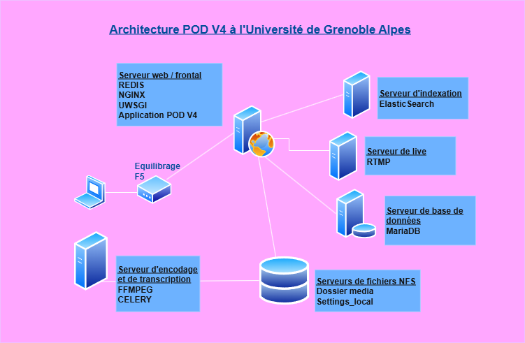

# Infrastructure Pod v4 à l'Université Grenoble Alpes (UGA)

## Contexte

|                         | Commentaires          |
|-------------------------|-----------------------|
| **Date de réalisation** | Septembre 2025        |
| **Version de Pod**      | Pod v4.0.0            |
| **Auteur**              | Alice LANGLOIS        |


Ce document présente l'infrastructure et l'installation de la plateforme POD V4 à l'Université Grenoble Alpes.
Celle ci a été installée "from scratch", et remplacera notre plateforme POD 3.8.
**Il s'agit d'une plateforme de préproduction, cette documentation sera mise à jour jusqu'à sa mise en production.**


## Présentation de l'infrastructure 



Cette infrastructure repose sur l'utilisation de :
- **Serveur web/frontal** : Pod v4, Nginx, uWSGI, Redis
- **Serveur d'encodage/transcription** : Celery, ffmpeg, Whisper, GPU Nvidia L4 
- **Serveur base de données** : MariaDB
- **Serveur d'indexation** : Elasticsearch
- **Serveur de fichiers** : serveur de fichiers partagé NFS entre le serveur frontal et d'encodage (40 To - 38 To utilisé)

Tous les serveurs tournent sur Debian 12.


### Etape 1 : Installation de POD V4

|                        | Commentaires                                      |
|------------------------|---------------------------------------------------|
| **Serveurs concernés** | serveur web/frontal, serveur d'encodage|
| **Documentations de référence** | [Documentation ESUP Pod](https://www.esup-portail.org/wiki/spaces/ES/pages/1163984902/Installation+de+la+plateforme+Pod+V3#InstallationdelaplateformePodV3-Environnement)|


#### Création de l'utilisateur POD

```
sudo adduser pod
adduser pod sudo
su pod
```
#### Installation de Python 3.12 et mise en place de l'environnement virtuel
```
apt install -y build-essential libssl-dev zlib1g-dev libbz2-dev \
    libreadline-dev libsqlite3-dev wget curl llvm libncurses5-dev libncursesw5-dev \
    xz-utils tk-dev libffi-dev liblzma-dev python3-openssl git
wget https://www.python.org/ftp/python/3.12.8/Python-3.12.8.tgz
tar -xf Python-3.12.8.tgz
cd Python-3.12.8
./configure --enable-optimizations
make -j 8
make altinstall
pip3.12 install virtualenvwrapper --break-system-packages
```

En tant que user POD, modifier le fichier `/home/pod/.bashrc` :
```
export WORKON_HOME=$HOME/.virtualenvs
export VIRTUALENVWRAPPER_PYTHON=/usr/local/bin/python3.12
source /usr/local/bin/virtualenvwrapper.sh 
```

Puis prendre en charge ces modifications :
```
source .bashrc 
```
Et enfin créer l‘environnement virtuel :

*sur le serveur frontal :*
```
mkvirtualenv --system-site-packages --python=/usr/local/bin/python3.12 django_pod4
```
*sur le serveur d'encodage :*
```
mkvirtualenv --system-site-packages --python=/usr/local/bin/python3.12 django_pod4_encode
mkvirtualenv --system-site-packages --python=/usr/local/bin/python3.12 django_pod4_transcript
```
> Pour entrer dans l'environnement virtuel :
> ```
> workon django_pod4
> ```

#### Récupération du projet Esup POD V4
```
mkdir /data/django4
chown pod:pod /data/django4
cd /data/django4
git clone https://github.com/EsupPortail/Esup-Pod.git podv4
cd podV4
pip3 install -r requirements.txt

```

Pour utiliser la base de données MySQL/MariaDB sur le serveur frontal (ou sur un serveur distant) il faut installer le moteur MySql/Python :
```
sudo apt install pkg-config python3-dev default-libmysqlclient-dev
```

Puis dans l'environnement `django_pod4`, installer le moteur Mysql/Python :

```
pip3 install mysqlclient
```

Création d'un dossier pour les logs de l'application :
```
mkdir /var/log/pod
ls -n /data/django4/podv4/pod/log /var/log/pod/
```
Dans l'espace partagé NFS, créer un dossier `Media` et un fichier `setting_local.py`
Faire un lien symbolique depuis le dossier pod des deux serveurs, afin que ces fichiers soient partagés entre les deux serveurs :
```
ls -n pod/custom/setting_local.py /data/NFS/setting_local.py
ls -n pod/media /data/NFS/media
```


### Etape 2 : Installation de MariaDB 10.11.6

|                        | Commentaires                                      |
|------------------------|---------------------------------------------------|
| **Serveurs concernés** | serveur base de données |
| **Documentations de référence**| [Documentation Esup POD](https://www.esup-portail.org/wiki/spaces/ES/pages/1163984911/Mise+en+production+de+la+plateforme+Pod+V3#MiseenproductiondelaplateformePodV3-BasededonnéesMySQL/MariaDB)


Après avoir installé MariaDB, éditer le fichier `/etc/mysql/mariadb.conf.d/50-server.cnf` :
```
character-set-server  = utf8
collation-server      = utf8_general_ci
```
Editer le fichier `etc/mysql/my.cnf` :
```
max_allowed_packet=256M
```
Donner les grant access à l'utilisateur pod :
```
GRANT ALL PRIVILEGES ON pod.* TO 'pod'@X.X.X.X IDENTIFIED BY 'mdp';
```
Installer le timezone dans le moteur mariaDB :
```
mysql_tzinfo_to_sql /usr/share/zoneinfo | mysql -u root -p mysql --database=mysql
```
Ajouter la configuration concernant la base de données dans le fichier `pod/custom/setting_local.py` :
```
DATABASES = { 
    'default': { 
        'ENGINE': 'django.db.backends.mysql', 
        'NAME': 'pod',
        'USER': 'pod',
        'mdp': 'ceciEstUnSecretBienGardé',
        'HOST': 'X.X.X.X',
        'PORT': '3306',
        'OPTIONS':
         { 'init_command': "SET storage_engine=INNODB, sql_mode='STRICT_TRANS_TABLES', innodb_strict_mode=1", }, } }
```

### Etape 3 : Installation de Redis
|                        | Commentaires                                      |
|------------------------|---------------------------------------------------|
| **Serveurs concernés** | serveur web/frontal|
| **Documentations de référence** | [Documentation Redis](https://redis.io/docs/latest/operate/oss_and_stack/install/install-redis/install-redis-on-linux/)|


Installer Redis :
```
curl -fsSL https://packages.redis.io/gpg | sudo gpg --dearmor -o /usr/share/keyrings/redis-archive-keyring.gpg
sudo chmod 644 /usr/share/keyrings/redis-archive-keyring.gpg
echo "deb [signed-by=/usr/share/keyrings/redis-archive-keyring.gpg] https://packages.redis.io/deb $(lsb_release -cs) main" | sudo tee /etc/apt/sources.list.d/redis.list
sudo apt-get update
sudo apt-get install redis
```
Pour activer et lancer Redis :
```
sudo systemctl enable redis-server
sudo systemctl start redis-server
```
Ajouter la configuration suivante dans `pod/custom/setting_local.py` :
```
CACHES = {
    "default": {
        "BACKEND": "django_redis.cache.RedisCache",
        "LOCATION": "redis://X.X.X.X:6379/3",
        "OPTIONS": {
            "CLIENT_CLASS": "django_redis.client.DefaultClient",
        },
        "KEY_PREFIX": "pod",
    },
    "select2": {
        "BACKEND": "django_redis.cache.RedisCache",
        "LOCATION": "redis://X.X.X.X:6379/2",
        "OPTIONS": {
            "CLIENT_CLASS": "django_redis.client.DefaultClient",
        },
    },
}

SESSION_ENGINE = "redis_sessions.session"
SESSION_REDIS = {
    "host": "X.X.X.X",
    "port": 6379,
    "db": 4,
    "prefix": "session",
    "socket_timeout": 1,
    "retry_on_timeout": False,
}
```
Modifier le fichier `/etc/redis/redis.conf` :
```
bind X.X.X.X 127.0.0.1
protect-mode : no
```
> Il faut remplacer X.X.X.X par l'adresse IP du serveur hebergeant Redis.

### Etape 4 : Mise en place de l'encodage
|                        | Commentaires                                      |
|------------------------|---------------------------------------------------|
| **Serveurs concernés** | serveur d'encodage|
| **Documentations de référence** | [Documentation Esup POD](https://www.esup-portail.org/wiki/spaces/ES/pages/1273004035/Gestion+de+l+encodage+de+la+transcription+de+l+xAPI+et+d+ActivityPub#Gestiondel'encodage,delatranscription,del'xAPIetd'ActivityPub-3.Déportésurunemachineouundockerenmicroservice)|


#### FFMPEG
Installer ffmpeg (version 5.1.6-0+deb12u1) :
```
sudo apt-get install ffmpeg ffmpegthumbnailer imagemagick
```
#### Celery
Vérifier que Celery est bien installé sur chaque environnement virtuel :
```
pip show celery
```

Ajouter la configuration suivante dans `pod/custom/setting_local.py` :
```
USE_REMOTE_ENCODING_TRANSCODING = True # Active encode
ENCODING_TRANSCODING_CELERY_BROKER_URL = "redis://X.X.X.X:6379/5" # on utilise la db numéro 5
POD_API_URL = "https://pod.univ.fr/rest/"
POD_API_TOKEN = "<token>"

USE_TRANSCRIPTION = True
TRANSCRIPTION_TYPE = "WHISPER"

TRANSCRIPTION_MODEL_PARAM = {
    'WHISPER': {
        'fr': {
            'model': "small",
            'download_root': "/whisper/",
        },
        'en': {
            'model': "small",
            'download_root': "/whisper/",
        }
    }
}
```
> Une fois que vous aurez accès à l'interface administrateur de votre POD, créez un jeton d'authentification lié à un utilisateur administateur sur l'application, qui sera la valeur de la variable `POD_API_TOKEN`

Créer le fichier `/etc/init.d/celeryd_encodet/etc/init.d/celeryd_transcript` et y mettre le contenu de [https://raw.githubusercontent.com/celery/celery/main/extra/generic-init.d/celeryd](https://raw.githubusercontent.com/celery/celery/main/extra/generic-init.d/celeryd) 

Puis rendre le fichier exécutable :
```
sudo chmod u+x /etc/init.d/celeryd_*
```
Créer le fichier `/etc/default/celeryd_encod` et insérer le contenu suivant :
```
CELERYD_NODES="worker-encodage"							    
CELERY_BIN="/data/.virtualenvs/django_pod4_encode/bin/celery"                	    
CELERY_APP="pod.video_encode_transcript.encoding_tasks"                            
CELERYD_CHDIR="/usr/local/django_projects/podv3"                                    
CELERYD_OPTS="--time-limit=86400 --concurrency=1 --max-tasks-per-child=1  --prefetch-multiplier=1 -Q encoding -n encode" 
CELERYD_LOG_FILE="/var/log/celery/%N.log"                                           
CELERYD_PID_FILE="/var/run/celery/%N.pid"                                           
CELERYD_USER="pod"                                                                  
CELERYD_GROUP="pod"                                                                 
CELERY_CREATE_DIRS=1                                                                
CELERYD_LOG_LEVEL="INFO"                                                
```
Créer le fichier `/etc/default/celeryd_transcript` et insérer le contenu suivant :
```
CELERYD_NODES="worker-transcript"
CELERY_BIN = "/data/.virtualenvs/django_pod4_transcript/bin/celery"
CELERY_APP="pod.video_encode_transcript.transcripting_tasks"                                    
CELERYD_CHDIR="data/django/podv4"                                                
CELERYD_OPTS="--time-limit=86400 --concurrency=1 --max-tasks-per-child=1  --prefetch-multiplier=1 -Q transcripting -n transcript" 
CELERYD_LOG_FILE="/var/log/celery/%N.log"                                           
CELERYD_PID_FILE="/var/run/celery/%N.pid"                                           
CELERYD_USER="pod"                                                                  
CELERYD_GROUP="pod"                                                                 
CELERY_CREATE_DIRS=1                                                                
CELERYD_LOG_LEVEL="INFO" 
```                                                 
Démarrer les workers Celery :
```
sudo /etc/init.d/celeryd_transcript start
sudo /etc/init.d/celeryd_encod start
```

> Au cas où, pour vérifier que le fichier pod.settings ne contient pas d'erreur (à exécuter dans l'environnement virtuel):
> ```
> python -m pod.settings
> ```


### Etape 5 : Installation d'Elasticsearch
|                        | Commentaires                                      |
|------------------------|---------------------------------------------------|
| **Serveurs concernés** | serveur d'indexation, serveur web/frontal|
| **Documentations de référence** | [Documentation ESUP Pod](https://www.esup-portail.org/wiki/spaces/ES/pages/1163984902/Installation+de+la+plateforme+Pod+V3#InstallationdelaplateformePodV3-Elasticsearch7et8), [Documentation Elastic.co](https://www.elastic.co/docs/deploy-manage/deploy/self-managed/install-elasticsearch-with-debian-package) |


#### Installation d'Elasticsearch (8.17.4) *(sur serveur d'indexation)*

Installer Java :
```
sudo apt-get install default-jdk
```
Installer ElasticSearch :
```
wget -qO - https://artifacts.elastic.co/GPG-KEY-elasticsearch | sudo gpg --dearmor -o /usr/share/keyrings/elasticsearch-keyring.gpg
echo "deb [signed-by=/usr/share/keyrings/elasticsearch-keyring.gpg] https://artifacts.elastic.co/packages/8.x/apt stable main" | sudo tee /etc/apt/sources.list.d/elastic-8.x.list
sudo apt-get update && sudo apt-get install elasticsearch
```
Création d'un user pod au niveau d'Elasticsearch :
```
sudo /usr/share/elasticsearch/bin/elasticsearch-users useradd pod -p podpod -r superuser
```
#### Paramétrage du mode sécurité d'ES 8 
Génération des certificats pour activer le TLS :
```
sudo /usr/share/elasticsearch/bin/elasticsearch-certutil ca
sudo /usr/share/elasticsearch/bin/elasticsearch-certutil cert --ca elastic-stack-ca.p12
```
> Deux certificats ont été créés : `/usr/share/elasticsearch/elastic-stack-ca.p12` et `/usr/share/elasticsearch/elastic-certificates.p12`

Lancer la commande `/usr/share/elasticsearch/bin/elasticsearch-certutil http` afin de générer des certificats pour le cryptage http.
Saisir les noms d'hôtes et les adresses IP des machines à partir desquelles vous souhaitez communiquer avec elaticsearch via http :
```
Generate a CDR => no
Use existing CA => yes
pod-web-v4
pod-sql-v4
pod-encod-v4

XXX.XXX.XXX.XXX
XXX.XXX.XXX.XXX
XXX.XXX.XXX.XXX
```
Copier les certificats dans `/etc/elasticsearch/`
```
sudo cp /usr/share/elasticsearch/elastic-stack-ca.p12 /usr/share/elasticsearch/elastic-certificates.p12 /etc/elasticsearch/
sudo chown pod:pod /etc/elasticsearch/elastic-stack-ca.p12 /etc/elasticsearch/elastic-certificates.p12
sudo chmod +r /etc/elasticsearch/elastic-stack-ca.p12 /etc/elasticsearch/elastic-certificates.p12
```
Modifier le fichier `/etc/elasticsearch.yml` :
```
xpack.security.http.ssl:
  enabled: true
  verification_mode: certificate
  keystore.path: /etc/elasticsearch/elastic-certificates.p12
  truststore.path: /etc/elasticsearch/elastic-certificates.p12

# Enable encryption and mutual authentication between cluster nodes
xpack.security.transport.ssl:
  enabled: true
  verification_mode: certificate
  keystore.path: /etc/elasticsearch/elastic-certificates.p12
  truststore.path: /etc/elasticsearch/elastic-certificates.p12
 ```

Définir les mots de passe :
```
bin/elasticsearch-keystore add xpack.security.http.ssl.keystore.secure_password
bin/elasticsearch-keystore add xpack.security.http.ssl.truststore.secure_password
bin/elasticsearch-keystore add xpack.security.transport.ssl.truststore.secure_password
bin/elasticsearch-keystore add xpack.security.transport.ssl.keystore.secure_password
```

#### Lancement et vérification d'Elasticsearch :
```
sudo systemctl daemon-reload
sudo systemctl enable elasticsearch.service
sudo systemctl start elasticsearch.service
```
Vérifier le fonctionnement d'ES 8 :
```
curl -k -XGET 'https://127.0.0.1:9200' -u pod:podpod
```
Résultat:
```
{
  "name" : "pod-1",
  "cluster_name" : "pod-application",
  "cluster_uuid" : "3HgKDjb6T7e6Mgt1oxB1Mg",
  "version" : {
    "number" : "8.17.4",
    "build_flavor" : "default",
    "build_type" : "deb",
    "build_hash" : "c63c7f5f8ce7d2e4805b7b3d842e7e792d84dda1",
    "build_date" : "2025-03-20T15:39:59.811110136Z",
    "build_snapshot" : false,
    "lucene_version" : "9.12.0",
    "minimum_wire_compatibility_version" : "7.17.0",
    "minimum_index_compatibility_version" : "7.0.0"
  },
  "tagline" : "You Know, for Search"
}
```
Installation du plugin ICU :
```
sudo bin/elasticsearch-plugin install analysis-icu
sudo systemctl restart elasticsearch.service
```
Ou alors, si vous rencontrez des problèmes de pare-feu :
```
sudo CLI_JAVA_OPTS="-Dhttp.proxyHost=proxy.univ.fr -Dhttp.proxyPort=3128 -Dhttps.proxyHost=proxy.univ.fr -Dhttps.proxyPort=3128" /usr/share/elasticsearch/bin/elasticsearch-plugin install analysis-icu
```
#### Création de l'index Pod *(sur serveur frontal)*

Modifier le fichier `pod/custom/setting_local.py` :
```
ES_VERSION = 8
ES_URL = ['http://elastic.univ.fr:9200/']
ES_OPTIONS = {'verify_certs' : False, 'basic_auth' : ('pod', 'mdp')}
```
Modifier le fichier requirements.txt :
```
elasticsearch==8.17.2
```
Et dans l'environnement virtuel `django_pod4` appliquer la modification précédente :
```
pip3 install -r requirements.txt
```
Puis lancer la création de l'index Pod :

```
python manage.py create_pod_index
```
> `Video index successfully created on ES.` Félicitations !

### Etape 6 : Installation de NGINX et UWSGI
|                        | Commentaires                                      |
|------------------------|---------------------------------------------------|
| **Serveurs concernés** | Serveur web/frontal|
| **Documentations de référence** | [Documentation ESUP Pod](https://www.esup-portail.org/wiki/spaces/ES/pages/1163984911/Mise+en+production+de+la+plateforme+Pod+V3#MiseenproductiondelaplateformePodV3-FrontalWebNGINX/UWSGIetfichiersstatiques)|

#### Installation de NGINX
```
sudo apt install nginx
sudo apt install nginx-extras
sudo /etc/init.d/nginx status
```
Configurer NGINX :
```
sudo vim /etc/nginx/sites-enabled/default
```
Commenter la ligne `listen [::]:80 default_server;`
```
sudo vim /etc/nginx/nginx.conf
```
Ajouter la ligne suivante :
```
http {
[...]
     # Pod Progress Bar : reserve 1MB under the name 'uploads' to track uploads 
 upload_progress uploadp 1m;
[...]
```
Copier le fichier `pod/pod_nginx.conf` dans le répertoire `pod/custom`, et modifier les paramètres si besoin.
```
cp /data/django4/podv4/pod_nginx.conf /data/django4/podv4/pod/custom/.
```
Créer un lien symbolique du fichier vers le dossier `sites-enabled` de NGINX, et redémarrer le service :
```
sudo ln -s pod/custom/pod_nginx.conf /etc/nginx/sites-enabled/pod_nginx.conf
/etc/init.d/nginx restart
```
#### Installation d'UWSGI
Dans l'environnement virtuel `django_pod4`, installer le module UWSGI :
```
pip3 install uwsgi
uwsgi --version
2.0.29
```
Copier le fichier `pod/pod_uwsgi.ini` dans le répertoire `pod/custom`, et modifier les paramètres :
```
cp pod/pod_uwsgi.ini pod/custom/.
vim pod/custom/pod_uwsgi.ini
```
```
chdir           = /data/django4/podv4
module          = pod.wsgi
home            = /home/pod/.virtualenvs/django_pod4
master          = true
processes       = 20
socket          = podv4.sock
chmod-socket    = 666
vacuum          = true
logto           = /var/log/pod/log/uwsgi.log
buffer-size     = 8192
```
Toujours dans l'environnement virtuel `django_pod4`, appliquer les paramètres :
```
sudo uwsgi --ini pod/custom/pod_uwsgi.ini --enable-threads --daemonize /var/log/pod/uwsgi-pod.log --uid pod --gid www-data --pidfile /tmp/pod.pid
```
Créer le service :
```
sudo nano /etc/systemd/system/uwsgi-pod.service
[Unit]
Description=Pod uWSGI app
After=syslog.target

[Service]
ExecStart=/usr/local/bin/uwsgi --ini /data/django4/podv4/pod/custom/pod_uwsgi.ini \
        --enable-threads \
        --pidfile /tmp/pod.pid
ExecStop=/usr/local/bin/uwsgi --stop /tmp/pod.pid
User=pod
Group=www-data
Restart=on-failure
KillSignal=SIGQUIT
Type=notify
StandardError=syslog
NotifyAccess=all

[Install]
WantedBy=multi-user.target
```
Puis activer le service, et le lancer :
```
sudo systemctl enable uwsgi-pod
sudo systemctl start uwsgi-pod
```

### Etape 7 : Installation des dépendances et mise en route

|                        | Commentaires                                      |
|------------------------|---------------------------------------------------|
| **Serveurs concernés** | Serveur web/frontal|
| **Documentations de référence** | [Documentation ESUP Pod](https://www.esup-portail.org/wiki/spaces/ES/pages/1163984902/Installation+de+la+plateforme+Pod+V3)|


Si besoin, installer Curl :
```
apt-get install -y curl
```
Installation de la dernière version de NodeJS (Node.js 22) et Yarn (1.22.22):
```
https://github.com/nodesource/distributions?tab=readme-ov-file#debian-versions
https://classic.yarnpkg.com/lang/en/docs/install/#windows-stable

curl -fsSL https://deb.nodesource.com/setup_22.x -o nodesource_setup.sh
bash nodesource_setup.sh
apt-get install nodejs -y
npm install --global yarn
npm install -g npm@11.2.0
yarn --version
```
En tant que user pod, installer les dépendances dans le dossier `pod` :
```
cd /data/django4/podv4/pod
yarn install
```
Dans l'environnement django_pod4, déployer les fichiers statiques :

```
python manage.py collectstatic --no-input --clear
```
Lancer le script `createDB`, afin de créer les fichiers de migration et la BDD :
```
make createDB
```
Dans l'environnement `django_pod4`, créer un superutilisateur POD :
```
python manage.py createsuperuser
```

### Configurer l'application POD

Voici la configuration de l'application POD à l'UGA : 
>Ces fichiers évoluerons lors du passage en https et lors de la mise en production des serveurs

`pod/custom/settings_local.py` :
```
SECRET_KEY = 'secretkey'

DATABASES = {
     'default': 
     { 'ENGINE': 'django.db.backends.mysql',
      'NAME': 'pod',
       'USER': 'pod', 
       'PASSWORD': 'mdp', 
       'HOST': 'X.X.X.X', 
       'PORT': '3306',
      'OPTIONS': { 'init_command': "SET storage_engine=INNODB, sql_mode='STRICT_TRANS_TABLES', innodb_strict_mode=1", }
      , } 
      }

DEBUG = False

ES_VERSION = 8
ES_URL = ['http://elastic.univ.fr:9200/']
ES_INDEX = "pod"
ES_OPTIONS = {'verify_certs' : False, 'basic_auth' : ('pod', 'podpod')}

ALLOWED_HOSTS = ['pod-univ.fr', 'pod-univ']
BASE_URL = 'http://pod.univ.fr'

USE_DOCKER = False

TIME_ZONE = 'Europe/Paris'
EMAIL_HOST = 'smtp.univ.fr'
EMAIL_PORT = 25
DEFAULT_FROM_EMAIL = 'pod@pod.fr'
SERVER_EMAIL = 'noreply@pod.fr'
ADMINS = ('Admin', 'admin@pod.fr' )
LANGUAGES = (
    ('fr', 'Français'),
    ('en', 'English')
)

AUTH_TYPE = (('local', 'local'), ('CAS', 'CAS'))

USE_CAS = True
CAS_GATEWAY = True
POPULATE_USER = 'LDAP'
CAS_SERVER_URL = 'https://cas.fr'
LDAP_SERVER = {'url': 'ldap.fr', 'port': port, 'use_ssl': False}
AUTH_LDAP_USER_SEARCH = ('ou=people,ou=univ,dc=agalan,dc=org', "(uid=%(uid)s)")
AUTH_LDAP_BIND_DN = 'cn=cn,ou=ou,dc=fr'
AUTH_LDAP_BIND_PASSWORD = 'ldapMDP'
USER_LDAP_MAPPING_ATTRIBUTES = {'first_name': 'givenName', 'last_name': 'sn', 'uid': 'uid', 'affiliations': 'employeeType', 'mail': 'mail', 'primaryAffiliation': 'employeeType', 'establishment': 'aglnPrimaryOrganizationName'}


USE_ESTABLISHMENT_FIELD = True
ESTABLISHMENTS =  ['uga', 'UGA']
AFFILIATION = ( ('E', ('student')), ('P', ('employee')), ('I', ('affiliate')) )
AFFILIATION_STAFF = ('P')
AFFILIATION_EVENT = ['P']
CREATE_GROUP_FROM_AFFILIATION = False
CREATE_GROUP_FROM_GROUPS = False

ACTIVE_VIDEO_COMMENT =  True

MODELTRANSLATION_FALLBACK_LANGUAGES = ('fr', 'en')

THIRD_PARTY_APPS = ['enrichment','live']


USE_PODFILE = True
USE_DRESSING = True
USE_CUT = True
USE_IMPORT_VIDEO = True
USER_VIDEO_CATEGORY = True
USE_FAVORITES = True
USE_PLAYLIST = True
USE_QUIZ = True


AFFILIATION_EVENT = ['staff']
VIEWERS_ONLY_FOR_STAFF = True
HEARTBEAT_DELAY = 90

USE_IMPORT_VIDEO = True
RESTRICT_EDIT_IMPORT_VIDEO_ACCESS_TO_STAFF_ONLY = True

HIDE_USERNAME = True

USE_HYPERLINKS = False

USE_REMOTE_ENCODING_TRANSCODING = True # Active encode
ENCODING_TRANSCODING_CELERY_BROKER_URL = "redis://X.X.X.X/5" # on utilise la db numéro 5

POD_API_URL = "http://pod-univ.fr/rest/"
POD_API_TOKEN = "<api_token>"

FFMPEG_CMD = "shuf -i 0-5 -n 1 | xargs -I{} ffmpeg"
FFMPEG_CRF = 29  # -crf 20 -maxrate 3M -bufsize 6M
FFMPEG_PRESET = "slow"
FFMPEG_PROFILE = "high"
FFMPEG_LEVEL = 0
FFMPEG_HLS_TIME = 2
FFMPEG_INPUT = '-hwaccel_device {} -hwaccel auto -hide_banner -threads %(nb_threads)s -i "%(input)s" '
FFMPEG_LIBX = "h264_nvenc -strict experimental"
FFMPEG_MP4_ENCODE = (
    '-map 0:v:0 %(map_audio)s -c:v %(libx)s  -vf "scale=-2:%(height)s" '
    + "-preset %(preset)s -profile:v %(profile)s "
    + "-pix_fmt nv12 -level %(level)s -crf %(crf)s "
    + "-maxrate %(maxrate)s -bufsize %(bufsize)s "
    + '-sc_threshold 0 -force_key_frames "expr:gte(t,n_forced*1)" '
    + "-max_muxing_queue_size 4000 "
    + '-c:a aac -ar 48000 -b:a %(ba)s -movflags faststart -y -vsync 0 "%(output)s" '
)


USE_TRANSCRIPTION = True
TRANSCRIPTION_TYPE = "WHISPER"

TRANSCRIPTION_MODEL_PARAM = {
    'WHISPER': {
        'fr': {
            'model': "small",
            'download_root': "/whisper/",
        },
        'en': {
            'model': "small",
            'download_root': "/whisper/",
        }
    }
}


CACHES = {
    "default": {
        "BACKEND": "django_redis.cache.RedisCache",
        "LOCATION": "redis://X.X.X.X:6379/3",
        "OPTIONS": {
            "CLIENT_CLASS": "django_redis.client.DefaultClient",
        },
        "KEY_PREFIX": "pod",
    },
    "select2": {
        "BACKEND": "django_redis.cache.RedisCache",
        "LOCATION": "redis://X.X.X.X:6379/2",
        "OPTIONS": {
            "CLIENT_CLASS": "django_redis.client.DefaultClient",
        },
    },
}
SESSION_ENGINE = "redis_sessions.session"
SESSION_REDIS = {
    "host": "X.X.X.X",
    "port": 6379,
    "db": 4,
    "prefix": "session",
    "socket_timeout": 1,
    "retry_on_timeout": False,
}

TEMPLATE_VISIBLE_SETTINGS = {
    "TITLE_SITE": "Esup.Pod",
    "TITLE_ETB": "UGA",
    "LOGO_SITE": "img/logoPod.svg",
    "LOGO_COMPACT_SITE": "img/logoPod.svg",
   # "LOGO_ETB": "img/logo_etb.svg",
    "LOGO_PLAYER": "img/logoPod.svg",
    "FOOTER_TEXT": (
        "La Maison des Universités 103 Bvd St Michel",
        "75005  PARIS - France"
    ),
    "LINK_PLAYER": "http://www.univ.fr",
   # "CSS_OVERRIDE": "custom/mycss.css",
    "PRE_HEADER_TEMPLATE": ""
}


```

`pod/custom/pod_nginx.conf`:
```
# the upstream component nginx needs to connect to
upstream django {

  server unix:///data/django4/podv4/podv4.sock;

}

# configuration of the server
server {
  # the port your site will be served on
  listen      80 default_server;
  # the domain name it will serve for
  server_name pod-univ.fr
  charset     utf-8;

  # max upload size
  client_max_body_size 4G;   # adjust to taste
  # Allow to download large files
  uwsgi_max_temp_file_size 0;

  error_log /var/log/pod/nginx_pod_error.log;

  location ^~ /progressbarupload/upload_progress {
    # JSON document rather than JSONP callback, pls
    upload_progress_json_output;
    report_uploads uploadp;
  }

  # Django media
  location /media  {
    expires 1y;
    add_header Cache-Control "public";
    gzip on;
    gzip_types text/vtt;
    alias /data/django4/podv4/pod/media;  # your Django project's media files - amend as required
  }

  location /static {
    alias /data/django4/podv4/pod/static/; # your Django project's static files - amend as required
  }

  # Finally, send all non-media requests to the Django server.
  location / {
    uwsgi_pass  django;
    include /data/django4/podv4/uwsgi_params; # the uwsgi_params file you installed
    track_uploads uploadp 30s;
  }
}

```

> Une fois ces étapes réalisées, vous devriez avoir une application POD fonctionnelle (ajout, encodage et publication de vidéos).
Vous pouvez enrichir et personnaliser votre POD grâce aux [différentes variables de configuration](https://github.com/EsupPortail/Esup-Pod/blob/main/CONFIGURATION_FR.md) à ajouter sur votre fichier `settings_local.py`

