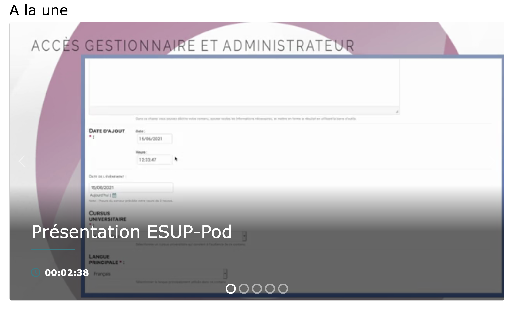
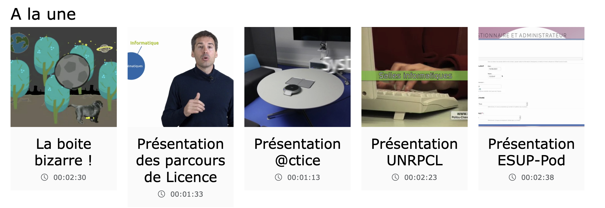

# Setting up display blocks on a static page (homepage)

> ⚠️ Documentation to be tested on Pod v4.
>
> This section only concerns ESUP-Pod version 3.6.0 and later. Since this version, displaying the latest videos on the homepage has been replaced by the use of blocks. A default block (Latest videos) is created to keep the equivalent. To display upcoming events, if you have enabled “live”, you must add a block of type “Upcoming events”.
> The following variables are deprecated (they are now configurable in each block):
>
> * HOMEPAGE_SHOWS_PASSWORDED
> * HOMEPAGE_SHOWS_RESTRICTED
> * HOMEPAGE_VIEW_VIDEOS_FROM_NON_VISIBLE_CHANNELS
> * HOMEPAGE_NB_VIDEOS
> * SHOW_EVENTS_ON_HOMEPAGE
{: .alert .alert-warning}

This feature allows you to “decorate” your static pages, and mainly your homepage, by adding customizable content blocks. For example, you can add a carousel whose content is a channel, or a list of the most viewed videos. This configuration is done in the administration interface, tab **Main configurations → Blocks**.

## Types of block

### Carousel

The carousel (or slider) allows you to display full-width content that can scroll.

### Multiple carousel

Just like the carousel, this type allows you to display several thumbnails (configurable) on the same line, with scrolling enabled.

### Card list

This is the standard display mode in the form of cards.

### HTML

You can add HTML content through this block. This allows you, for example, to insert a ` ` tag between each block.

## Types of data

### Channel

Displays all videos contained in a **channel**. If the channel contains themes, the videos from those themes will also be included.

### Theme

Displays all videos contained in a **theme**.

### Playlist

Displays all videos contained in a **playlist**.

### Latest videos

Displays the most recently added videos on the ESUP-Pod platform (configurable).

### Most viewed

Displays the most viewed / accessed videos (configurable).

### Upcoming events

Displays upcoming events if the “LIVE” option is enabled (configurable).

## Configuring the addition or modification of a block

* **Title**
  Makes it easy to find your block in the administration.

* **Order**
  Defines the order of the blocks on the page.

* **Page**
  Define the static page on which the block will be applied.

* **Sites**
  Define the sites concerned.

* **Type**
  Choose the display type of the content (see the “Types of block” section).

* **Data type**
  Choose the type of content to display (see the “Types of data” section). Depending on the choice, an additional field may appear to select the source data.

* **Displayed title (lang)**
  Define the title to be displayed at the beginning of the block. It is possible to add the language versions available on your platform.

* **No cache**
  If checked, the block will not be cached.

* **Debug**
  If checked, debug information will be displayed in the block to facilitate troubleshooting (do not leave enabled in production!).

* **Show restricted content**
  If checked, restricted videos (in draft mode) will be displayed in the different data types.

* **Must be authenticated**
  If checked, the block will only be displayed when the user is logged in (authenticated).

* **Automatic scrolling**
  If checked, automatic scrolling will be active (for the “carousel” and “multiple carousel” types).

* **Number of items**
  Define the number of items to display (videos or events).

* **Number of items for the multiple carousel**
  Define the number of cards per line for the multiple carousel.

* **Show videos from a non-visible channel**
  If checked, videos from a non-visible channel will be displayed.

* **Show password-protected videos**
  If checked, password-protected videos will be displayed in the different data types.
