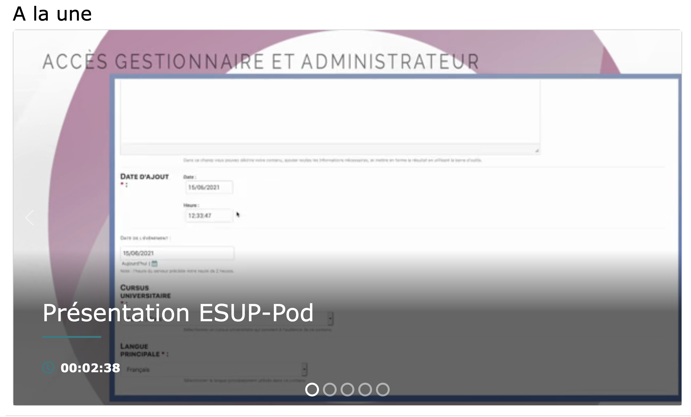
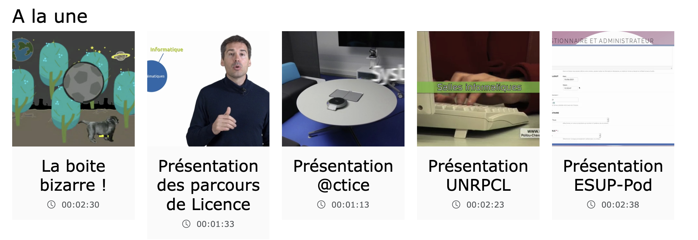
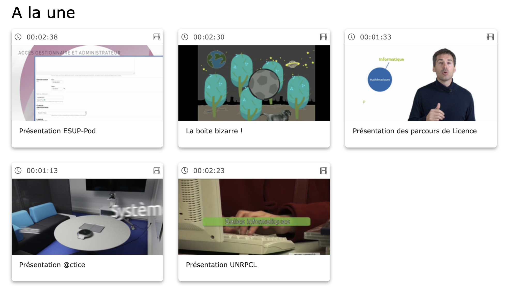

# Mise en place des blocs d'affichage sur une page statique (page d'accueil)

> ⚠️ Documentation à tester sur un Pod v4.

> Ce paragraphe ne concerne que les versions de ESUP-Pod 3.6.0 et suivantes. Depuis cette version, l’affichage des dernières vidéos sur la page d’accueil est remplacé par l’affichage de blocs. Un bloc par défaut (Dernières vidéos) est créé pour conserver l’équivalent. Pour faire afficher les prochains événements, si vous avez activé le “live”, il vous faudra ajouter un bloc de type “Prochains événements”.
> Les variables suivantes sont obsolètes (elles sont désormais configurables dans chaque bloc) :
>
> * HOMEPAGE_SHOWS_PASSWORDED
> * HOMEPAGE_SHOWS_RESTRICTED
> * HOMEPAGE_VIEW_VIDEOS_FROM_NON_VISIBLE_CHANNELS
> * HOMEPAGE_NB_VIDEOS
> * SHOW_EVENTS_ON_HOMEPAGE
{: .alert .alert-warning}

Ce dispositif permet de « décorer » vos pages statiques, et principalement votre page d’accueil, en y ajoutant des blocs de contenus personnalisables. Par exemple, on peut ajouter un carrousel dont le contenu est une chaîne, ou bien une liste des vidéos les plus vues. Ce paramétrage se fait dans l’interface d’administration, onglet **Configurations principales → Blocs**.

## Types de bloc

### Carrousel

Le carrousel (ou slider) permet d’afficher un contenu en pleine largeur qui peut défiler.

### Carrousel multiple

De la même manière que le carrousel, ce type permet d’afficher plusieurs vignettes (paramétrables) sur une même ligne, avec possibilité de défilement.

### Liste de cartes

C’est le mode d’affichage standard sous forme de cartes.

### HTML

Vous pouvez ajouter du contenu HTML via ce bloc. Cela permet, par exemple, d’insérer une balise ` ` entre chaque bloc.

## Types de données

### Chaîne

Affiche toutes les vidéos contenues dans une **chaîne**. Si la chaîne contient des thèmes, les vidéos de ces thèmes seront également incluses.

### Thème

Affiche toutes les vidéos contenues dans un **thème**.

### Liste de lecture

Affiche toutes les vidéos contenues dans une **playlist**.

### Dernières vidéos

Affiche les vidéos les plus récemment ajoutées sur la plateforme ESUP-Pod (paramétrable).

### Les plus vues

Affiche les vidéos les plus vues / consultées (paramétrable).

### Prochains événements

Affiche les prochains événements (à venir) si l’option “LIVE” est activée (paramétrable).

## Paramétrage de l’ajout ou de la modification d’un bloc

* **Titre**
  Permet de retrouver facilement votre bloc dans l’administration.

* **Ordre**
  Organise l’ordre des blocs sur la page.

* **Page**
  Définir la page statique sur laquelle le bloc sera appliqué.

* **Sites**
  Définir les sites concernés.

* **Type**
  Choisir le type d’affichage du contenu (voir la section “Types de bloc”).

* **Type de données**
  Choisir le type de contenu à afficher (voir la section “Types de données”). Selon le choix, un champ supplémentaire peut apparaître pour sélectionner la donnée source.

* **Titre affiché (lang)**
  Définir le titre à afficher au début du bloc. Il est possible d’ajouter les versions linguistiques présentes sur votre plateforme.

* **Pas de cache**
  Si coché, le bloc ne sera pas mis en cache.

* **Debug**
  Si coché, des informations de debug seront affichées dans le bloc pour faciliter la correction (ne pas laisser activé en production !).

* **Montrer le contenu restreint**
  Si coché, les vidéos restreintes (en mode brouillon) seront affichées dans les différents types de données.

* **Doit être authentifié**
  Si coché, le bloc ne sera affiché que lorsque l’utilisateur est connecté (authentifié).

* **Défilement automatique**
  Si coché, le défilement automatique sera actif (pour les types “carrousel” et “carrousel multiple”).

* **Nombre d’éléments**
  Définir le nombre d’éléments à afficher (vidéos ou événements).

* **Nombre d’éléments pour le carrousel multiple**
  Définir le nombre de cartes par ligne pour le carrousel multiple.

* **Voir les vidéos d’une chaîne non visible**
  Si coché, les vidéos d’une chaîne non visible seront affichées.

* **Voir les vidéos avec un mot de passe**
  Si coché, les vidéos protégées par mot de passe seront affichées dans les différents types de données.
