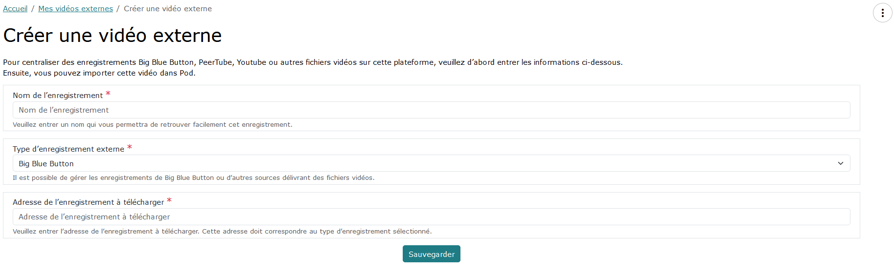
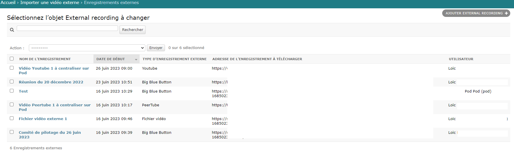

- [Import an external video / BigBlueButton recording in video format](#import-an-external-video--bigbluebutton-recording-in-video-format)
  - [Context and application of meetings in Esup-Pod](#context-and-application-of-meetings-in-esup-pod)
  - [Esup-Pod Interface / My Big Blue Button Meetings](#esup-pod-interface--my-big-blue-button-meetings)
  - [Big Blue Button](#big-blue-button)
  - [Esup-Pod Interface / Big Blue Button Meeting Recordings](#esup-pod-interface--big-blue-button-meeting-recordings)
  - [Problem and solution provided](#problem-and-solution-provided)
    - [The problem](#the-problem)
    - [The solution](#the-solution)
  - [Solution architecture](#solution-architecture)
    - [Enable video format recording in Big Blue Button 2.6 and above](#enable-video-format-recording-in-big-blue-button-26-and-above)
    - [Choice of Python modules used and prerequisites](#choice-of-python-modules-used-and-prerequisites)
    - [Problem related to the import of YouTube videos](#problem-related-to-the-import-of-youtube-videos)
    - [Configuration of the Import\_Video application](#configuration-of-the-import_video-application)
  - [Usage](#usage)
    - [Creation of an external video](#creation-of-an-external-video)
    - [List of external videos](#list-of-external-videos)
    - [Possible errors](#possible-errors)
  - [Operation](#operation)

# Import an external video / BigBlueButton recording in video format

## Context and application of meetings in Esup-Pod

Since version 3.X of Esup-Pod, and the implementation of the meetings application - based on a Big Blue Button (BBB) architecture - users can now use this platform as a central point for everything related to videos as well as virtual classrooms and video conferencing meetings.

As a reminder, the meetings module of Esup-Pod is based on a Big Blue Button architecture (https://bigbluebutton.org/) which is a virtual classroom tool, with the following features:

- Video/webcam
- Audio
- Chat
- Document sharing + annotation
- Screen sharing
- Polling
- Recording
- Group creation
- Shared notes
- Integration of external videos
- Integration with Moodle, WordPress, Esup-Pod...

## Esup-Pod Interface / My Big Blue Button Meetings


## Big Blue Button


## Esup-Pod Interface / Big Blue Button Meeting Recordings


> In this interface, the action "Upload to Esup-Pod as a video" is available because we are using a Big Blue Button 2.6 architecture with the video recording system (see paragraph below).

## Problem and solution provided

### The problem

Thus, by using Esup-Pod to conduct our meetings, virtual classrooms, and other video conferences, we also have access to their recordings directly in Esup-Pod, and we have the ability to import these recordings into Pod directly with one click.

However, when using other external services or applications to conduct these meetings, virtual classrooms, and other video conferences (typically, conducting a Big Blue Button virtual classroom via Moodle), there was previously no tool to easily import these recordings into the platform.

### The solution

The solution then relies on the application for importing external videos into Esup-Pod.

This solution is based on:

- Recording sessions in Big Blue Button in video format, natively thanks to version 2.6 and above of Big Blue Button.
- Developing, in Esup-Pod, the module for importing videos from the following sources:
    - Big Blue Button (if video recording has been installed)
    - Direct video file
    - PeerTube
    - YouTube

> Currently, this list is exhaustive but may evolve according to needs.

## Solution architecture

### Enable video format recording in Big Blue Button 2.6 and above

As explained above, if you want to be able to import Big Blue Button recordings into Esup-Pod, it is necessary for these recordings to be saved in video format.

> ⚠️ Enabling this video format recording in Big Blue Button will require more storage space on the Big Blue Button architecture.

To do this, here is the procedure to follow for each BBB 2.6+ server in the architecture (see documentation https://docs.bigbluebutton.org/administration/customize/#install-additional-recording-processing-formats):

- Install the additional recording processing video format via the following command:

```bash
sudo apt install bbb-playback-video
```

- Perform the following configuration in the file /usr/local/bigbluebutton/core/scripts/bigbluebutton.yml:

```yaml
steps:
  archive: 'sanity'
  sanity: 'captions'
  captions:
    - 'process:presentation'
    - 'process:video'
  'process:presentation': 'publish:presentation'
  'process:video': 'publish:video'
```

- Optimization (optional):

By default, the encoded video does not seem to be of very good quality.

After research, it turns out that the encoding is done by default with the following ffmpeg parameters: -preset fast -crf 23

To modify this behavior, it is possible to tweak the following file:

    - /usr/local/bigbluebutton/core/lib/recordandplayback/edl/video.rb: FFMPEG_WF_ARGS section

```python
FFMPEG_WF_ARGS = [
        '-codec', FFMPEG_WF_CODEC.to_s, '-preset', 'fast', '-crf', '23',
        '-x264opts', 'stitchable=1', '-force_key_frames', 'expr:gte(t,n_forced*10)', '-pix_fmt', 'yuv420p',
      ]
```

Personally, I directly modified the values in this file to set: -preset medium -crf 20

- At a minimum, restart the recording processing queue:

```bash
sudo systemctl restart bbb-rap-resque-worker.service
# It may also be necessary to restart the Nginx service
# Personally, I prefer to restart all BBB services (be careful if there are sessions in progress) via:
# sudo bbb-conf --restart
```

- If necessary, remove the footer “Recorded by bigbluebutton“ by editing the file **/usr/local/bigbluebutton/core/playback/video/index.html.erb** and removing the *footer*.

In a second step, it will probably be interesting to create a script (if it does not exist by then) to delete the generated video files after a certain time (configurable).

### Choice of Python modules used and prerequisites

No specific Python module was useful for importing videos from Big Blue Button, PeerTube, or direct access.

However, for importing videos from YouTube, I used the Python module **PyTube**, which seems to be a reference for importing YouTube videos: https://pytube.io/en/latest/

It would also have been possible to use the Python module YT-DLP: https://github.com/yt-dlp/yt-dlp

### Problem related to the import of YouTube videos

June 2023, August and September 2023 - YouTube Update

Following the YouTube update of June 2023, August 2023, and September 2023, PyTube is not yet up to date.

It was then necessary to directly update the code in **/home/pod/.virtualenvs/django_pod4/lib/python3.11/site-packages/pytube/cipher.py**

The update for July and August concerns the following chain: https://github.com/pytube/pytube/commit/22d20bd92b3bb16a5fb5d7d86572d97287161e8f with the more recent addition of https://github.com/pytube/pytube/issues/1750

The update for September concerns an error of the type ('NoneType' object has no attribute 'span'): https://medium.com/@hasan.trz/pytube-cipher-py-attributeerror-nonetype-object-has-no-attribute-span-37ff564f1272

In the end, this involves changing the function_patterns variable on line 264 of the cipher.py file with this code:

```python
function_patterns = [
 # https://github.com/ytdl-org/youtube-dl/issues/29326#issuecomment-865985377
 # https://github.com/yt-dlp/yt-dlp/commit/48416bc4a8f1d5ff07d5977659cb8ece7640dcd8
 # var Bpa = [iha];
 # ...
 # a.C && (b = a.get("n")) && (b = Bpa[0](b), a.set("n", b),
 # Bpa.length || iha("")) }};
 # In the above case, `iha` is the relevant function name
 r'a\\.[a-zA-Z]\\s*&&\\s*\\([a-z]\\s*=\\s*a\\.get\\("n"\\)\\)\\s*&&.*?\\|\\|\\s*([a-z]+)',
 r'\\([a-z]\\s*=\\s*([a-zA-Z0-9$]+)(\\[\\d+\\])\\([a-z]\\)',
]
```

And modifying line 411 of the same cipher.py file with this code:

```python
# transform_plan_raw = find_object_from_startpoint(raw_code, match.span()[1] - 1)
transform_plan_raw = js
```

The simplest way is to replace this cipher.py file with this one: [Cipher.py](import-external-video-bbb-recording_screens/cipher.py)

A PyTube update should be coming soon; it will be enough to update this module via the following command: python3 -m pip install --upgrade pytube

⚠️ If this PyTube module is not regularly updated, I will replace it with the Python module YT-DLP: https://github.com/yt-dlp/yt-dlp

### Configuration of the Import_Video application

The configuration of the external video import module is done, as usual, via the settings_local.py file, using the following parameters:

| Parameter | Minimum Version | Default Value | Description |
|-----------|------------------|-------------------|-------------|
| USE_IMPORT_VIDEO | 3.3.0 | True | Activation of the video import application (True / False) |
| RESTRICT_EDIT_IMPORT_VIDEO_ACCESS_TO_STAFF_ONLY | 3.3.0 | True | Only "staff" users can import videos (True / False) |
| MAX_UPLOAD_SIZE_ON_IMPORT | 3.3.1 | 4 | Maximum size in GB of video files that can be uploaded to the platform via the import_video module (0 = no limit) |
{: .table .table-striped}

## Usage

The use of this external video import module has been designed to be as simple as possible for the user and is similar to the management of recordings from the Big Blue Button meetings module.

### Creation of an external video

Before importing an external video, it is necessary to create it first.



> The address of the recording to download must correspond to a publicly accessible URL.

### List of external videos

If the import into Esup-Pod seems possible, the import action is displayed to the user.


In the list above, we can see that it is not possible to upload the "Meeting of December 20, 2022" to Esup-Pod. This is explained by the fact that it is a recording of a somewhat old BBB meeting, for which only the Web presentation is available; there is no video file available and therefore no import is possible.

### Possible errors

Depending on the type of video to import to Esup-Pod, it may not be possible to import (only publicly accessible videos can be uploaded to Esup-Pod); in this kind of case, an error message will then be displayed to the user with a proposed solution.

For example, when attempting to import a non-public YouTube video, the error message will be as follows:


## Operation

This module does not require any particular operation: normally, users should be able to be autonomous.

If necessary, the Esup-Pod administrator can always access the external recordings in the administration, under the Import an external video / External recordings tab.


