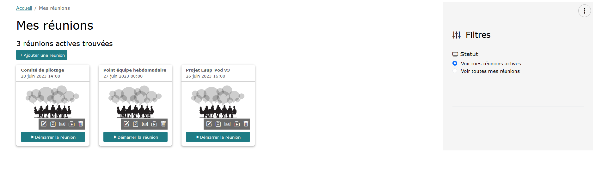
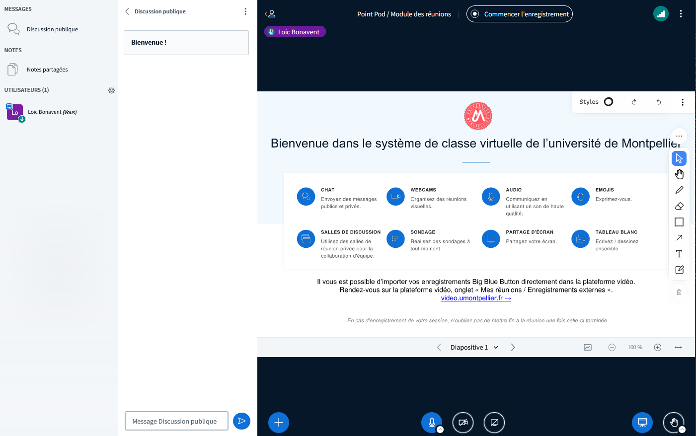
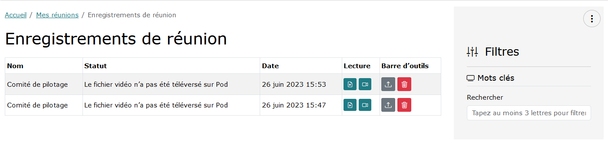
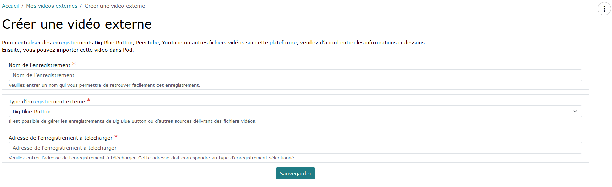
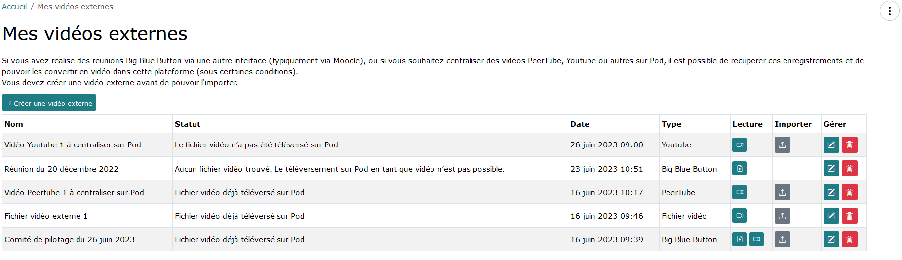
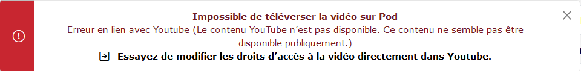
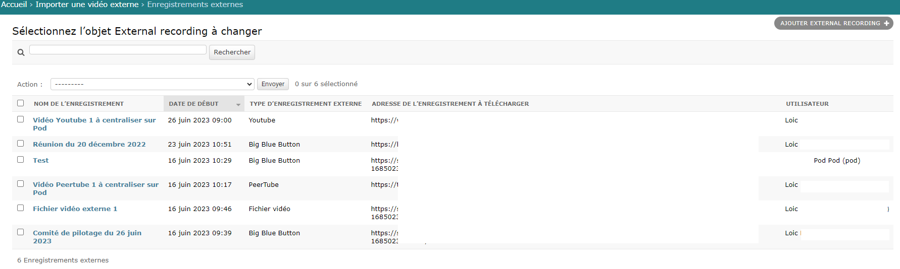

# Importer une vidéo externe / un enregistrement BigBlueButton au format vidéo

## Contexte et application des réunions dans Esup-Pod

Depuis la version 3.X d'Esup-Pod, et la mise en place de l'application de réunions - reposant sur une architecture Big Blue Button (BBB) - il est dorénavant possible aux usagers d'utiliser cette plateforme comme point central pour tout ce qui concerne les vidéos ainsi que pour les classes virtuelles et réunions en visioconférence.

Pour rappel, le module des réunions d'Esup-Pod repose sur une architecture Big Blue Button (https://bigbluebutton.org/) qui est un outil de classe virtuelle, ayant les fonctionnalités suivantes :

- Vidéo/webcam
- Audio
- Chat
- Partage de document + annotation
- Partage d’écran
- Sondage
- Enregistrement
- Création de groupes
- Prises de notes partagées
- Intégration de vidéos externes
- Intégration Moodle, WordPress, Esup-Pod...

## Interface Esup-Pod / Mes réunions Big Blue Button



## Big Blue Button



## Interface Esup-Pod / Enregistrements de réunion Big Blue Button



> Dans cette interface, l'action "Téléverser sur Esup-Pod en tant que vidéo" est disponible car nous utilisons une architecture Big Blue Button 2.6 avec le système d'enregistrement vidéo (cf. paragraphe ci-dessous).


## Problématique et solution apportée

### La problématique

Ainsi, en passant par Esup-Pod pour réaliser nos réunions, classes virtuelles et autres visioconférences, nous avons également accès aux enregistrements de celles-ci, directement dans Esup-Pod et nous avons la possibilité d'importer ces enregistrements dans Pod directement en un clic.

Cependant, lorsque nous utilisons d'autres services ou applications externes pour réaliser ses réunions, classes virtuelles et autres visioconférences (typiquement, réaliser une classe virtuelle Big Blue Button via Moodle), il n'y avait jusque là aucun outil permettant d'importer facilement ces enregistrements dans la plateforme.

### La solution

La solution repose alors sur l'application d'import des vidéos externes dans Esup-Pod.

Cette solution repose sur :

- l'enregistrement des sessions sous Big Blue Button au format vidéo, de façon native grâce à la version 2.6 et + de Big Blue Button.
- le développement, dans Esup-Pod, du module d'import des vidéos en provenance de sources suivantes :
    - Big Blue Button (si l'enregistrement vidéo a été installé)
    - Fichier vidéo direct
    - PeerTube
    - Youtube

> A l'heure actuelle, cette liste est exhaustive mais peut être amené à évoluer selon les besoins.

## Architecture de la solution

### Activer l'enregistrement au format vidéo dans Big Blue Button 2.6 et supérieure

Comme expliqué ci-dessus, si l'on souhaite pouvoir importer sur Esup-Pod les enregistrements Big Blue Button, il est nécessaire que ces derniers soient sauvegardés au format vidéo.

> ⚠️ Le fait d'activer cet enregistrement au format vidéo dans Big Blue Button va demander plus d'espace de stockage sur l'architecture Big Blue Button.

Pour ce faire, voici la marche à suivre pour chaque serveur BBB 2.6+ de l'architecture (cf. documentation https://docs.bigbluebutton.org/administration/customize/#install-additional-recording-processing-formats) :

- Installer le format vidéo de traitement d'enregistrement supplémentaire via la commande suivante :

```bash
sudo apt install bbb-playback-video
```

- Réaliser la configuration suivante dans le fichier /usr/local/bigbluebutton/core/scripts/bigbluebutton.yml :

```yaml
steps:
  archive: 'sanity'
  sanity: 'captions'
  captions:
    - 'process:presentation'
    - 'process:video'
  'process:presentation': 'publish:presentation'
  'process:video': 'publish:video'
```

- Optimisation (optionnelle) :

Par défaut, la vidéo encodée ne me semble pas être de très bonne qualité.

Après recherche, il s'avère que l'encodage se réalise par défaut avec les paramètres ffmpeg suivants : -preset fast -crf 23

Pour modifier ce comportement, il est possible de jouer sur le fichier suivant :

    - /usr/local/bigbluebutton/core/lib/recordandplayback/edl/video.rb : partie FFMPEG_WF_ARGS

```py
FFMPEG_WF_ARGS = [
        '-codec', FFMPEG_WF_CODEC.to_s, '-preset', 'fast', '-crf', '23',
        '-x264opts', 'stitchable=1', '-force_key_frames', 'expr:gte(t,n_forced*10)', '-pix_fmt', 'yuv420p',
      ]
```

Personnellement, c'est sur ce fichier que j'ai directement modifié les valeurs, pour mettre : -preset medium -crf 20

- Redémarrer à minima la file d'attente de traitement d'enregistrements :

```bash
sudo systemctl restart bbb-rap-resque-worker.service
# Il se peut qu'il faille aussi redémarrer le service Nginx
# Personnellement, je préfère redémarrer tous les services BBB (attention s'il y a des sessions en cours) via :
# sudo bbb-conf --restart
```

- Si nécessaire, supprimer le bas de page “Recorded by bigbluebutton“ en éditant le fichier **/usr/local/bigbluebutton/core/playback/video/index.html.erb** et en supprimant le *footer*.

Dans un deuxième temps, il sera sûrement intéressant de réaliser un script (s'il n'existe pas d'ici là) permettant de supprimer les fichiers vidéos générées au bout d'un certain temps (paramétrable).

### Choix des modules Python utilisés et pré-requis

Aucune module spécifique Python n'a été utile pour l'import des vidéos depuis Big Blue Button, PeerTube ou en accès direct.

Par contre, pour l'import des vidéos en provenance de Youtube, j'ai utilisé le module Python **PyTube**, qui semble être une référence pour l'import des vidéos Youtube : https://pytube.io/en/latest/

Il aurait aussi été possible d'utiliser le module Python YT-DLP : https://github.com/yt-dlp/yt-dlp

### Problématique en lien avec l'import des vidéos Youtube

Juin 2023, Août et Septembre 2023 - Mise à jour Youtube

Suite à la mise à jour de Youtube de Juin 2023, d'Août 2023 et de Septembre 2023, PyTube n'est pas encore à jour.

Il a alors été nécessaire de réaliser directement la mise à jour de code directement dans **/home/pod/.virtualenvs/django_pod4/lib/python3.11/site-packages/pytube/cipher.py**

La mise à jour pour Juillet et Août concerne la chaîne suivante : https://github.com/pytube/pytube/commit/22d20bd92b3bb16a5fb5d7d86572d97287161e8f avec l'ajout plus récent de https://github.com/pytube/pytube/issues/1750

La mise à jour pour Septembre concerne une erreur du type ('NoneType' object has no attribute 'span') : https://medium.com/@hasan.trz/pytube-cipher-py-attributeerror-nonetype-object-has-no-attribute-span-37ff564f1272

Au final, cela revient à changer la variable function_patterns de la ligne 264 du fichier cipher.py avec ce code :

```py
function_patterns = [
 # https://github.com/ytdl-org/youtube-dl/issues/29326#issuecomment-865985377
 # https://github.com/yt-dlp/yt-dlp/commit/48416bc4a8f1d5ff07d5977659cb8ece7640dcd8
 # var Bpa = [iha];
 # ...
 # a.C && (b = a.get("n")) && (b = Bpa[0](b), a.set("n", b),
 # Bpa.length || iha("")) }};
 # In the above case, `iha` is the relevant function name
 r'a\\.[a-zA-Z]\\s*&&\\s*\\([a-z]\\s*=\\s*a\\.get\\("n"\\)\\)\\s*&&.*?\\|\\|\\s*([a-z]+)',
 r'\\([a-z]\\s*=\\s*([a-zA-Z0-9$]+)(\\[\\d+\\])\\([a-z]\\)',
]
```

Et de modifier la ligne 411 du même fichier cipher.py avec ce code :

```py
# transform_plan_raw = find_object_from_startpoint(raw_code, match.span()[1] - 1)
transform_plan_raw = js
```

Le plus simple est de remplacer ce fichier cipher.py par celui-ci : [Cipher.py](import-external-video-bbb-recording_screens/cipher.py)

Une mise à jour de PyTube ne devrait plus tarder à arriver; il suffira de mettre à jour ce module via la commande suivante : python3 -m pip install --upgrade pytube

⚠️ Si ce module PyTube n'est pas mis à jour régulièrement, je le remplacerai par le module Python YT-DLP : https://github.com/yt-dlp/yt-dlp

### Configuration de l'application Import_Video

Le paramétrage du module d'import des vidéos externes se réalise, comme habituellement, via le fichier de settings_local.py, avec l'utilisation des paramètres suivants :

| Paramètre | Version minimale | Valeur par défaut | Description |
|-----------|------------------|-------------------|-------------|
| USE_IMPORT_VIDEO | 3.3.0 | True | Activation de l’application d'import des vidéos (True / False) |
| RESTRICT_EDIT_IMPORT_VIDEO_ACCESS_TO_STAFF_ONLY | 3.3.0 | True | Seuls les utilisateurs "staff" pourront importer des vidéos (True / False) |
| MAX_UPLOAD_SIZE_ON_IMPORT | 3.3.1 | 4 | Taille maximum en Go des fichiers vidéos qui peuvent être téléversés sur la plateforme via le module import_video (0 = pas de limite) |
{: .table .table-striped}

## Utilisation

L'utilisation de ce module d'import des vidéos externes a été pensé pour être le plus simple possible pour l'usager et se rapproche de la gestion des enregistrements du module des réunions Big Blue Button.

### Création d'une vidéo externe

Avant de pouvoir importer une vidéo externe, il est nécessaire de la créer dans un premier temps.



> L'adresse de l'enregistrement à télécharger doit correspondre à une URL accessible publiquement.

### Liste des vidéos externes

Si l'import dans Esup-Pod paraît possible, l'action d'import est affiché à l'utilisateur.



Dans la liste ci-dessus, nous pouvons voir qu'il n'est pas possible de téléverser dans Esup-Pod la "Réunion du 20 décembre 2022". Cela s'explique par le fait qu'il s'agisse d'un enregistrement d'une réunion BBB quelque peu ancienne, pour laquelle seule la présentation Web est disponible; il n'y a pas de fichier vidéo disponible et donc pas d'import réalisable.

### Erreurs possibles

Selon le type de vidéo à importer sur Esup-Pod, il se peut que l'import ne soit pas possible (seules les vidéos accessibles publiquement peuvent être téléversées sur Esup-Pod); dans ce genre de cas, un message d'erreur sera alors affiché à l'usager avec une proposition de solution.

Par exemple, lors d'une tentative d'import d'une vidéo Youtube non publique, le message d'erreur sera le suivant :



## Exploitation

Ce module ne nécessite pas d'exploitation particulière : normalement, les usagers devraient pouvoir être autonomes.

Si nécessaire, il est toujours possible à l'administrateur d'Esup-Pod d'accéder aux enregistrements externes dans l'administration, onglet Importer une vidéo externe / Enregistrements externes.


