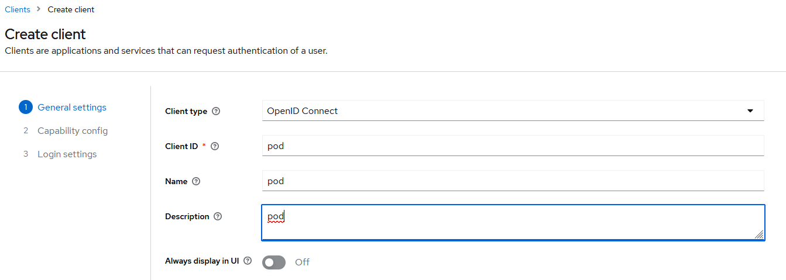
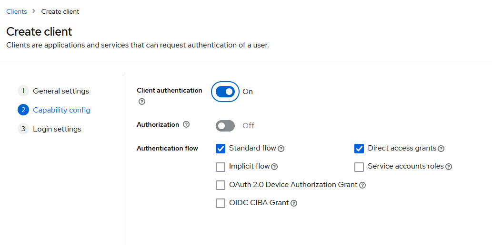
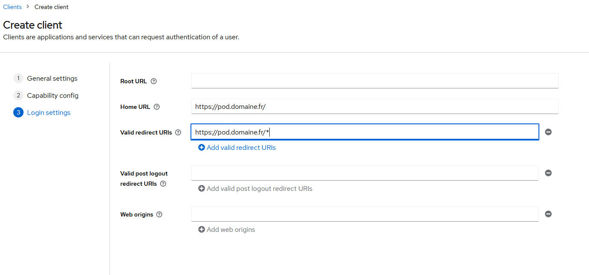
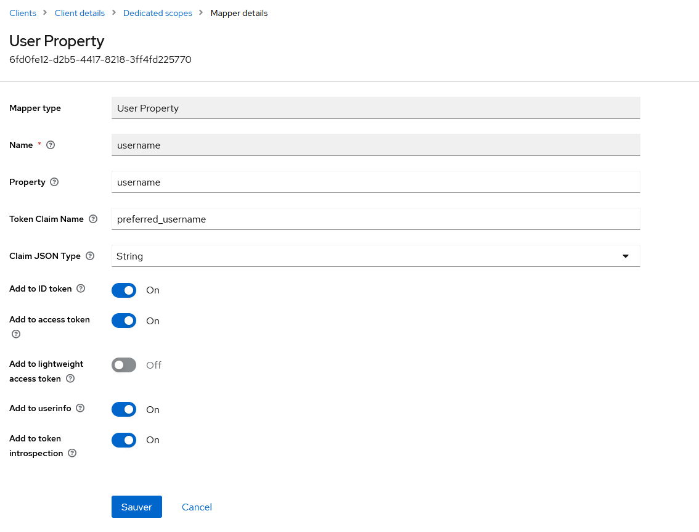

# Setting up authentication with Keycloak and OpenID

> ⚠️ Documentation to be tested on Pod v4.

## Creating the Keycloak client

In the client menu, click on `Create client`.



Click on "Next".



Click on "Next".



Then save.

### Adding a `UserName` client scope

Click on `pod-dedicated`.

Click on `Configure a new mapper` and choose `User Property` from the list.



Click on `Save`.

## On the POD side

### Adding the Keycloak configuration in the settings file

```bash
AUTH_TYPE = (('local', ('local')), ('OIDC', "OIDC"))
USE_OIDC = True
OIDC_NAME = "OPENID KeyCloak"
OIDC_RP_CLIENT_ID = "pod"
OIDC_RP_CLIENT_SECRET = " fatVB6q9KkGx6EoNiGdGJGG7K40gQPUH"  (1)
OIDC_OP_AUTHORIZATION_ENDPOINT = https://keycloak-server-address.../openid-connect/auth (2)
OIDC_OP_TOKEN_ENDPOINT = " https://keycloak-server-address.../openid-connect/token" (2)
OIDC_OP_USER_ENDPOINT = "https://keycloak-server-address.../openid-connect/userinfo" (2)
OIDC_RP_SIGN_ALGO = 'RS256'
OIDC_OP_JWKS_ENDPOINT = "https://keycloak-server-address.../openid-connect/certs" (2)
OIDC_CREATE_USER = True
OIDC_CLAIM_PREFERRED_USERNAME = "preferred_username"
OIDC_DEFAULT_AFFILIATION = "student"
OIDC_CLAIM_AFFILIATION = "affiliations"
OIDC_CLAIM_PRIMARY_AFFILIATION = "primaryAffiliation"
```

*(1) Keycloak client credentials*

*(2) Retrieve the information from the OpenID configuration of the Keycloak server*

> ⚠️ Note: If you encounter the error `"module lib has no attribute X509_V_FLAG_CB_ISSUER_CHECK"`, you will need to update Python’s OpenSSL library.
