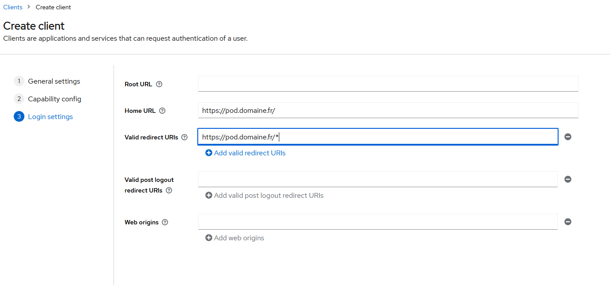

# Mise en place de l’authentification avec Keycloak et OpenID

> ⚠️ Documentation à tester sur un Pod v4.

## Création du client KeyCloak

Dans le menu client, cliquer sur `Create client`.


Cliquer sur "Next".


Cliquer sur "Next".



Puis sauvegarder.

### Ajout d’un client scope `UserName`

Cliquer sur `pod-dedicated`.

Cliquer sur `Configure a new mapper` et choisir dans la liste `User Property`.


Cliquer sur `Sauver`.

## Côté POD

### Ajout de la conf KeyCloak dans le fichier settings

```bash
AUTH_TYPE = (('local', ('local')), ('OIDC', "OIDC"))
USE_OIDC = True
OIDC_NAME = "OPENID KeyCloak"
OIDC_RP_CLIENT_ID = "pod"
OIDC_RP_CLIENT_SECRET = " fatVB6q9KkGx6EoNiGdGJGG7K40gQPUH"  (1)
OIDC_OP_AUTHORIZATION_ENDPOINT = https://adresse du serveur KeyCloak.../openid-connect/auth (2)
OIDC_OP_TOKEN_ENDPOINT = " https://adresse du serveur KeyCloak.../openid-connect/token" (2)
OIDC_OP_USER_ENDPOINT = "https://adresse du serveur KeyCloak.../openid-connect/userinfo" (2)
OIDC_RP_SIGN_ALGO = 'RS256'
OIDC_OP_JWKS_ENDPOINT = "https:// https://adresse du serveur KeyCloak.../openid-connect/certs" (2)
OIDC_CREATE_USER = True
OIDC_CLAIM_PREFERRED_USERNAME = "preferred_username"
OIDC_DEFAULT_AFFILIATION = "student"
OIDC_CLAIM_AFFILIATION = "affiliations"
OIDC_CLAIM_PRIMARY_AFFILIATION = "primaryAffiliation"
```

_(1) Crédentials du client KeyCloak_

_(2) Récupérer les infos dans la configuration OpenID du serveur KeyCloak_

> ⚠️ Remarque : si vous rencontrez l’erreur "module `lib` has no attribute `X509_V_FLAG_CB_ISSUER_CHECK`", vous devrez mettre à jour la bibliothèque OpenSSL de Python.
