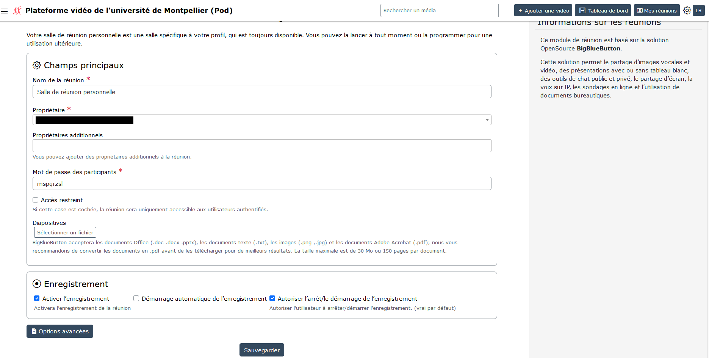
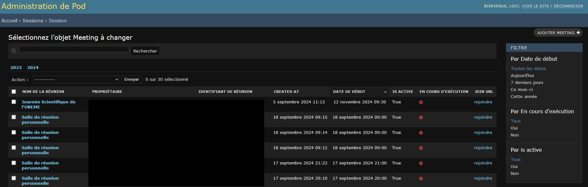

# Pairing with BigBlueButton

## Pod v4 Compatible with BigBlueButton

Pod v4 is compatible with the open-source virtual classroom / videoconferencing / web conferencing system BigBlueButton.

For your information, BigBlueButton ([https://bigbluebutton.org/](https://bigbluebutton.org/)) is a virtual classroom / videoconferencing / web conferencing tool with the following features:

- Video/webcam
- Audio
- Chat
- Document sharing + annotation
- Screen sharing
- Polling
- Recording
- Group creation
- Shared notes
- Integration of external videos
- Moodle and WordPress integration
- ...

## BigBlueButton Infrastructure of the Ministry of Higher Education and Research

As part of the recovery plan, a virtual classroom solution from the Ministry of Higher Education and Research (ESR), based on the free and open-source software BigBlueButton (BBB), has been deployed nationwide.

More information can be found on the following websites:

- [https://doc.numerique-esr.fr/](https://doc.numerique-esr.fr/)
- [https://www.enseignementsup-recherche.gouv.fr/fr/classes-virtuelles-et-webinaires-pour-l-enseignement-superieur-90257](https://www.enseignementsup-recherche.gouv.fr/fr/classes-virtuelles-et-webinaires-pour-l-enseignement-superieur-90257)
- And especially its dedicated website: [https://www.numerique-esr.fr/](https://www.numerique-esr.fr/)

## The BBB ESR Infrastructure

To date, this infrastructure is:

- freely accessible to all higher education institutions,
- funded by the MESR,
- operated by France Université Numérique
- hosted on Scaleway by Arawa in partnership with the DNE,
- regularly updated for more features

It therefore seems relevant to use this infrastructure in conjunction with Pod.

## Access to the BBB ESR Infrastructure

3 types of access are possible:

- **Institutional Tenant**: Moodle (BBB Plugin), Pod, GreenLight etc.
- **LTI**: Moodle (LTI Plugin), Chamilo, Sakai etc. (all LTI-compatible platforms)
- **National Portal**: [https://classe-virtuelle.numerique-esr.fr](https://classe-virtuelle.numerique-esr.fr) federated authentication (Shibboleth)

*Technical diagram, from the presentation by Nicolas Can and Loïc Bonavent during the Esup-Pod#3 Days: "10 years already" at the University of Avignon, in March 2024.*

At the University of Montpellier, we use a specific BBB ESR tenant for our institution.

A dedicated instant messaging channel is available on Esup’s RocketChat: [https://rocket.esup-portail.org/channel/plateformes_numeriques_ESR](https://rocket.esup-portail.org/channel/plateformes_numeriques_ESR)

## The Pod Meetings Module

### Configuration

To use the meetings module in Pod, simply perform the following mandatory configuration in your `settings_local.py`:

| Parameter | Default Value | Comments |
|-----------|---------------|----------|
| `USE_MEETING` | `False` | Activation (True) of the meetings module. |
| `BBB_API_URL` |  | Indicate the BBB API URL e.g. `https://webconf.univ.fr/bigbluebutton/api`. On an institutional installation, this is the URL of your BBB/Scalelite server. On the BBB ESR infrastructure, it will be provided by FUN. |
| `BBB_SECRET_KEY` |  | Security key for BBB. On an institutional installation, you can retrieve this key using the command: `bbb-conf --secret` on the BBB server. On the BBB ESR infrastructure, it will be provided by FUN. |
{: .table .table-striped}

#### Additional Optional Configuration

| Parameter | Default Value | Comments |
|-----------|---------------|----------|
| `BBB_LOGOUT_URL` |  | Indicate the URL to return to when you leave the BBB meeting |
| `BBB_MEETING_INFO` | `{}` | Dictionary of `key:value` to display information from a meeting session in BBB. |
| `DEFAULT_MEETING_THUMBNAIL` | `/img/default-meeting.svg` | Default image displayed as a poster or thumbnail, used to present the meeting. This image must be located in the `static` directory. |
| `MEETING_DATE_FIELDS` | `("start", "start_time", "expected_duration",)` | List of fields in the meeting creation form. |
| `MEETING_DISABLE_RECORD` | `True` | Configuration of meeting recording (set to True to disable meeting recordings). |
| `MEETING_MAIN_FIELDS` | `"name", "owner", "additional_owners", "attendee_password", "is_restricted", "restrict_access_to_groups",` | Defines the main fields of the meeting creation form, the main fields are displayed directly on the meeting form page. |
| `MEETING_MAX_DURATION` | `5` | Maximum duration of a meeting (in hours). |
| `MEETING_PRE_UPLOAD_SLIDES` |  | Preloaded slideshow for virtual meetings. A user can override this value by choosing a slideshow when creating a virtual meeting. This document must be located in the `static` directory. |
| `MEETING_RECORD_FIELDS` | `("record", "auto_start_recording", "allow_start_stop_recording")` | Set of fields that will be hidden if `MEETING_DISABLE_RECORD` is set to true. |
| `MEETING_RECURRING_FIELDS` | `("recurrence", "frequency", "recurring_until", "nb_occurrences", "weekdays", "monthly_type",)` | List of all fields to define the recurrence of a meeting, all these fields are grouped in a set of fields displayed in a modal. |
| `RESTRICT_EDIT_MEETING_ACCESS_TO_STAFF_ONLY` | `False` | Only "staff" users will be able to edit meetings. |
{: .table .table-striped}

## Features

### Meeting Management

Upon the user’s first connection, a personal meeting room is automatically created for them.

Via this interface, it is possible to:

- edit a meeting,
- copy the direct access link to participate in the meeting,
- invite users to the meeting,
- access meeting recordings,
- delete the meeting.

Editing a meeting allows the user to choose their options as they wish.

### Recording Management

#### Recordings

After recording a BigBlueButton meeting, the recording will automatically appear - after a certain time - in the recordings interface.

At this point, the user will receive an email notifying them of the availability of the recording.

It is important to understand that recordings made on BigBlueButton are stored in the source BBB infrastructure.

Thus, the recording playback icons only point to the BBB infrastructure.

The BBB ESR infrastructure differs from a local architecture on the following 2 points:

- recordings are secured and require a single-use token, transparent through Pod.
- apparently, recordings are available for 1 year, with no storage cost to date.

#### Uploading to Pod

Once the recording is available in this interface, the user can also directly upload the video to Pod, via the "Upload to Pod as video" icon.

It is important to understand that at this point a new video will be uploaded to Pod, then encoded by Pod’s encoding servers and stored in Pod.

## Operation

### Administration Interface

Depending on your configuration, here are the administration options available for the meetings module:

#### Session Administration

#### Session Log Administration

This can be useful for knowing the statistics and participants of meetings.

### Log Files

Depending on your configuration (see `pod_uwsgi.ini` file), you can find the meeting logs in the Pod application log file.

For example, it could be `/home/pod/django_projects/podv4/uwsgi/uwsgi-pod.log` or `/var/log/syslog`.

In the case of an upload to Pod, the Celery log files (`/var/log/celery/worker1.log`, `/var/log/celery/worker2.log`...) on the encoding servers can be consulted.

## Additional Features Related to the Coupling of Pod with BigBlueButton

### Migration of BigBlueButton Infrastructure, with the Support of Pod

As part of the recovery plan, a virtual classroom solution from the Ministry of Higher Education and Research (ESR), based on the free and open-source software BigBlueButton (BBB), has been deployed nationwide.

For institutions that have never had a local BigBlueButton infrastructure, using this virtual classroom solution (BBB ESR) is simple to implement.

However, for institutions that previously had a local BBB infrastructure, using the ESR BBB has an impact on users.

Documentation of this feature can be useful for these institutions: [Migration of BigBlueButton infrastructure, with the support of Pod](bbb-infrastructure-migration-install_en)

### Importing an External Video / BigBlueButton Recording as a Video

This feature allows users to easily import recordings into the platform from other external services or applications (typically, conducting a Big Blue Button virtual classroom via Moodle, a video published on PeerTube...).

Documentation of this feature is available on this Wiki: [Importing an external Video / BigBlueButton recording as a Video](import-external-video-bbb-recording-install_en)

### Setting Up Webinar Mode for BigBlueButton Sessions for Pod

This feature addresses one of the biggest constraints of BigBlueButton, namely the limit of 200 students per session (see [https://docs.bigbluebutton.org/support/faq.html#how-many-simultaneous-users-can-bigbluebutton-support](https://docs.bigbluebutton.org/support/faq.html#how-many-simultaneous-users-can-bigbluebutton-support)).

In most cases, this limit of 200 students per session is not a blocker, but in some specific cases - for example, lectures for first-year students - this limit becomes a barrier to using BigBlueButton.

There may also be other cases where you want to separate the presenter interface from the audience interface, in terms of rights.

This webinar mode allows information to be transmitted to a large audience via a live broadcast (accessible from the platform’s live page) and interaction - if the user wishes - via an integrated chat.

The idea is to separate the presenters from the audience:

- presenters must join the BigBlueButton meeting,
- audience members must access the live broadcast on Pod.

Documentation of this feature is available on this Wiki: [Setting up Webinar Mode for BigBlueButton sessions for Pod](set-up-webinar-mode-bbb-install_en)
