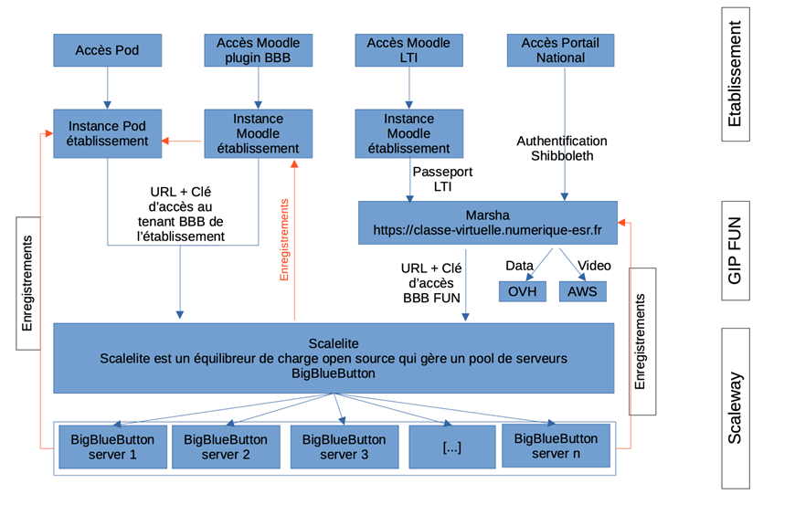
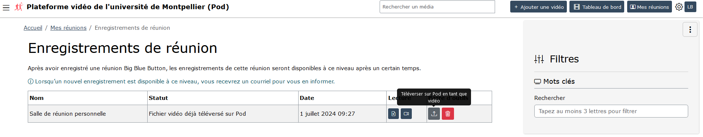
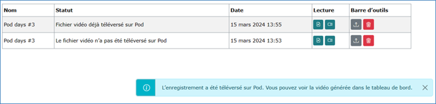
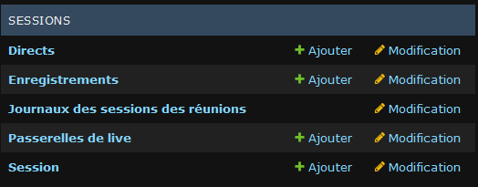
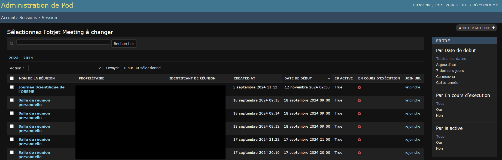
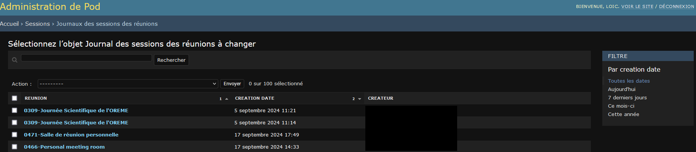

# Couplage avec BigBlueButton

## Pod v4 compatible avec BigBlueButton

Pod v4 est compatible pour utiliser le système de classe virtuelle / visioconférence / webconférence open source BigBlueButton.

Pour informations, BigBlueButton ([https://bigbluebutton.org/](https://bigbluebutton.org/)) est un outil de classe virtuelle / visioconférence / webconférence ayant les fonctionnalités suivantes :

- Vidéo/webcam
- Audio
- Chat
- Partage de document + annotation
- Partage d’écran
- Sondage
- Enregistrement
- Création de groupes
- Prises de notes partagées
- Intégration de vidéos externes
- Intégration Moodle et WordPress
- ...

## Infrastructure BigBlueButton du ministère de l'Enseignement Supérieur et de la Recherche

Dans le cadre du plan de relance, une solution de classe virtuelle du ministère de l'Enseignement Supérieur et de la Recherche (ESR), s'appuyant sur logiciel libre et open source BigBlueButton (BBB), a été déployée à l'échelle nationale.

Plus d'informations peuvent être retrouvées sur les sites suivants :

- [https://doc.numerique-esr.fr/](https://doc.numerique-esr.fr/)
- [https://www.enseignementsup-recherche.gouv.fr/fr/classes-virtuelles-et-webinaires-pour-l-enseignement-superieur-90257](https://www.enseignementsup-recherche.gouv.fr/fr/classes-virtuelles-et-webinaires-pour-l-enseignement-superieur-90257)
- Et surtout son site web dédié : [https://www.numerique-esr.fr/](https://www.numerique-esr.fr/)

## L'infrastructure BBB ESR

A ce jour, cette infrastructure est :

- accessible gratuitement à l'ensemble des établissements de l'enseignement supérieur,
- financé par le MESR,
- opéré par France Université Numérique
- hébergé sur Scaleway par Arawa en partenariat avec la DNE,
- régulièrement mis à jour pour plus de fonctionnalités

Il paraît alors pertinent d'utiliser cette infrastructure en lien avec Pod.

## Les accès à l'infrastructure BBB de l'ESR

3 types d’accès sont possibles :

- **Tenant établissement** : Moodle (Plugin BBB), Pod, GreenLight etc.
- **LTI** : Moodle (Plugin LTI), Chamillo, Sakaï etc. (toutes plateformes compatibles LTI)
- **Portail national** : [https://classe-virtuelle.numerique-esr.fr](https://classe-virtuelle.numerique-esr.fr) authentification fédérée (Shibboleth)

*Schéma technique, en provenance de la présentation de Nicolas Can et Loïc Bonavent lors des Journées Esup-Pod#3 : "10 ans déjà" à l'Université d'Avignon, en mars 2024.*

A l'université de Montpellier, nous utilisons un tenant BBB ESR spécifique à notre établissement.

Un canal de messagerie instantanée dédié est accessible sur le RocketChat d'Esup : [https://rocket.esup-portail.org/channel/plateformes_numeriques_ESR](https://rocket.esup-portail.org/channel/plateformes_numeriques_ESR)

## Le module des réunions de Pod

### Configuration

Pour utiliser le module des réunions dans Pod, il suffit de réaliser le paramétrage obligatoire suivant, dans son `settings_local.py` :

| Paramètre | Valeur par défaut | Commentaires |
|-----------|-------------------|--------------|
| `USE_MEETING` | `False` | Activation (True) du module des réunions. |
| `BBB_API_URL` |  | Indiquer l’URL API de BBB par ex `https://webconf.univ.fr/bigbluebutton/api`. Sur une installation établissement, il s'agit de l'URL de votre serveur BBB/Scalelite. Sur l'infrastructure BBB ESR, elle vous sera fournie par FUN. |
| `BBB_SECRET_KEY` |  | Clé de sécurité pour BBB. Sur une installation établissement, vous pouvez récupérer cette clé à l’aide de la commande :`bbb-conf --secret` sur le serveur BBB. Sur l'infrastructure BBB ESR, elle vous sera fournie par FUN. |
{: .table .table-striped}

#### Paramétrage optionnel complémentaire :

| Paramètre | Valeur par défaut | Commentaires |
|-----------|-------------------|--------------|
| `BBB_LOGOUT_URL` |  | Indiquer l’URL de retour au moment où vous quittez la réunion BBB |
| `BBB_MEETING_INFO` | `{}` | Dictionnaire de `clé:valeur` permettant d’afficher les informations d’une session de réunion dans BBB. |
| `DEFAULT_MEETING_THUMBNAIL` | `/img/default-meeting.svg` | Image par défaut affichée comme poster ou vignette, utilisée pour présenter la réunion. Cette image doit se situer dans le répertoire `static`. |
| `MEETING_DATE_FIELDS` | `("start", "start_time", "expected_duration",)` | Liste des champs du formulaire de création d’une réunion. |
| `MEETING_DISABLE_RECORD` | `True` | Configuration de l’enregistrement des réunions (mettre à True pour désactiver les enregistrements de réunion). |
| `MEETING_MAIN_FIELDS` | `"name", "owner", "additional_owners", "attendee_password", "is_restricted", "restrict_access_to_groups",` | Permet de définir les champs principaux du formulaire de création d’une réunion, les champs principaux sont affichés directement dans la page de formulaire d’une réunion. |
| `MEETING_MAX_DURATION` | `5` | Durée maximum d'une réunion (en heures). |
| `MEETING_PRE_UPLOAD_SLIDES` |  | Diaporama préchargé pour les réunions virtuelles. Un utilisateur peut remplacer cette valeur en choisissant un diaporama lors de la création d’une réunion virtuelle. Ce document doit se situer dans le répertoire `static`. |
| `MEETING_RECORD_FIELDS` | `("record", "auto_start_recording", "allow_start_stop_recording")` | Ensemble des champs qui seront cachés si `MEETING_DISABLE_RECORD` est défini à true. |
| `MEETING_RECURRING_FIELDS` | `("recurrence", "frequency", "recurring_until", "nb_occurrences", "weekdays", "monthly_type",)` | Liste de tous les champs permettant de définir la récurrence d’une reunion, tous ces champs sont regroupés dans un ensemble de champs affichés dans une modale. |
| `RESTRICT_EDIT_MEETING_ACCESS_TO_STAFF_ONLY` | `False` | Seuls les utilisateurs "staff" pourront éditer les réunions. |
{: .table .table-striped}

## Fonctionnalités

### La gestion des réunions

A la première connexion de l'usager, une salle de réunion personnelle lui est créée automatiquement.

Via cette interface, il est possible de :

- éditer une réunion,
- copier le lien d’accès direct pour participer à la réunion,
- inviter les usagers à la réunion,
- accéder aux enregistrements de la réunion,
- supprimer la réunion.

L'édition d'une réunion permet à l'usager de choisir ses options à sa convenance.

### La gestion des enregistrements

#### Les enregistrements

Après avoir enregistré une réunion BigBlueButton, l'enregistrement apparaîtra automatiquement - au bout d'un certain temps - dans l'interface d'enregistrements.

A ce moment là, l'usager recevra un email l'avertissant de la disponibilité de l'enregistrement.

Il faut bien comprendre que les enregistrements réalisés sur BigBlueButton sont stockés dans l'infrastructure BBB source.

Ainsi, les icônes de lecture de l'enregistrement ne font que pointer vers l'infrastructure BBB.

L'infrastructure BBB de l'ESR présente des différences avec une architecture locale sur les 2 points suivants :

- les enregistrements sont sécurisés et nécessitent un jeton à usage unique, transparent au travers de Pod.
- à priori, les enregistrements sont disponibles pendant 1 an, sans notion de coût de stockage à ce jour.

#### Le téléversement sur Pod

Une fois l'enregistrement disponible dans cette interface, il est aussi possible à l'usager de téléverser directement la vidéo sur Pod, via l'icône de "Téléverser sur Pod en tant que vidéo".

Il faut bien comprendre qu'à ce moment là une nouvelle vidéo sera téléversée sur Pod, sera alors encodée par les serveurs d'encodage de Pod et sera stockée dans Pod.

## Exploitation

### L'interface d'administration

Selon votre configuration, voici les options d’administration disponibles pour le module des réunions :

#### L'administration des sessions

#### L'administration des journaux de session

Cela peut-être utile pour connaître les statistiques et participants aux réunions.

### Les fichiers de logs

Selon votre configuration (cf. fichier `pod_uwsgi.ini`), il vous est possible de retrouver les logs des réunions dans le fichier de logs applicatif de Pod.

Par exemple, il peut s'agir de `/home/pod/django_projects/podv4/uwsgi/uwsgi-pod.log` ou `/var/log/syslog`.

Dans le cas d'un téléversement sur Pod, les fichiers de logs de Celery (`/var/log/celery/worker1.log`, `/var/log/celery/worker2.log`...) sur les serveurs d'encodage peuvent être consultés.

## Fonctionnalités annexes concernant le couplage de Pod avec BigBlueButton

### Migration d'infrastructure BigBlueButton, avec l'appui de Pod

Dans le cadre du plan de relance, une solution de classe virtuelle du ministère de l'Enseignement Supérieur et de la Recherche (ESR), s'appuyant sur logiciel libre et open source BigBlueButton (BBB), a été déployée à l'échelle nationale.

Pour les établissements n'ayant jamais eu d’infrastructure locale BigBlueButton, l'utilisation de cette solution de classe virtuelle (BBB ESR) est simple à mettre en œuvre.

Cependant, pour les établissements ayant auparavant une infrastructure locale BBB, l'utilisation du BBB de l'ESR présente des impacts aux usagers.

Une documentation de cette fonctionnalité peut alors être utile pour ces établissements : [Migration d'infrastructure BigBlueButton, avec l'appui de Pod](bbb-infrastructure-migration-install_fr)

### Importer une vidéo externe / un enregistrement BigBlueButton au format vidéo

Cette fonctionnalité permet, aux usagers, d'importer facilement des enregistrements dans la plateforme en provenance d'autres services ou applications externes (typiquement, réaliser une classe virtuelle Big Blue Button via Moodle, une vidéo publiée sur PeerTube...).

Une documentation de cette fonctionnalité est disponible sur ce Wiki : [Importer une vidéo externe / un enregistrement BigBlueButton au format vidéo](import-external-video-bbb-recording-install_fr)

### Mise en place du mode webinaire pour les sessions BigBlueButton pour Pod

Cette fonctionnalité permet de solutionner une des plus grosses contraintes de BigBlueButton, à savoir la limite de 200 étudiants par session (cf. [https://docs.bigbluebutton.org/support/faq.html#how-many-simultaneous-users-can-bigbluebutton-support](https://docs.bigbluebutton.org/support/faq.html#how-many-simultaneous-users-can-bigbluebutton-support)).

Dans la plupart des cas, cette limite de 200 étudiants par session n'est pas un blocage, mais dans certains cas bien précis - par exemple, des cours magistraux pour des L1 - cette limite devient bloquante à l'utilisation de BigBlueButton.

Il peut y avoir aussi d'autres cas où vous pouvez souhaiter séparer l'interface des présentateurs de celles des auditeurs, vis-à-vis des droits.

Ce mode webinaire permet de transmettre des informations à un large public via une diffusion en direct (accessible depuis la page des directs de la plateforme) et une interaction - si l'usager le souhaite - via un chat intégré.

L'idée étant de séparer les présentateurs des auditeurs:

- les présentateurs devront rejoindre la réunion BigBlueButton,
- les auditeurs devront accéder au direct sur Pod.

Une documentation de cette fonctionnalité est disponible sur ce Wiki : [Mise en place du mode webinaire pour les sessions BigBlueButton pour Pod](set-up-webinar-mode-bbb-install_fr)
