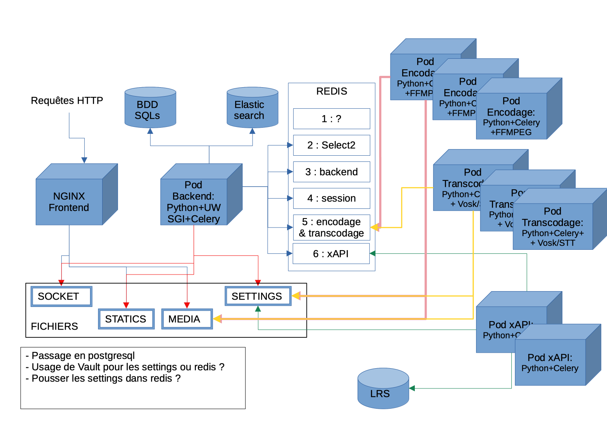

# Setting up encoding, transcoding and xAPI Microservices

> ⚠️ Documentation to be tested on a v4 Pod.

Since version 3.4.0, it has been possible to offload encoding, transcription and xAPI to microservices. These microservices are autonomous and no longer require connections to the database or search engine as before.

This is done according to the following diagram:



You have **dockerfiles** for each microservice in the Pod source code:

- Encoding: [https://github.com/EsupPortail/Esup-Pod/blob/main/dockerfile-dev-with-volumes/pod-encode/Dockerfile](https://github.com/EsupPortail/Esup-Pod/blob/main/dockerfile-dev-with-volumes/pod-encode/Dockerfile)
- Transcription: [https://github.com/EsupPortail/Esup-Pod/blob/main/dockerfile-dev-with-volumes/pod-transcript/Dockerfile](https://github.com/EsupPortail/Esup-Pod/blob/main/dockerfile-dev-with-volumes/pod-transcript/Dockerfile)
- xAPI: [https://github.com/EsupPortail/Esup-Pod/blob/main/dockerfile-dev-with-volumes/pod-xapi/Dockerfile](https://github.com/EsupPortail/Esup-Pod/blob/main/dockerfile-dev-with-volumes/pod-xapi/Dockerfile)

Each service must have access to the same Pod file storage space (shared space) and access to Redis which will act as a queue for encoding, transcription or xAPI sending tasks.

Each microservice is launched via a Celery command.

## Encoding Microservice

> In this documentation, we will call the **Pod backend server** the server where the web part is installed, and **Pod encoding server** the server where encoding is offloaded.

### Prerequisites

- Your `podv4` directory from the backend server must be shared between your servers (NFS mount for example).

### Configuration on the Pod backend server

In the `settings_local.py` file:

```bash
(django_pod4) pod@pod:/usr/local/django_projects/podv4$ vim pod/custom/settings_local.py

# Celery configuration on the frontend
USE_REMOTE_ENCODING_TRANSCODING = True
ENCODING_TRANSCODING_CELERY_BROKER_URL = "redis://redis:6379/5"
```

### Installation on the encoding server

Install system dependencies:

```bash
(django_pod4) pod@pod-encoding:/usr/local/django_projects/podv4$ apt-get update && apt-get install -y ffmpeg \
    ffmpegthumbnailer \
    imagemagick
```

Install Python libraries (in a virtual environment):

```bash
(django_pod4) pod@pod-encoding:/usr/local/django_projects/podv4$ pip3 install --no-cache-dir -r requirements-encode.txt
```

Required configuration in the `settings_local.py` file:

```bash
(django_pod4) pod@pod:/usr/local/django_projects/podv4$ vim pod/custom/settings_local.py

# Configuration on the encoding server
# REST API address to call after remote encoding or transcription:
POD_API_URL = "https://pod.univ.fr/rest/"
# Authentication token used for the call after remote encoding or transcription
POD_API_TOKEN = "xxxx"
```

Then simply launch Celery via:

```bash
(django_pod4) pod@pod-encoding:/usr/local/django_projects/podv4$ celery -A pod.video_encode_transcript.encoding_tasks worker -l INFO -Q encoding --concurrency 1 -n encode
```

## Transcoding Microservice

> In this documentation, we will call the **Pod backend server** the server where the web part is installed, and **Pod transcoding server** the server where transcoding is performed.

### Prerequisites

Your `podv4` directory from the backend server must be shared between your servers (NFS mount for example).

### Configuration on the Pod backend server

In the `settings_local.py` file:

```bash
(django_pod4) pod@pod:/usr/local/django_projects/podv4$ vim pod/custom/settings_local.py

# Celery configuration on the frontend
USE_REMOTE_ENCODING_TRANSCODING = True
ENCODING_TRANSCODING_CELERY_BROKER_URL = "redis://redis:6379/5"
```

### Installation on the transcoding server

Install system dependencies:

```bash
(django_pod4) pod@pod-transcoding:/usr/local/django_projects/podv4$ apt-get update && apt-get install -y sox libsox-fmt-mp3
```

Install Python libraries:

```bash
(django_pod4) pod@pod-transcoding:/usr/local/django_projects/podv4$ pip3 install --no-cache-dir -r requirements-transcripts.txt \
    && pip3 install --no-cache-dir -r requirements-encode.txt
```

Required configuration in `settings_local.py`:

```bash
(django_pod4) pod@pod:/usr/local/django_projects/podv4$ vim pod/custom/settings_local.py

# REST API address to call after remote encoding or transcription:
POD_API_URL = "https://pod.univ.fr/rest/"
# Authentication token for the call after remote processing:
POD_API_TOKEN = "xxxx"
```

Then launch Celery:

```bash
(django_pod4) pod@pod-transcoding:/usr/local/django_projects/podv4$ celery -A pod.video_encode_transcript.transcripting_tasks worker -l INFO -Q transcripting --concurrency 1 -n transcript
```

## xAPI Microservice

> In this documentation, we will call the **Pod backend server** the server where the web part is installed, and **Pod xAPI server** the server where xAPI processing is performed.

### Prerequisites

Your `podv4` directory from the backend server must be shared between your servers (NFS mount for example).

### Configuration on the Pod backend server

In `settings_local.py`:

```bash
(django_pod4) pod@pod:/usr/local/django_projects/podv4$ vim pod/custom/settings_local.py

USE_XAPI = True
XAPI_ANONYMIZE_ACTOR = False
XAPI_LRS_LOGIN = "XXXX"
XAPI_LRS_PWD = "XXXXX"
XAPI_LRS_URL = "http://xapi.univ.fr/xAPI/statements/"
USE_XAPI_VIDEO = True
XAPI_CELERY_BROKER_URL = "redis://redis:6379/6"
```

### Installation on the xAPI processing server

Install Python dependencies in a virtual environment (identical to those for encoding):

```bash
(django_pod4) pod@pod-transcoding:/usr/local/django_projects/podv4$ pip3 install --no-cache-dir -r requirements-encode.txt
```

Then simply launch Celery:

```bash
(django_pod4) pod@pod-transcoding:/usr/local/django_projects/podv4$ celery -A pod.xapi.xapi_tasks worker -l INFO -Q xapi --concurrency 1 -n xapi
```

## Monitoring

To monitor the list of encoding tasks in progress or pending, you can use the `celery` command line tool.

Navigate to the django virtual environment and run the following commands, replacing <ID> with the desired Redis thread (5 for encoding, 6 for xAPI for example).

For active tasks:

```bash
(django_pod4) pod@pod-transcoding:/$ celery --broker=redis://redis:6379/<ID> inspect active
```

For pending tasks:

```bash
(django_pod4) pod@pod-transcoding:/$ celery --broker=redis://redis:6379/<ID> inspect reserved
```
