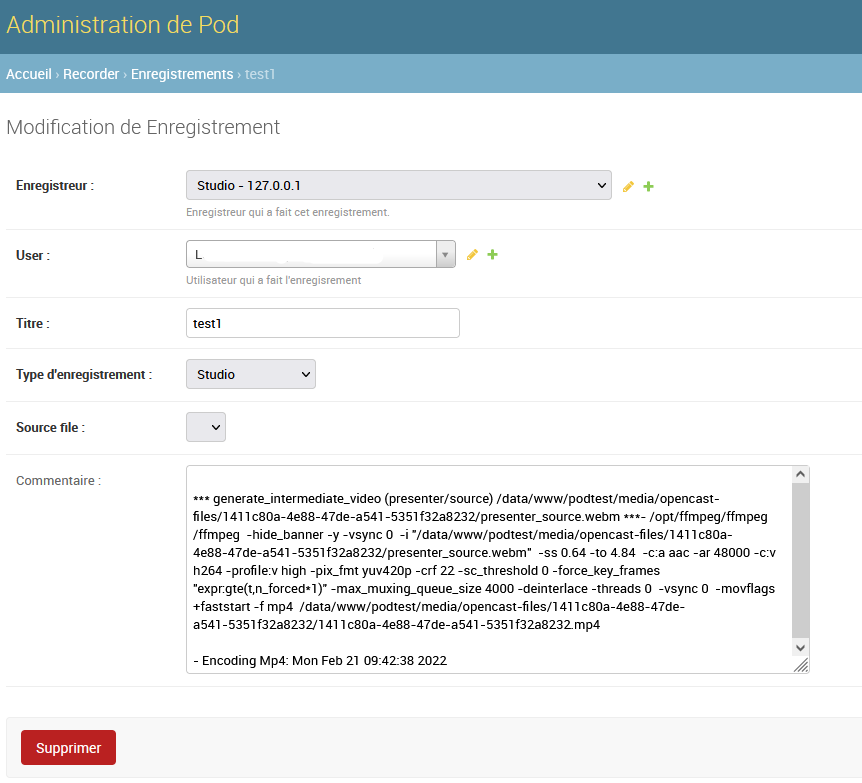

- [Setting Up Opencast Studio](#setting-up-opencast-studio)
  - [Installation](#installation)
  - [Configuration and Prerequisites](#configuration-and-prerequisites)
    - [Configuration](#configuration)
    - [Prerequisites](#prerequisites)
  - [Operation](#operation)

# Setting Up Opencast Studio

## Installation

To add Opencast Studio to your Esup-Pod instance, follow these steps:

* Retrieve the Opencast Studio sources using the following command:

```sh
git clone https://github.com/elan-ev/opencast-studio/
```

* Create the Opencast Studio with the appropriate configuration for Pod using the following commands:

```sh
cd opencast-studio/
export PUBLIC_PATH=/studio
npm install
npm run build:release
```

* A `build` directory is then generated. Rename this `build` directory to `studio`, then copy it to the `pod/custom/static/opencast/` directory

```sh
mkdir -p pod/custom/static/opencast/studio
cp -r build/* pod/custom/static/opencast/studio
```

* Finally, do not forget to collect your static files for production using the following command:

```sh
(django_pod) [userpod@video][/data/www/userpod/django_projects/podv2] python manage.py collectstatic
```

The generation of Opencast Studio can be done on another server. Pod only needs the `build` directory, renamed to `studio`, and placed in the `pod/custom/static/opencast` subdirectory.

It is essential that the server is configured in HTTPS (and not in HTTP) for Opencast Studio to function.
{: .alert .alert-warning}

## Configuration and Prerequisites

### Configuration

In your `custom/settings-local.py`, the following parameters concern the use of Opencast Studio:

| Property  | Description  | Default Value |
|:---------------|:------------------:|-----------------------:|
| **USE_OPENCAST_STUDIO** | Enable Opencast Studio recorder | `False` |
| **OPENCAST_FILES_DIR**  | Working directory for files generated by Opencast Studio (will be accessible in the media) | `"opencast-files"` |
| **ENCODE_STUDIO**       | Function called to start encoding intermediate studio videos | `"start_encode_studio"` |
| **OPENCAST_DEFAULT_PRESENTER** | Parameter to set the default behavior when recording the camera and screen (modifiable by the user). Possible values: `mid`: Same size for screen and camera, `piph`: Pip - camera inside the screen video at the top right, `pipb`: Pip - camera inside the screen video at the bottom right | `"mid"` |
{: .table .table-striped}

### Prerequisites

It is also necessary to create, via the administration interface, a new Recorder of type **Studio**:


It is essential that this recorder has the recording type **Studio**; for the publication directory, use `opencast-files`, or at least the value configured in the `OPENCAST_FILES_DIR` parameter.

You can perform this creation via the command line if you wish:

```sh
(django_pod) [userpod@video][/data/www/userpod/django_projects/podv2] echo "from pod.recorder.models import Recorder; from pod.video.models import Type; type=Type.objects.get(pk=1); rec=Recorder.objects.create(name='Studio', address_ip='127.0.0.1', recording_type='studio', type=type)" | python manage.py shell
```

## Operation

Opencast Studio files are generated in the `/media/opencast-files/` directory, and everything is logged in the Pod administration interface.

Indeed, it is possible to find the recordings made by users via the Recorder / Recording module for the defined Studio type recorder:


