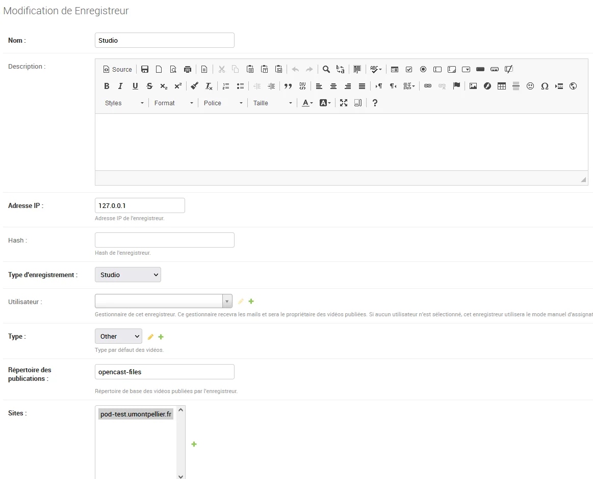
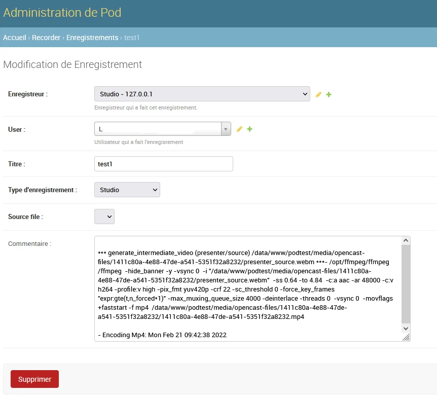

# Mise en place du studio Opencast

## Installation

Pour rajouter le studio d’Opencast dans votre instance d’Esup-Pod, voici les étapes à suivre :

- Récupérer les sources Opencast Studio via la commande suivante :

```sh
git clone https://github.com/elan-ev/opencast-studio/
```

- Créer l’Opencast Studio avec la bonne configuration pour Pod via les commandes suivantes :

```sh
cd opencast-studio/
export PUBLIC_PATH=/studio
npm install
npm run build:release
```

- Un répertoire `build` est alors généré. Renommez ce répertoire `build` en `studio`, puis copier le dans le répertoire `pod/custom/static/opencast/`

```sh
mkdir -p pod/custom/static/opencast/studio
cp -r build/* pod/custom/static/opencast/studio
```

- Finalement, n’oubliez pas de collecter vos fichiers statiques pour la mise en production via la commande :

```sh
(django_pod) [userpod@video][/data/www/userpod/django_projects/podv2] python manage.py collectstatic
```

La génération d’Opencast Studio peut très bien se réaliser sur un autre serveur. Pod n’a besoin que du répertoire `build`, renommé en `studio`, et positionné dans le sous-répertoire `pod/custom/static/opencast`.

Il est indispensable que le serveur soit configuré en HTTPS (et non en HTTP) pour que l’Opencast Studio puisse fonctionner.
{: .alert .alert-warning}

## Configuration et pré-requis

### Configuration

Dans votre `custom/settings-local.py`, les paramètres suivants concernent l’utilisation d’Opencast Studio :

| Propriété  | Description  | Valeur par défaut |
|:---------------|:------------------:|-----------------------:|
| **USE_OPENCAST_STUDIO** | Activer l’enregistreur Opencast Studio | `False` |
| **OPENCAST_FILES_DIR**  | Répertoire de travail pour les fichiers générés par Opencast Studio (sera accessible dans le media) | `"opencast-files"` |
| **ENCODE_STUDIO**       | Fonction appelée pour lancer l’encodage des vidéos intermédiaires du studio | `"start_encode_studio"` |
| **OPENCAST_DEFAULT_PRESENTER** | Paramètre permettant de savoir le comportement par défaut lors de l’enregistrement de la caméra et de l’écran (modifiable par l’utilisateur). Valeurs possibles : `mid` : Même taille pour l’écran et la caméra, `piph` : Pip - caméra à l’intérieur de la vidéo de l’écran en haut à droite, `pipb` : Pip - caméra à l’intérieur de la vidéo de l’écran en bas à droite | `"mid"` |
| **FFMPEG_STUDIO_COMMAND** | Commande ffmpeg utilisée pour l’encodage des vidéos du studio | _cf. remarque ci-dessous_ |
{: .table .table-striped}

Pensez à vérifier la version de ffmpeg utilisée par le serveur d’encodage. S’il s’agit d’une version 5 ou plus, il est nécessaire de surcharger le paramètre `FFMPEG_STUDIO_COMMAND` de votre `custom/settings-local.py` avec :

```sh
FFMPEG_STUDIO_COMMAND = (
    " -hide_banner -threads %(nb_threads)s %(input)s %(subtime)s"
    + " -c:a aac -ar 48000 -c:v h264 -profile:v high -pix_fmt yuv420p"
    + " -crf %(crf)s -sc_threshold 0 -force_key_frames"
    + ' "expr:gte(t,n_forced*1)" -max_muxing_queue_size 4000 '
)
```

_Par défaut, l’encodage utilise l’option `-deinterlace` qui a été supprimée depuis la version 5 de ffmpeg._
{: .alert .alert-warning}

### Pré-requis

Il est aussi nécessaire de créer, via l’interface d’administration, un nouvel Enregistreur de type **Studio** :



Il est indispensable que cet enregistreur ait comme type d’enregistrement **Studio**; concernant le répertoire des publications, mettre `opencast-files`, ou du moins, la valeur configurée dans le paramètre `OPENCAST_FILES_DIR`.

Vous pouvez faire cette création en ligne de commande si vous le souhaitez :

```sh
(django_pod) [userpod@video][/data/www/userpod/django_projects/podv2] echo "from pod.recorder.models import Recorder; from pod.video.models import Type; type=Type.objects.get(pk=1); rec=Recorder.objects.create(name=’Studio’, address_ip=’127.0.0.1’, recording_type=’studio’, type=type)" | python manage.py shell
```

## Exploitation

Les fichiers d’Opencast Studio sont générés dans le répertoire `/media/opencast-files/` et tout est loggué dans l’interface d’administration de Pod.

En effet, il est possible de retrouver les enregistrements réalisés par les usagers via le module Recorder / Enregistrement pour l’enregistreur de type Studio défini :


