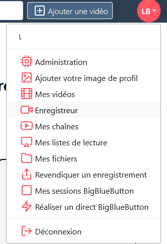
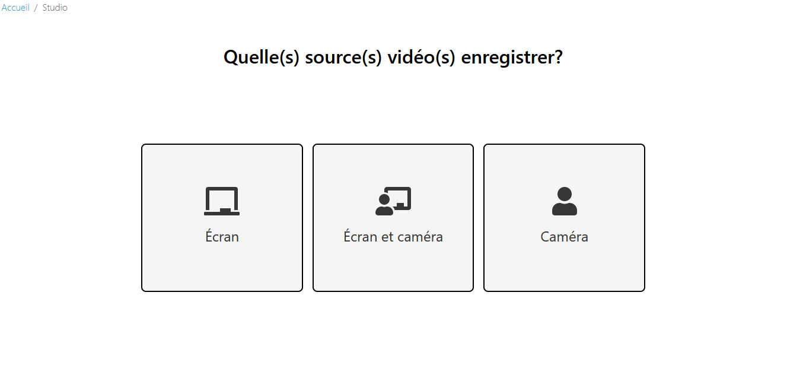
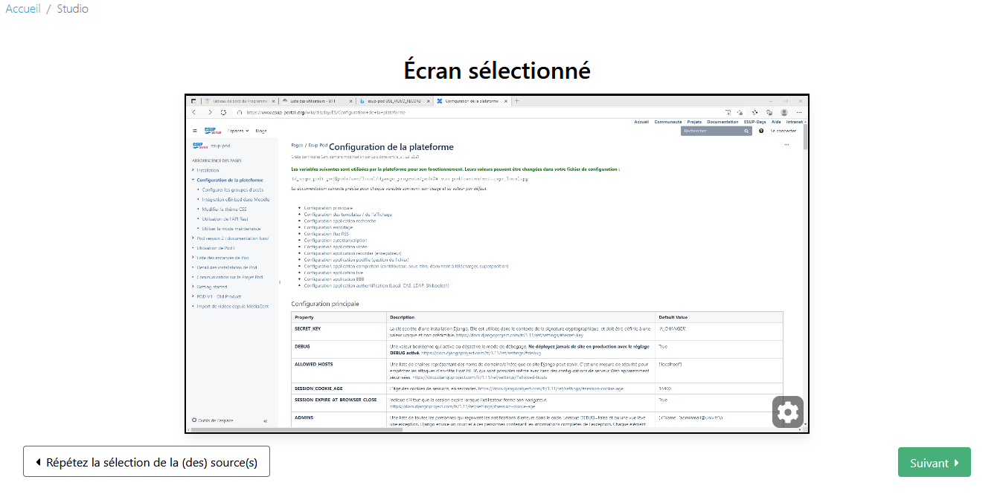
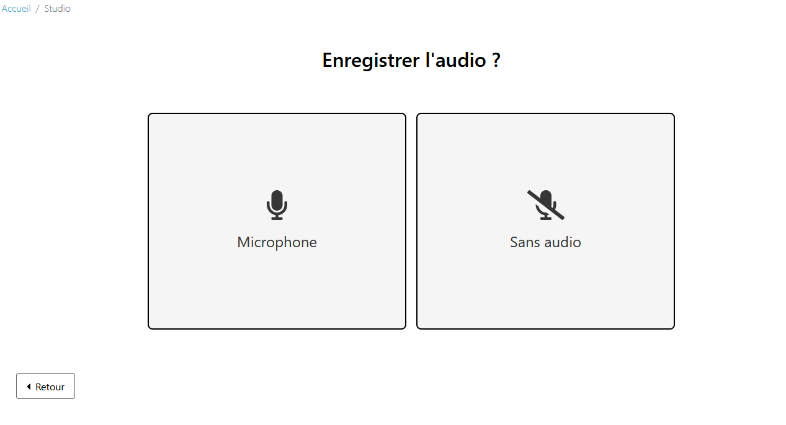
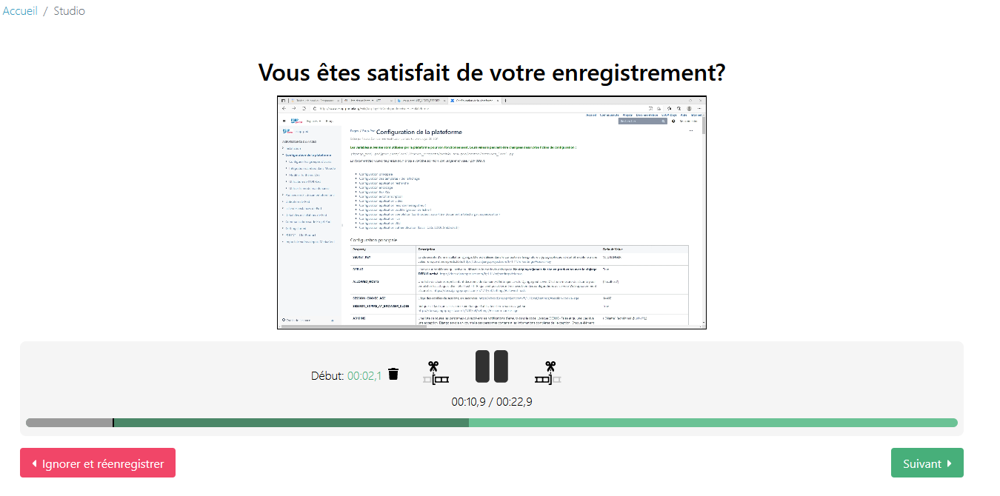
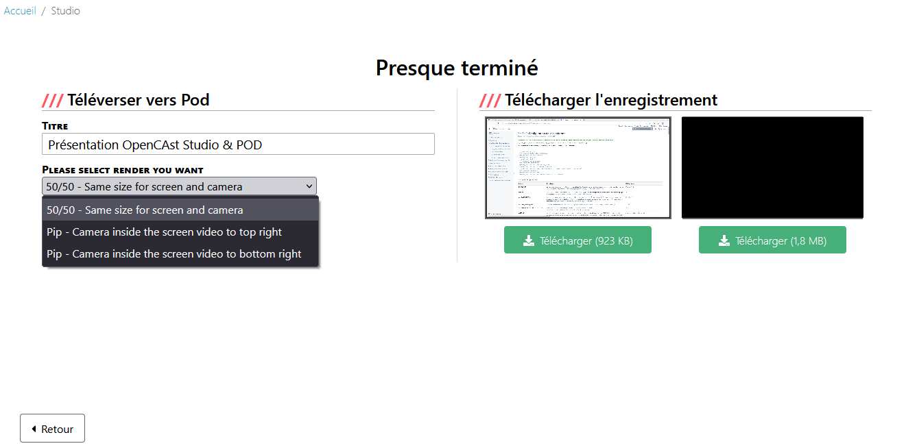

# Enregistreur Opencast studio

Ce système d’Opencast studio permet aux usagers de Pod, en totale autonomie, d’enregistrer la caméra, le micro et l’écran de l’utilisateur.

Ainsi, en plus de pouvoir enregistrer tout cela localement, il peut publier automatiquement l’ensemble sur la plateforme Pod avec différentes possibilités de rendu. (Voir présentation faite lors de la journée Esup).

## Fonctionnement

* Lorsque connecté à Pod, cliquer sur "Enregistreur" dans le menu de profil utilisateur.

  

* Choisir les sources à enregistrer

  

* Paramétrer les sources audio et vidéo (en terme de choix de matériel, de qualité)

  

* Choisir d’enregistrer l’audio ou non

  

* Lancer l’enregistrement.

  

Une fois l’enregistrement réalisé, possibilité de couper le début et/ou la fin de celui-ci.

  

À la fin de l’enregistrement, et après les coupes (si besoin), choisir d’enregistrer en local ou d’envoyer directement sur Pod.
En cas d’enregistrement de 2 flux vidéos, Pod les concatènera en une seule vidéo, selon l’option choisie (PiP ou 50/50). Une fois encodée, la vidéo finale se retrouvera, comme d’habitude, dans le menu **Tableau de bord**.

  
