# Setting up webinar mode for BigBlueButton sessions for Pod

> ⚠️ Do not confuse this system with the old system used for Pod v2, which has become obsolete.

## Context and provided solution

### Context

The meetings module of Pod is based on the use of BigBlueButton.

For information, BigBlueButton (<https://bigbluebutton.org/>) is a virtual classroom tool with the following features:

- Video/webcam
- Audio
- Chat
- Document sharing + annotation
- Screen sharing
- Polling
- Recording
- Group creation
- Shared notes
- Integration of external videos
- Integration with Moodle and WordPress

However, one of the biggest constraints of BigBlueButton is the limit of 200 students per session (see <https://docs.bigbluebutton.org/support/faq.html#how-many-simultaneous-users-can-bigbluebutton-support>).

In most cases, this limit of 200 students per session is not a problem, but in some specific cases - for example, lectures for first-year students - this limit becomes a barrier to using BigBlueButton.

There may also be other cases where you want to separate the presenters' interface from the audience's interface in terms of rights.

### Solution: Webinar mode

Thus, the solution to address this issue is to offer a webinar mode for the meetings module of Pod.

This webinar mode allows information to be transmitted to a large audience via a live broadcast (accessible from the live page of the platform) and interaction - if the user wishes - via an integrated chat.

The idea is to separate the presenters from the audience:

- Presenters must join the BigBlueButton meeting.
- The audience must access the live broadcast on Pod.

### Interface in Pod

In terms of the interface in Pod, here is what it looks like:

- Editing a webinar, by the presenter (notion of moderator in BigBlueButton)

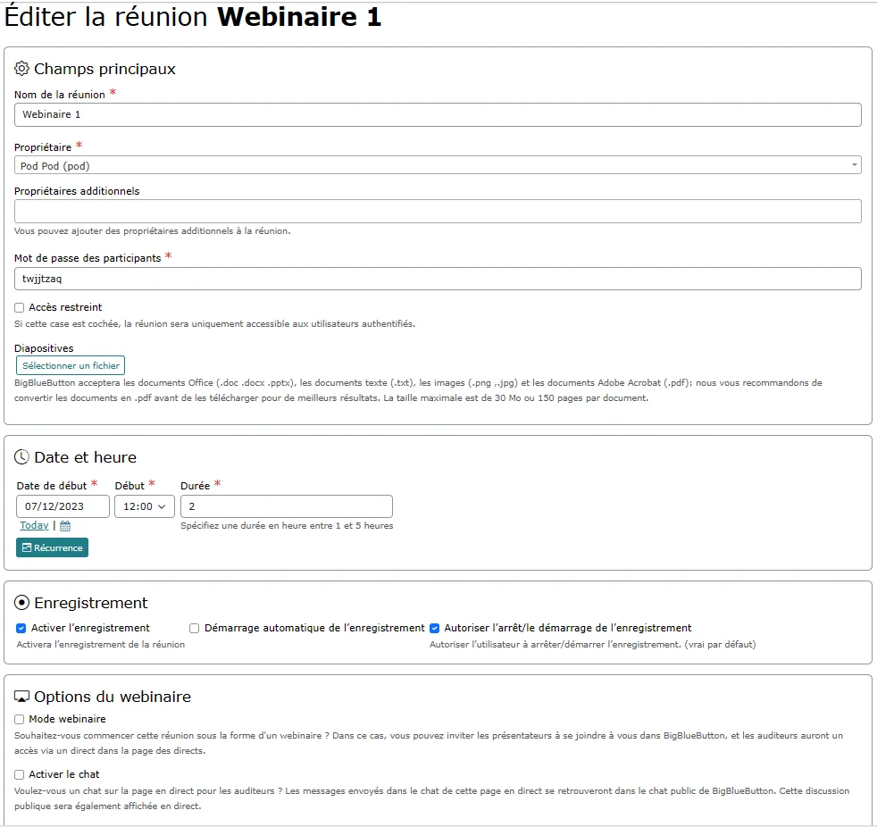

- Explanations about webinar mode, accessible to users

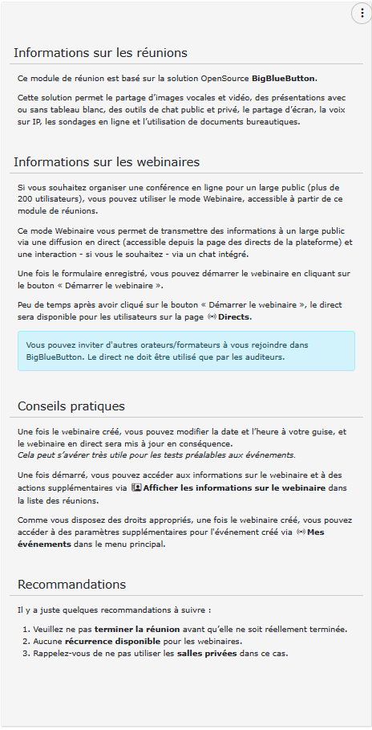

- List of meetings and webinars

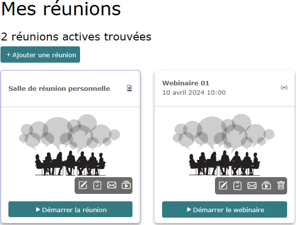

- The BigBlueButton interface, with the streaming account connected

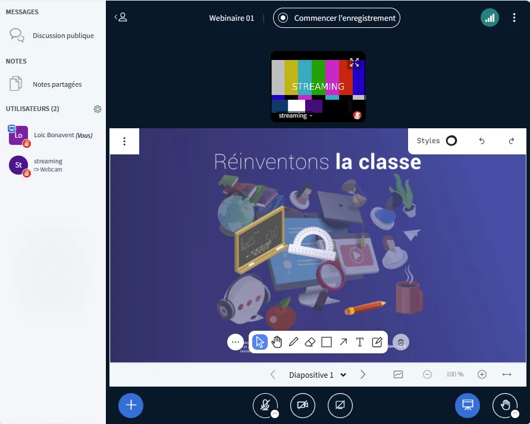

- The live events page

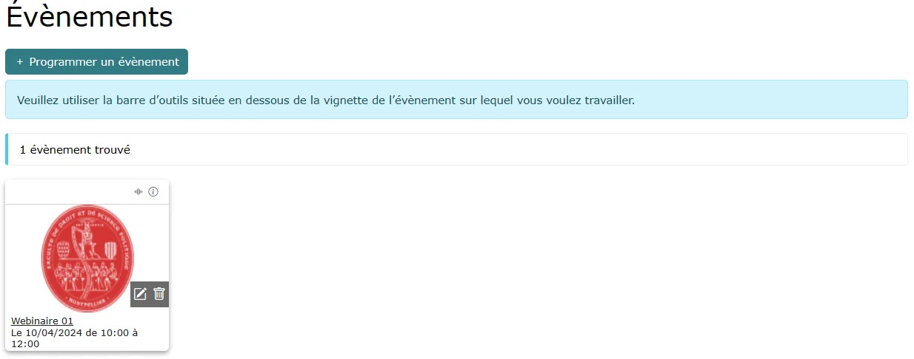

- The live broadcast for the audience, with integrated chat (if enabled by the presenter)

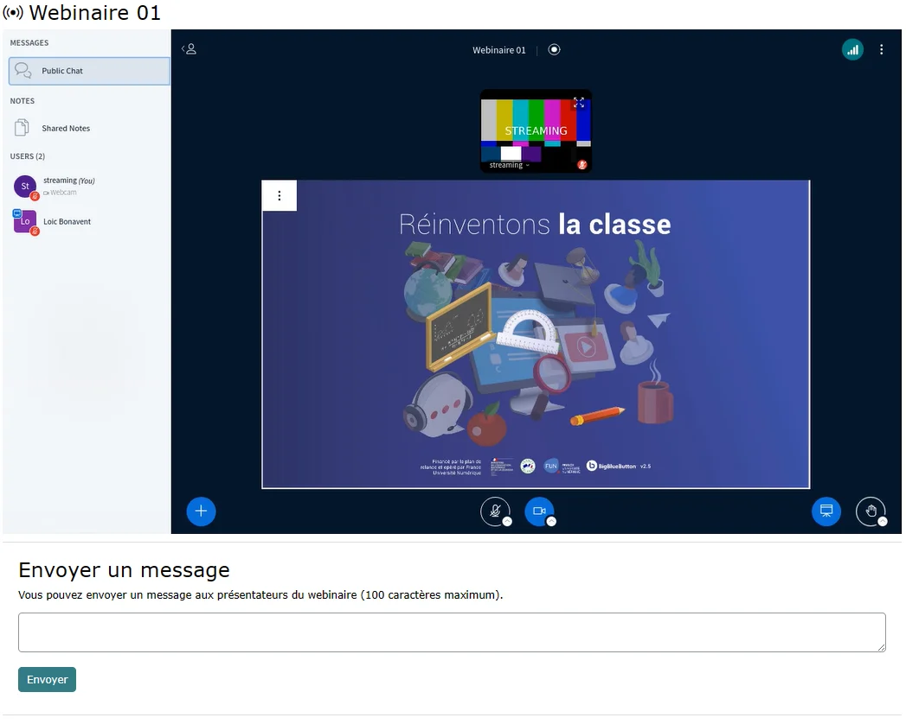

- Information and actions that can be performed on an ongoing webinar

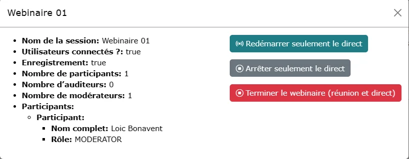

## Architecture of the solution

This solution is based on:

- BigBlueButton, whether it is a local infrastructure or rather that of the ESR
- SIPMediaGW, the videoconferencing room connector project by RENATER
<https://www.renater.fr/connecteur-de-salles-la-solution-dinteroperabilite-entre-les-differents-systemes-de-visioconference>
- Pod, regarding the user interface and the connection with BigBlueButton.

Technically, here is what it looks like:


Screenshot from a presentation by Nicolas Can and Loïc Bonavent during the Esup-Pod#3 Days: "10 years already" at the University of Avignon, in March 2024.

### SIPMediaGW by RENATER

#### Presentation

SIPMediaGW is a videoconferencing room connector, an interoperability solution between different videoconferencing systems by RENATER.

See <https://www.renater.fr/connecteur-de-salles-la-solution-dinteroperabilite-entre-les-differents-systemes-de-visioconference>

The purpose of this project is to provide a functional component compatible with WebRTC protocol standards, allowing access from videoconferencing room equipment (Cisco, Polycom...) to BigBlueButton/Jitsi-Meet instances.

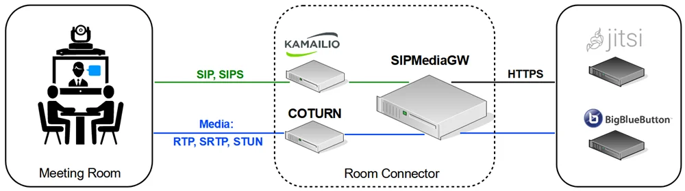

RENATER has added, in recent versions of SIPMediaGW, another feature that allows RTMP publication of the session, which truly transforms a meeting into a webinar.

It is this RTMP publication feature of SIPMediaGW that we use in this webinar mode context, with live broadcasting on Pod.

#### Installation

Here is how I installed SIPMediaGW on a virtual machine at the University of Montpellier.

##### The virtual machine

I started with a VM running ubuntu/focal64, with 8 vCPU / 6 GB RAM.

It should be noted that a SIPMediaGW server only manages one stream (to manage several, it is necessary to install several servers).

From what I have seen, it is not necessary to have a VM with 8 vCPU: 6 (or even 4) are largely sufficient.

##### Installation and configuration

Reference site: <https://github.com/Renater/SIPMediaGW>

###### Prerequisites

```bash
# Create a user: vagrant
adduser vagrant
usermod -aG wheel vagrant
# Install git
sudo apt-get install git
```

###### Effective installation

```bash
# Retrieve the latest version of SIPMediaGW from Git, in the /sipmediagw application directory
cd /
sudo git clone https://github.com/Renater/SIPMediaGW.git sipmediagw
chown vagrant:vagrant /sipmediagw/ -R
cd /sipmediagw/deploy/
# Remember to enter the public IP address of your server
HOST_IP=1.2.3.4 ./provision.sh
```

⚠️ Please replace 1.2.3.4 with the public IP address of your server.

###### Configuration

```bash
# Edit the /sipmediagw/.env file with its values
MAIN_APP=streaming
BROWSE_FILE="bigbluebutton.py"
```

Given this configuration, it should be understood that a SIPMediaGW server can only be used for one function:

- either as a room connector (MAIN_APP=baresip)
- or as an RTMP publication server (MAIN_APP=streaming)

In the context of this documentation, it will be streaming.

By default, the security token is initialized to 1234.

To modify this behavior, it is necessary to edit the /sipmediagw/HTTPLauncher.py file:

```py
# Edit the /sipmediagw/HTTPLauncher.py file
allowedToken = '1234'
```

###### Service restart

```bash
# Restart the service
sudo systemctl restart sipmediagw
```

#### Verification and operation

By performing these steps, various services will be installed, namely:

- coturn
- kamailio
- homer
- sipmediagw

For RTMP publication, apparently, only the sipmediagw service is necessary (to be confirmed).

Here are some commands useful for operating the SIPMediaGW application:

| Commands | Comments |
| --- | --- |
| `sudo systemctl restart sipmediagw` | Restart the sipmediagw service |
| `sudo systemctl status sipmediagw` | Check the status of the sipmediagw service. Note: On the 1st start, the following error is normal: {'res':'error','type':'The gateway failed to launch'} |
| `sudo docker ps` | Allows you to see the running containers, particularly renater/sipmediagw:1.5.5 during a webinar |
| `sudo docker logs container_id` | Allows you to see the logs of sipmediagw during a webinar. `container_id` corresponds to the id of the renater/sipmediagw:1.5.5 container |
{: .table .table-striped}

## Configuration and additional actions in Pod

### Configuration in Pod

Here is the necessary configuration to be done in your **settings_local.py**:

| Parameter | Default value | Description |
| --- | --- | --- |
| USE_MEETING_WEBINAR | False | Enable Webinar mode for the meetings module |
| MEETING_WEBINAR_FIELDS | ("is_webinar", "enable_chat",) | Allows you to define the additional fields of the webinar creation form. These additional fields are displayed directly on the webinar form page. |
| MEETING_WEBINAR_AFFILIATION | "['faculty', 'employee', 'staff']" | Access groups or affiliations of people authorized to create a webinar |
| MEETING_WEBINAR_GROUP_ADMIN | webinar admin | Group of people authorized to create a webinar |
{: .table .table-striped}

Typically, here is an example of a *settings_local.py* that allows you to use this webinar mode:

```py
# Use of Webinar mode for the meetings module
USE_MEETING_WEBINAR = True
# Possible options for a webinar
MEETING_WEBINAR_FIELDS = (
        "is_webinar",
        "enable_chat",
)
# Access groups or affiliations of people authorized to create a webinar
MEETING_WEBINAR_AFFILIATION = ["faculty", "employee", "staff"]
# Group of webinar admins
MEETING_WEBINAR_GROUP_ADMIN = "webinar admin"
```

### Additional actions in Pod

To use this feature, it is necessary to define the information related to RTMP publication, HLS streaming, and the SIPMediaGW server.

To do this, you need to access the Pod Administration module and define this information via the new "Live gateways" access.

> This new live gateway system connects an RTMP address, a Pod broadcaster, already existing in Pod - for those who use live broadcasts - and a SIPMediaGW server.

This information is accessible in the **Administration / Sessions / Live gateways** section

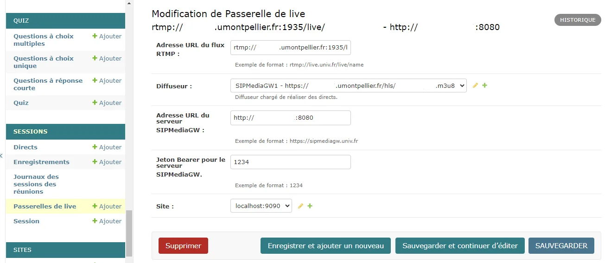

To add a live gateway, simply:

- Enter the URL address of the **RTMP stream**, in the form rtmp://live.univ.fr/live/name
- Select a Pod **broadcaster**, which points to an HLS stream. It is possible to choose the parameters of this broadcaster.
- Enter the URL address of a **SIPMediaGW** server (see installation of a SIPMediaGW server above).
- Enter the **Bearer token** of the **SIPMediaGW** server used.

For more information on live broadcasts, please refer to the documentation: <https://www.esup-portail.org/wiki/x/BgC8KQ>

For example, if you enter:

- RTMP stream: rtmp://live.univ.fr/live/name
- HLS stream (broadcaster): <https://live.univ.fr/hls/name.m3u8>
- SIPMediaGW server URL: <http://1.2.3.4:8080>
- SIPMediaGW server token: 1234

This live gateway will be able to manage a webinar; the video and audio stream will be sent by the **SIPMediaGW server <http://1.2.3.4:8080>** via the **RTMP** protocol to the **live.univ.fr** server, on the **live** application with the name ***name***.

The webinar live broadcast, displayed on the Pod live page, will read the video and audio stream via the **HLS** protocol at the address **<https://live.univ.fr/hls/name.m3u8>**.

> 💡Each live gateway can then be used to conduct a webinar.
> This means that it is possible to have multiple live gateways to manage **multiple webinars in parallel** (over overlapping time slots).
> For example, if I define 2 live gateways - each using a different SIPMediaGW server - there can be 2 webinars in parallel over the same periods.

## Overall operation

The principle of this webinar mode is to be as simple and intuitive as possible for the user:

- The presenter - if they have the **appropriate rights** (see configuration above) - creates a meeting in webinar mode. They can choose their options regarding:

  - The **display and activation of the public chat**: to display the public chat in the live broadcast and give access to a chat on the live page for the audience.
   The messages sent in the chat on this live page will be found in the **public chat of BigBlueButton**.

> Creating a webinar will automatically create a new event accessible on the live page (according to the configuration of the broadcaster used by the live gateway).

When the presenter starts the webinar:

- The BigBlueButton meeting is launched.
- A start request will be made on the configured SIPMediaGW server, which will then connect to Pod with a "streaming" user on the meeting defined as a webinar.

> ⚠️ The **streaming** user, used by SIPMediaGW, simulates a regular user. It will then make a connection to the **starting Pod** and participate in the ongoing BigBlueButton meeting.
> **Network-wise, this means that Pod must be accessible by the SIPMediaGW server (configured in the live gateway used) on the Web ports (80, 443)**.

- The **streaming** user retrieves the video/audio stream and sends this stream to the **RTMP server of an available live gateway**.
- The audience can then attend the webinar on the live interface; according to the configuration, the delay should be around 10s.
If the presenter has checked the option to enable the chat, the **connected audience** will have the possibility to send a message directly via the live interface in Pod.
This message will be sent to the BigBlueButton session of the presenter.

During the webinar, the presenter can use all the options and actions on the webinar, namely:

- Modify the date and duration settings,
- Modify the chat activation setting,
- Restart only the live broadcast
- Stop only the live broadcast,
- Immediately end the webinar (meeting and live broadcast),
- End the meeting in BigBlueButton, which will stop the live broadcast in less than 2 minutes.

Stopping the live broadcast corresponds to sending a Stop type request to the SIPMediaGW server; currently, stopping takes around 10s.

Thus, there may be a little wait when stopping the live broadcast, restarting the live broadcast, and when clicking End Webinar.

However, starting is very fast.

The presenter can also modify the date and duration of the webinar at their convenience; the event is modified accordingly. This can be useful for testing the system before the big day.

## Operation

### The administration interface

2 new interfaces are now available in the administration, namely:

### Administration of live gateways


### Administration of live sessions (in the sense of BigBlueButton sessions)

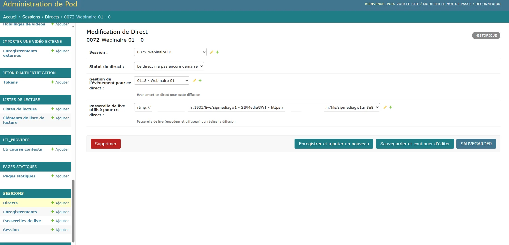

There is also the live management module, particularly for events:

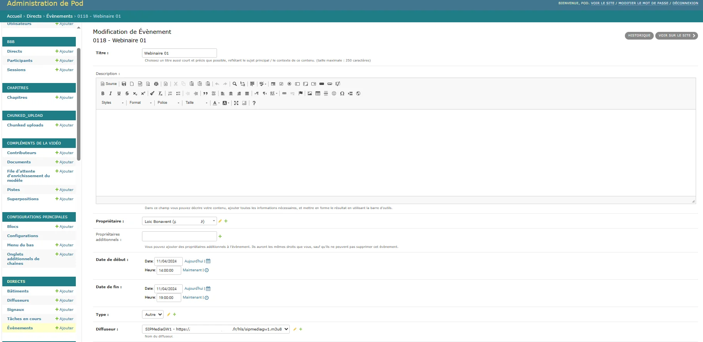

### Log files

Depending on your configuration (see **pod_uwsgi.ini** file), you can find the logs for this webinar mode in the Pod application log file.

For example, it could be **/home/pod/django_projects/podv4/uwsgi/uwsgi-pod.log** or **/var/log/syslog**

Just search for the lines containing the keyword **webinar**.

Here is an example of a line related to webinars:

[29/Mar/2024 14:50:11] INFO [webinar - webinar.py:225] start_rtmp_gateway for meeting 13 “Webinar of March 29, 2024”: {"res": "ok", "app": "streaming", "uri": ""} (EXCEPTION: None)

> It should be noted that all important actions are logged, even if there are no errors.
