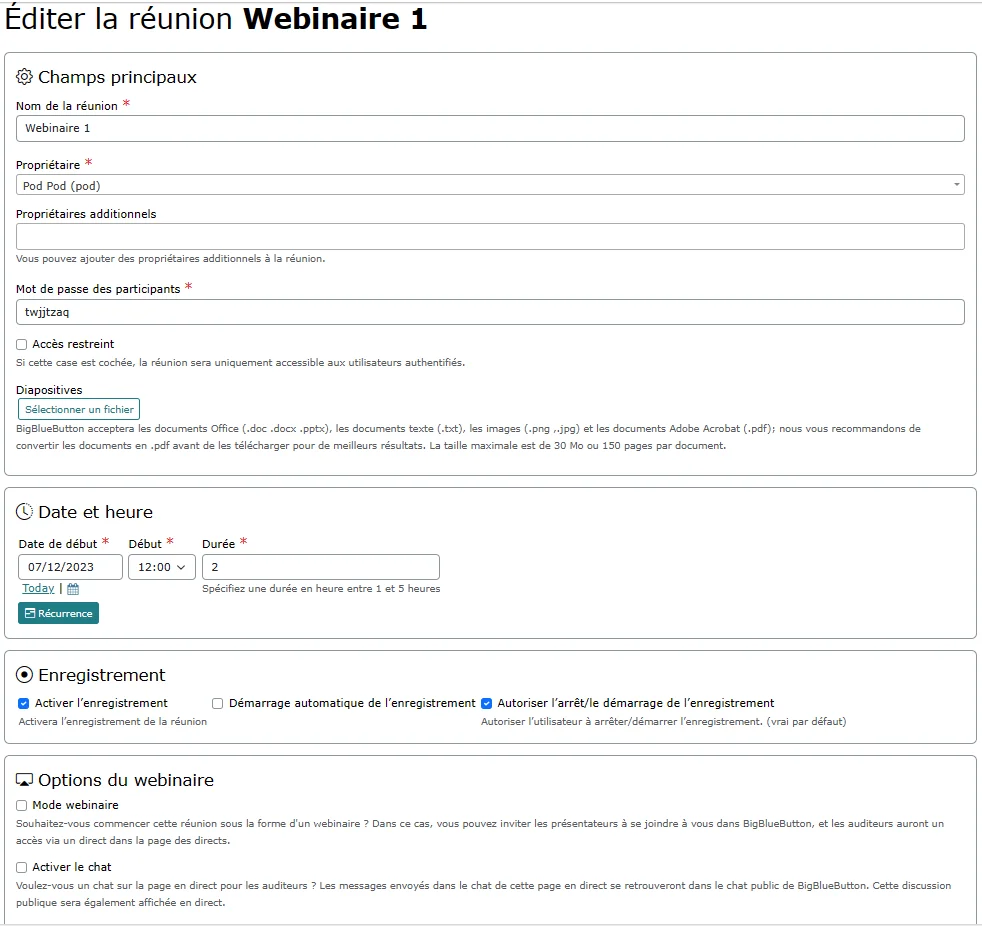
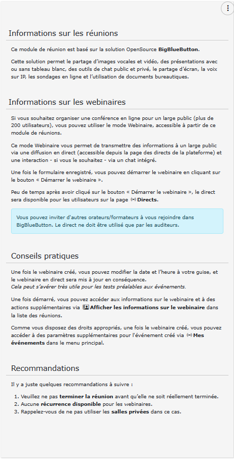
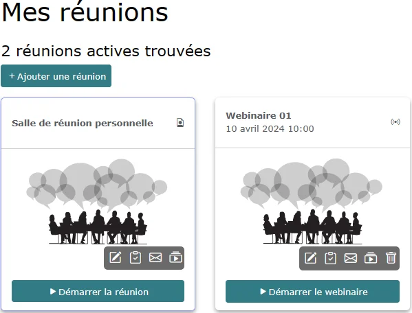
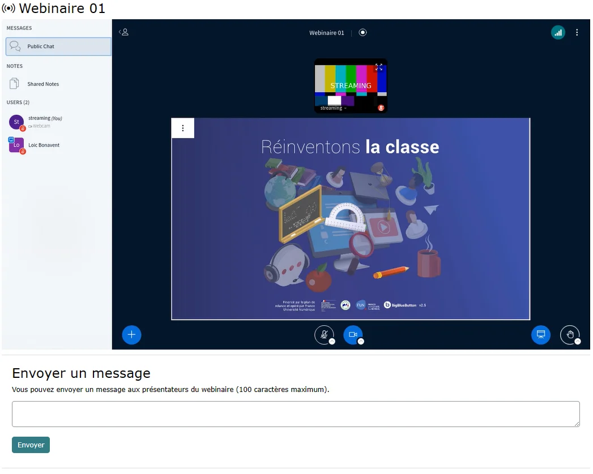
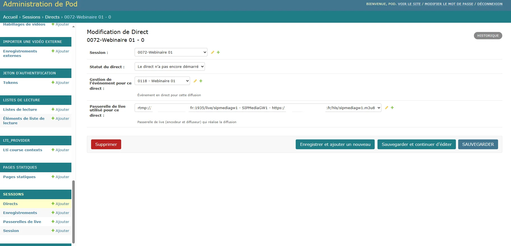
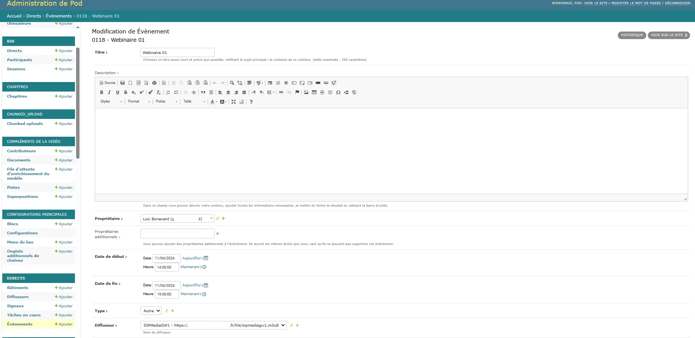

# Mise en place du mode webinaire pour les sessions BigBlueButton pour Pod

> ⚠️ Il ne faut pas confondre ce système avec l’ancien système utilisé pour Pod v2, devenu obsolète.

## Contexte et solution apportée

### Contexte

Le module des réunions de Pod repose sur l’utilisation de BigBlueButton.

Pour informations, BigBlueButton (<https://bigbluebutton.org/>) est un outil de classe virtuelle ayant les fonctionnalités suivantes :

- Vidéo/webcam
- Audio
- Chat
- Partage de document + annotation
- Partage d’écran
- Sondage
- Enregistrement
- Création de groupes
- Prises de notes partagées
- Intégration de vidéos externes
- Intégration Moodle et WordPress

Cependant, l’une des plus grosses contraintes de BigBlueButton concerne la limite de 200 étudiants par session (cf. <https://docs.bigbluebutton.org/support/faq.html#how-many-simultaneous-users-can-bigbluebutton-support>).

Dans la plupart des cas, cette limite de 200 étudiants par session n’est pas un blocage, mais dans certains cas bien précis - par exemple, des cours magistraux pour des L1 - cette limite devient bloquante à l’utilisation de BigBlueButton.

Il peut y avoir aussi d’autres cas où vous pouvez souhaiter séparer l’interface des présentateurs de celles des auditeurs, vis-à-vis des droits.

### Solution : le mode webinaire

Ainsi, la solution pour résoudre cette problématique est de proposer un mode webinaire pour le module des réunions de Pod.

Ce mode webinaire permet de transmettre des informations à un large public via une diffusion en direct (accessible depuis la page des directs de la plateforme) et une interaction - si l’usager le souhaite - via un chat intégré.

L’idée étant de séparer les présentateurs des auditeurs:

- les présentateurs devront rejoindre la réunion BigBlueButton,
- les auditeurs devront accéder au direct sur Pod.

### Interface dans Pod

En terme d’interface dans Pod, voici ce que cela donne :

- Édition d’un webinaire, par le présentateur (notion de modérateur dans BigBlueButton)



- Les explications sur le mode webinaire, accessible aux usagers



- Liste des réunions et webinaires



- L’interface BigBlueButton, avec le compte streaming connecté


- La page des évènements en direct


- Le direct pour les auditeurs, avec le chat intégré (si activé par le présentateur)



- Les informations et actions réalisables sur un webinaire en cours


## Architecture de la solution

Cette solution repose sur :

- BigBlueButton, que cela soit une infrastructure locale ou plutôt celle de l’ESR
- SIPMediaGW, le projet de connecteur de salles visioconférence par RENATER
<https://www.renater.fr/connecteur-de-salles-la-solution-dinteroperabilite-entre-les-differents-systemes-de-visioconference/>
- Pod, en ce qui concerne l’interface usager et la jonction avec BigBlueButton.

Au final, techniquement, voici ce que cela donne :


Copie d’écran d’une présentation réalisée par Nicolas Can et Loïc Bonavent lors des Journées Esup-Pod#3 : "10 ans déjà" à l’Université d’Avignon, en mars 2024.

### SIPMediaGW par RENATER

#### Présentation

SIPMediaGW est un connecteur de salles visioconférence, une solution d’interopérabilité entre les différents systèmes de visioconférence par RENATER.

cf. <https://www.renater.fr/connecteur-de-salles-la-solution-dinteroperabilite-entre-les-differents-systemes-de-visioconference/>

Le but de ce projet est de mettre à disposition une brique fonctionnelle compatible avec les standards du protocole WebRTC permettant l’accès depuis un équipement de salle de visioconférence (Cisco, Polycom…) à des instances BigBlueButton / Jitsi-Meet.


RENATER a ajouté, dans les versions récentes de SIPMediaGW, une autre fonctionnalité permettant de réaliser une publication RTMP de la session, ce qui permet de réellement transformer une réunion en webinaire.

C’est cette fonctionnalité de publication RTMP du SIPMediaGW que nous utilisons dans le ce contexte de mode webinaire, avec diffusion en direct sur Pod.

#### Installation

Pour ma part, voici comment j’ai installé SIPMediaGW sur une machine virtuelle à l’université de Montpellier.

##### La machine virtuelle

Je suis parti d’une VM tournant sous ubuntu/focal64, avec 8 vCPU / 6 Go RAM.

Il faut savoir qu’un serveur SIPMediaGW ne gère qu’un seul flux (pour en gérer plusieurs, il est nécessaire d’installer plusieurs serveurs).

D’après ce que j’ai pu voir, il n’est pas nécessaire d’avoir une VM avec 8 vCPU : 6 (voire même 4) suffisent largement.

##### Installation et configuration

Le site de référence : <https://github.com/Renater/SIPMediaGW>

###### Pré-requis

```sh
# Création d’un user : vagrant
adduser vagrant
usermod -aG wheel vagrant
# Installation de git
sudo apt-get install git
```

###### Installation effective

```sh
# Récupération de la dernière version de SIPMediaGW depuis Git, dans le répertoire applicatif /sipmediagw
cd /
sudo git clone https://github.com/Renater/SIPMediaGW.git sipmediagw
chown vagrant:vagrant /sipmediagw/ -R
cd /sipmediagw/deploy/
# Penser à mettre l’adresse IP publique de votre serveur
HOST_IP=1.2.3.4 ./provision.sh
```

⚠️ Veuillez remplacer 1.2.3.4 par l’adresse IP publique de votre serveur.

###### Configuration

```bash
# Editer le fichier/sipmediagw/.env avec ses valeurs
MAIN_APP=streaming
BROWSE_FILE="bigbluebutton.py"
```

Au vue de cette configuration, il faut comprendre qu’un serveur SIPMediaGW ne peut qu’être utilisé que pour une seule fonction :

- soit comme connecteur de salle (MAIN_APP=baresip)
- soit comme serveur de publication RTMP (MAIN_APP=streaming)

Dans le cadre de cette documentation, cela sera alors streaming.

Par défaut, le jeton de sécurité est initialisé à 1234.

Pour modifier ce comportement, il est nécessaire de modifier le fichier /sipmediagw/HTTPLauncher.py :

```py
# Editer le fichier /sipmediagw/HTTPLauncher.py
allowedToken = "1234"
```

###### Redémarrage du service

```sh
# Redémarrer le service
sudo systemctl restart sipmediagw
```

#### Vérification et exploitation

En réalisant ces étapes, différents services seront installés, à savoir :

- coturn
- kamailio
- homer
- sipmediagw

Pour de la publication RTMP, à priori, seul le service sipmediagw est nécessaire (à faire confirmer).

Voici quelques commandes utiles à l’exploitation de l’application SIPMediaGW:

| Commandes | Commentaires |
| --- | --- |
|`sudo systemctl restart sipmediagw` | Redémarrage du service sipmediagw |
|`sudo systemctl status sipmediagw` | Vérifie l’état du service sipmediagw. Remarque : au 1° démarrage, l’erreur suivante est normale: `{'res':'error','type':'The gateway failed to launch'}` |
| `sudo docker ps` | Permet de voir les containers qui tournent, en particulier renater/sipmediagw:1.5.5 lors d’un webinaire |
| `sudo docker logs container_id` | Permet de voir les logs de sipmediagw lors d’un webinaire. `container_id` correspond à l’id du container renater/sipmediagw:1.5.5 |
{: .table .table-striped}

## Configuration et actions complémentaires dans Pod

### Configuration dans Pod

Voici la configuration nécessaire à réaliser dans son **settings_local.py** :

| Paramètre | Valeur par défaut | Description |
| --- | --- | --- |
| USE_MEETING_WEBINAR | False | Activation du mode Webinaire pour le module des réunions |
| MEETING_WEBINAR_FIELDS | ("is_webinar", "enable_chat",) | Permet de définir les champs complémentaires du formulaire de création d’un webinaire. Ces champs complémentaires sont affichés directement dans la page de formulaire d’un webinaire. |
| MEETING_WEBINAR_AFFILIATION | `"['faculty', 'employee', 'staff']"` | Groupes d’accès ou affiliations des personnes autorisées à créer un webinaire |
| MEETING_WEBINAR_GROUP_ADMIN | webinar admin | Groupe des personnes autorisées à créer un webinaire |
{: .table .table-striped}

Typiquement, voici un exemple de *settings_local.py* permettant d’utiliser ce mode webinaire :

```py
# Utilisation du mode Webinaire pour le module des réunions
USE_MEETING_WEBINAR = True
# Options possibles pour un webinaire
MEETING_WEBINAR_FIELDS = (
        "is_webinar",
        "enable_chat",
)
# Groupes d’accès ou affiliations des personnes autorisées à créer un webinaire
MEETING_WEBINAR_AFFILIATION = ["faculty", "employee", "staff"]
# Groupe des admins des webinaires
MEETING_WEBINAR_GROUP_ADMIN = "webinar admin"
```

### Actions complémentaires dans Pod

Pour utiliser cette fonctionnalité, il est nécessaire de définir les informations liées à la publication RTMP, au streaming HLS et au serveur SIPMediaGW.

Pour ce faire, il est nécessaire d’accéder au module d’Administration de Pod et de définir ses informations via le nouvel accès "Passerelles de live".

> Ce nouveau système de passerelle de live fait la jointure entre une adresse RTMP, un diffuseur de Pod, déjà existants dans Pod - pour ceux qui utilisent des directs - et un serveur SIPMediaGW.

Ces informations sont accessibles dans la partie **Administration / Sessions / Passerelles de live**


Pour ajouter une passerelle de live, il suffit de :

- saisir l’adresse URL du **flux RTMP**, sous la forme rtmp://live.univ.fr/live/nom
- sélectionner un **diffuseur** Pod, qui pointe vers un flux HLS. Il est possible de choisir les paramètres de ce diffuseur.
- saisir l’adresse URL d’un serveur **SIPMediaGW** (cf. installation d’un serveur SIPMediaGW ci-dessus).
- saisir le **jeton Bearer** du serveur **SIPMediaGW** utilisé.

Pour plus d'informations sur les directs, veuillez consulter la documentation : <https://www.esup-portail.org/wiki/x/BgC8KQ>

Par exemple, si vous saisissez :

- Flux RTMP : rtmp://live.univ.fr/live/nom
- Flux HLS (diffuseur) : <https://live.univ.fr/hls/nom.m3u8>
- URL du serveur SIPMediaGW : <http://1.2.3.4:8080>
- Jeton du serveur SIPMediaGW: 1234

Cette passerelle de live pourra gérer un webinaire; le flux vidéo et audio sera envoyé par le serveur **SIPMediaGW <http://1.2.3.4:8080>** via le protocole **RTMP** au serveur **live.univ.fr**, sur l’application **live** avec le nom ***nom***.

Le direct du webinaire, affiché dans la page des directs de Pod, lira le flux vidéo et audio via le protocole HLS à l'adresse **<https://live.univ.fr/hls/nom.m3u8>**.

> 💡Chaque passerelle de live pourra alors être utilisé pour réaliser un webinaire.
> Cela signifie qu’il est possible d’avoir plusieurs passerelles de live pour pouvoir gérer **plusieurs webinaires en parallèle** (sur des plages horaires qui se chevauchent).
> Par exemple, si je définis 2 passerelles de live - chacun utilisant un serveur SIPMediaGW différent - il pourra y avoir 2 webinaires en parallèle sur les mêmes périodes.

## Fonctionnement global

Le principe de ce mode webinaire est d’être le plus simple et le plus intuitif possible pour l’usager :

- le présentateur - s’il a les **droits adéquats** (cf. paramétrage ci dessus) - créé une réunion en mode webinaire. Il peut choisir ses options concernant :

  - l’**affichage et l’activation du chat public** : pour afficher le chat public dans le direct et donner accès à un chat sur la page en direct pour les auditeurs.
Les messages envoyés dans le chat de cette page en direct se retrouveront dans le **chat public de BigBlueButton**.

> Le fait de créer un webinaire va automatiquement créer un nouvel évènement accessible dans la page des directs (selon le paramétrage du diffuseur utilisé par la passerelle de live).

Lorsque le présentateur démarre le webinaire :

- la réunion BigBlueButton est lancée.
- une requête, de démarrage, sera réalisée sur le serveur configuré SIPMediaGW qui va alors se connecter à Pod avec un utilisateur "streaming" sur la réunion définie comme webinaire.

> ⚠️ L’utilisateur **streaming**, utilisé par SIPMediaGW simule un usager lambda. Il va alors réaliser une connexion au **Pod** de départ et participer à la réunion BigBlueButton en cours.
> **Côté réseau, cela signifie que Pod doit être accessible par le serveur SIPMediaGW (configuré dans la passerelle de live utilisée) sur les ports Web (80, 443)**.

- l’utilisateur **streaming** récupère le flux vidéo/audio et renvoie ce flux sur le **serveur RTMP d’une passerelle de live disponible**.
- les auditeurs peuvent alors assister au webinaire sur l’interface des directs; selon la configuration, le décalage doit être de l’ordre de 10s.
Si le présentateur a coché l’option permettant d’activer le chat, les **auditeurs connectés** auront la possibilité d’envoyer un message directement via l’interface des directs dans Pod.
Ce message sera envoyé à la session BigBlueButton du présentateur.

Pendant le webinaire, le présentateur peut utiliser l’ensemble des options et actions sur le webinaire, à savoir :

- modifier les paramètres de date et de durée,
- modifier le paramètre d’activation du chat,
- redémarrer seulement le direct
- arrêter seulement le direct,
- terminer immédiatement le webinaire (réunion et direct),
- terminer la réunion dans BigBlueButton, ce qui aura pour effet d’arrêter le direct en moins de 2 minutes.

Le fait d’arrêter le direct correspond à envoyer une requête de type Stop au serveur SIPMediaGW; à l’heure actuelle, l’arrêt prends de l’ordre de 10s.

Ainsi, il peut y avoir un peu d’attente lors de l’arrêt du direct, redémarrage du direct et lors d’un clic sur Terminer le webinaire.

Par contre, le démarrage est quant à lui très rapide.

Le présentateur peut également modifier à sa convenance la date et la durée du webinaire; l’évènement est modifié en conséquence. Cela peut-être pratique pour tester le système avant le jour J.

## Exploitation

### L’interface d’administration

2 nouvelles interfaces sont maintenant disponibles dans l’administration, à savoir :

### L’administration des passerelles de live


### L’administration des directs (au sens sessions BigBlueButton)



Il y a aussi le module de gestion des directs, en particulier pour les évènements :



### Les fichiers de logs

Selon votre configuration (cf. fichier **pod_uwsgi.ini**), il vous est possible de retrouver les logs de ce mode webinaire dans le fichier de logs applicatif de Pod.

Par exemple, il peut s’agir de **/home/pod/django_projects/podv4/uwsgi/uwsgi-pod.log** ou **/var/log/syslog**

Il suffit de rechercher les lignes contenant le mot-clé **webinar**.

Voici un exemple de ligne en lien avec les webinaires :

```log
[29/Mar/2024 14:50:11] INFO [webinar - webinar.py:225] start_rtmp_gateway for meeting 13 “Webinaire du 29 mars 2024”: {"res": "ok", "app": "streaming", "uri": ""} (EXCEPTION: None)
````

> Il faut savoir que toutes les actions importantes sont loggués, même s’il n’y a pas d’erreurs.
