# Setting up video publishing from recorders

This documentation explains how to set up a semi-automated video publishing process from a recorder—which allows at least an _FTP export_—to the Pod video platform.

In principle, many recorders from different companies—such as Inwicast, Rapidmooc, Ubicast, Multicam, Kalizee, Extron...—allow FTP export of recorded videos and could benefit from this Pod functionality (_possibly requiring some adaptations_).

The publishing process is as follows:

1. Once the video is recorded, the recorder publishes the video to a specific directory on the Pod FTP server.
2. After the copy is complete, a script—which runs regularly via a CRON job—processes this video file.
3. Depending on the configuration linked to the recorder, there are two possibilities:
    1. Either the recorder manager receives an email notifying them of the video deposit and clicks on the provided link,
    2. Or a user can preview and claim the recording directly from the video platform menu.
4. In both cases, the video is encoded and assigned to the relevant user.

## The Publishing System

### Recorder-Side Configuration

Before publishing videos to an FTP server, the recorder must be configured as follows:

* The protocol to use for copying the video file,
* The name,
* The server address,
* The login of the account with rights to deposit the video file on the Pod server,
* The associated password,
* The default directory on the Pod server where video files will be transferred.

For example, here is what the configuration screen looks like for a MultiCAM Systems recorder:

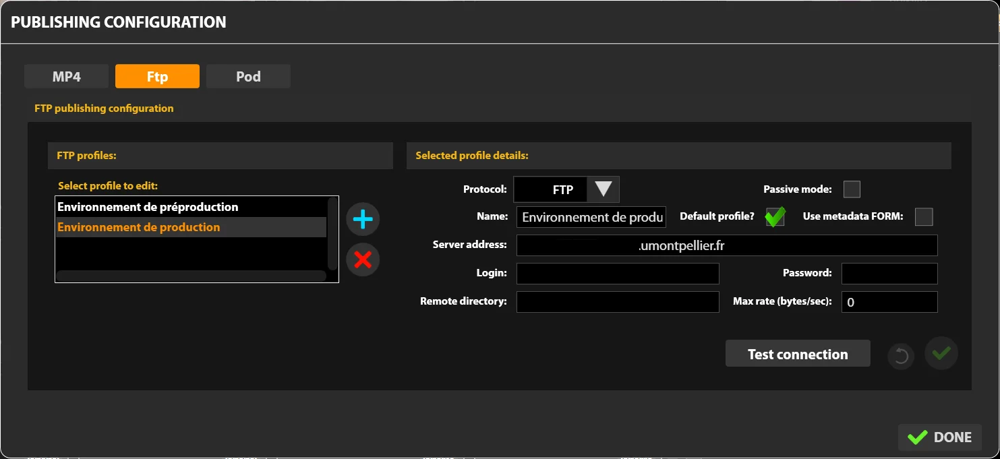

### Pod-Side Configuration

On the Pod side, configuration is also required via:

#### The custom/settings_local.py Configuration File

Several properties are essential for configuration in the settings file:

* **ALLOW_MANUAL_RECORDING_CLAIMING**: If True, a link will appear in the authorized user ’s profile menu, allowing them to claim a recording.
* **ALLOW_RECORDER_MANAGER_CHOICE_VID_OWNER**: If True, the recorder manager can choose the owner of the recording.
* **DEFAULT_RECORDER_ID**: Adds a default recorder to an unidentifiable recording (incorrect path in the FTP deposit).
  > ⚠️ Useful if the Recorder plugin was used previously.
* **DEFAULT_RECORDER_PATH**: Base directory used by recorders to publish videos.
  > ⚠️ Each recorder must publish videos in a subdirectory of this base directory (see explanations below).
* **DEFAULT_RECORDER_TYPE_ID**: Identifier of the default video type (if not specified).
  > ⚠️ This is the type of video (_Example: 3 for Conference, 4 for Course..._) and not the type of recording.
* **DEFAULT_RECORDER_USER_ID**: Identifier of the default owner (if not specified) of the deposited recordings.
* **RECORDER_SKIP_FIRST_IMAGE**: Allows skipping the first image when processing an AudioVideoCast type recording file.
* **RECORDER_TYPE**: Type of recording of the video published by the recorder.
  Currently, two types exist and are processed:
  1. **video**: The recorder sends a video file in MP4 format to the FTP server.
  2. **audiovideocast**: The recorder sends a compressed file in ZIP format (standardized and containing the video, a SMIL file, images...) to the FTP server.
* **USE_RECORD_PREVIEW**: Use or not use the preview of the source files of the recordings in the claiming interface.
* **SELF_REQUESTS_PROXIES**: Defines the HTTP and HTTPS proxies that will be used for the request on the application itself. By default, proxy usage is forced off.
* **ALLOW_INSECURE_REQUESTS**: Allow the request on the application itself without verifying the SSL certificate.
* **BASE_URL**: Necessary for the CRON job (below) to send the notification.

Example configuration:

```py
##
# Recorder settings
#
ALLOW_MANUAL_RECORDING_CLAIMING = True
ALLOW_RECORDER_MANAGER_CHOICE_VID_OWNER = True
DEFAULT_RECORDER_ID = 1
DEFAULT_RECORDER_PATH = '/data/www/%userpod%/uploads/'
DEFAULT_RECORDER_TYPE_ID = 3
DEFAULT_RECORDER_USER_ID = 1
RECORDER_SKIP_FIRST_IMAGE = False
RECORDER_TYPE = (('video', ('Video')), ('audiovideocast', ('Audiovideocast')),)
USE_RECORD_PREVIEW = False
PUBLIC_RECORD_DIR = 'records'
SELF_REQUESTS_PROXIES = { "http": None, "https": None}
ALLOW_INSECURE_REQUESTS = False
BASE_URL = 'https://pod.univ.fr/'
```

#### The Administration Interface

After proper configuration and logging in with a superuser account to the administration interface, an additional Recorder menu is available:

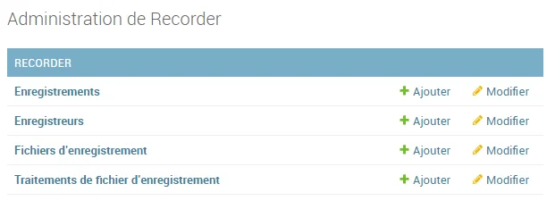

Some information about this menu:

* **Recordings**: List of video recordings published from the recorder(s), processed, and encoded.
* **Recorders**: List of available recorders.
* **Recording Files**: List of recording files published via HTTP API Rest (and not FTP).
* **Treatments**: List of files published from the recorder(s) and processed by the CRON job (see explanations below).

> 💡Technically, we use the model `pod/recorder/models.py`, classes `Recorder`, `Recording`, and `RecordingFileTreatment`, and the administration page `pod/recorder/admin.py`.

Before publishing a video, it is necessary to define at least one recorder:

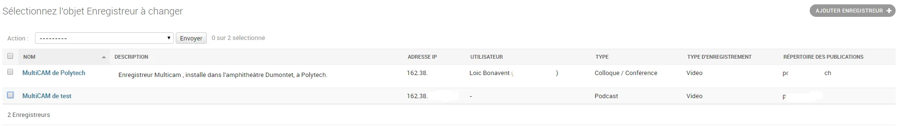

Here is the useful information for entering a recorder:

* Name.
* Description: Optional.
* IP Address: IP address of the recorder (_useful for security purposes, see explanations below_).
* Hash: Hash key (_useful for security purposes, see explanations below_).
* User: Manager of this recorder. This manager will receive emails and be the owner of the published videos. If no user is selected, this recorder will use manual assignment mode.
* Type: Default type of videos published by this recorder.
* Recording Type: Type of recording exported by this recorder (_currently, Video or AudioVideoCast_).
* Publication Directory: Corresponds to the base directory containing the videos published by the recorder.

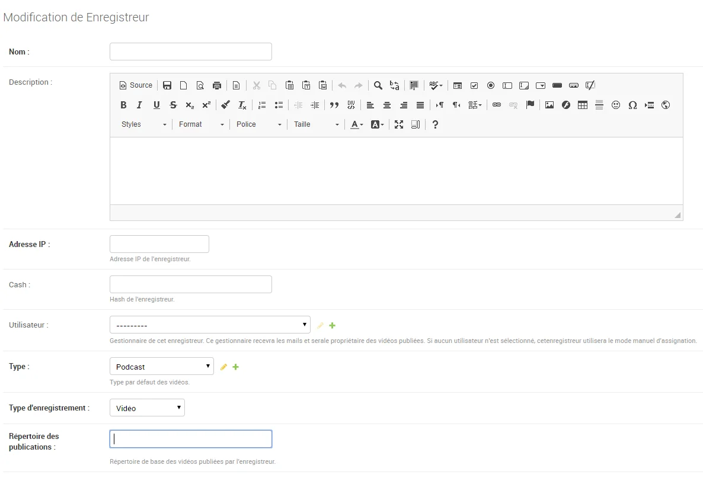

## Communication Between the Recorder and Pod

The recorder copies the video file (which can take a long time depending on the video size) to the configured FTP server in the defined publication directory. This directory must be set in `DEFAULT_RECORDER_PATH`.

For example, with the following configuration:

* `DEFAULT_RECORDER_PATH = '/data/www/%userpod%/uploads/'`
* Recorder publication directory = `test`

Videos will be deposited in the directory: `/data/www/%userpod%/uploads/test/`

At this point, the video publication by the recorder is complete: the video file has been deposited on the Pod server in a specific directory.

## Handling the Video on Pod

Once the copy is complete, a script—which runs regularly via a CRON job—processes this video file.

This script corresponds to a video management command. Technically, it is the script `pod/video/management/commands/recorder.py`.

It will be called via a CRON job, but if necessary, it can be executed manually via: `python manage.py recorder checkDirectory`

_It is possible to run this script in debug mode by modifying the DEBUG parameter in its settings_local._
{: .alert .alert-info}

To set up the CRON job, the following was done under the user **pod**:

```sh
crontab -e

*/2 * * * * /usr/bin/bash -c 'export WORKON_HOME=/data/www/pod/.virtualenvs; export VIRTUALENVWRAPPER_PYTHON=/usr/bin/python3.11; cd /data/www/pod/django_projects/podv4; source /usr/bin/virtualenvwrapper.sh; workon django_pod; python manage.py recorder checkDirectory'
```

This script:

1. Scans the directory structure and identifies new video files that have been completely transferred (_💡thanks to the use of the recorder_recordingfiletreatment table and the file size_).
2. Verifies that the video file is positioned for a known recorder (_💡thanks to the previously defined publication directory_).
3. Depending on the recorder configuration:
    1. Either sends a notification to the recorder manager,
    2. Or allows users to assign the video via recording claim.

### Notification and Addition by the Recorder Manager

Case of a recorder configured with a manager.

#### The Notification

To enable notification to the recorder manager, the script will make an HTTPS request to the following address:

**https://[WEB_HOSTNAME]/mediacourses_notify/?recordingPlace=[IP_ADDRESS_UNDERSCORED]&mediapath=[FILENAME.MP4]&key=[HASHKEY]**

Example request:
<https://xxxxx.umontpellier.fr/mediacourses_notify/?recordingPlace=192_168_1_1&mediapath=file.zip&key=77fac92a3f06....98187e50e5>

The URL used corresponds to:

* **WEB_HOSTNAME** = Pod server address (BASE_URL).
* **IP_ADDRESS_UNDERSCORED** = Recorder IP address with dots replaced by underscores.
* **FILENAME.MP4** = Name of the file in MP4 or ZIP format corresponding to the processed video; name generated randomly—with a timestamp notion—by the recorder.
* **HASHKEY** = MD5 key generated from the recorder ’s IP address (with dots) and the configured "Hash" property.

At this point, the video file has been deposited on the Pod server, and an HTTPS request has been sent.

> 💡 Technically, the previous request is handled by Pod via the view `pod/recorder/views.py`, function `recorder_notify()`.

The email is in the following format:

```txt
[Pod] New recording added

Hello,

A new recording has arrived on the "Pod" platform from the recorder "MultiCAM de Polytech".
To add it, please click on the following link.
[https://pod.universite.fr/sso-cas/login/?next=https%3A%2F%2Fpod.universite.fr%2Fmediacourses_add%2F%3Fmediapath%3De60e464d-d096-4388-91c2-7ac67a60176e.zip%26course_title%3DEnregistrement+2+juil.+2019%26recorder%3D1](https://pod.universite.fr/sso-cas/login/?next=https%3A%2F%2Fpod.universite.fr%2Fmediacourses_add%2F%3Fmediapath%3De60e464d-d096-4388-91c2-7ac67a60176e.zip%26course_title%3DEnregistrement+2+juil.+2019%26recorder%3D1)
_If the link is not active, it must be copied and pasted into the browser ’s address bar._

Best regards
```

⚠️ _The link in this email depends on the CAS configuration (USE_CAS) in the custom/settings_local.py file._
{: .alert .alert-info}

#### Adding the Video

Once the email is received, the concerned user must click on the link in the email.

This link redirects the user—_who must authenticate at this point (if not already authenticated)_—to the video addition form. From this form, they can also delete the recording (if it is an error, for example) by checking the box and validating the form.

> 💡Technically, this form is defined by the page `pod/recorder/forms.py`, class `RecordingForm()` as well as the view `pod/recorder/templates/recorder/add_recording.html`.

For a `"staff" type user`, with the parameter `ALLOW_RECORDER_MANAGER_CHOICE_VID_OWNER = False`, the form is as follows:

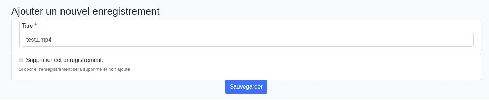

For a `"staff" type user`, with the parameter `ALLOW_RECORDER_MANAGER_CHOICE_VID_OWNER = True`, the form is as follows:

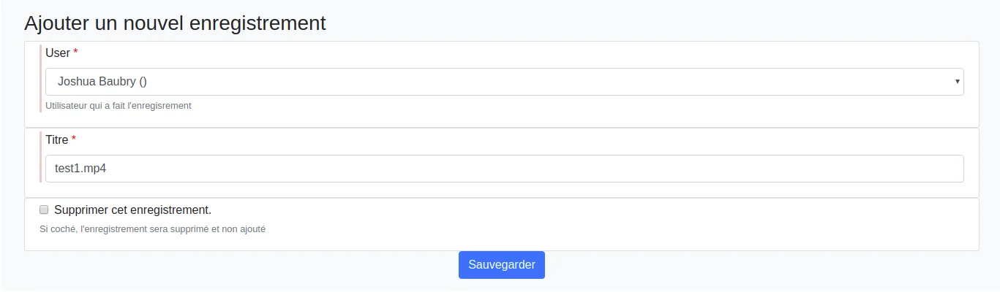

In this case, the recorder manager can assign the video to another user.
{: .alert .alert-info}

For a `"superadmin" type user`, the form is as follows:

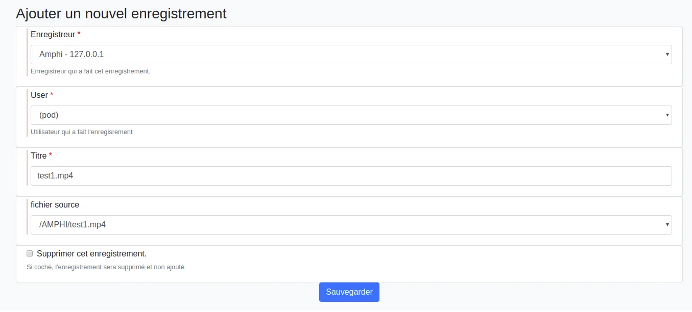

💡 _A "superadmin" type user can, if necessary, process all previously published videos on any recorder._

Saving this form allows the processing and encoding of the file provided by the recorder and assigns it to the concerned user (depending on the case).

> 💡Technically, we use the model `pod/recorder/models.py`, classes `Recorder`, `Recording`, and `RecordingFileTreatment`, as well as the function `process_recording()`.
This function uses the plugin `pod/recorder/plugins/type_audiovideocast.py` or `pod/recorder/plugins/type_video.py`, which allows copying slides (in the case of _type_audiovideocast.py_), as well as processing and encoding the video published by the recorder.

### Claiming the Recording

Case of a recorder configured without a manager and with ALLOW_MANUAL_RECORDING_CLAIMING = True

In this specific case, users have the possibility to claim a recording from the profile menu:

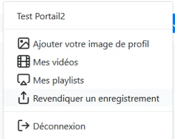

Claiming a recording displays the list of all unassigned videos:

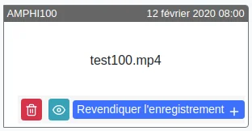

💡 _A "superadmin" type user can, if necessary, delete recordings from this interface._

💡 _If preview mode is activated, a button appears (the eye on the capture) to display a window that will play the source video if the format is supported._

⚠️ If preview mode is activated (USE_RECORD_PREVIEW = True), the public path (_PUBLIC_RECORD_DIR = 'records'_) of the recording deposit directory (DEFAULT_RECORDER_PATH = '/data/www/%userpod%/uploads/') must be specified, and the following must be added to the NGINX configuration:

```sh
vi pod/custom/pod_nginx.conf
...
location /records {
alias /data/www/%userpod%/uploads/;
}
...
```

When claiming a video, a form appears:


Saving this form allows the processing and encoding of the file provided by the recorder and assigns it to the user.

### Tracking Published Videos

Once the videos are published by the recorder and processed by Pod, these recordings can be tracked via the Recordings module, accessible from the administration interface.

The superuser can also manually add a new recording, corresponding to video files located in the directory defined by **DEFAULT_RECORDER_PATH** and the recorder ’s directory.

This can be useful if claiming is not activated and a user has not clicked on the link in the notification email (_which means the MP4 file (or ZIP) containing the video (and slides) is on the Pod server, but the video has not been processed or encoded_).

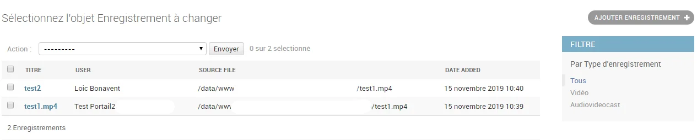

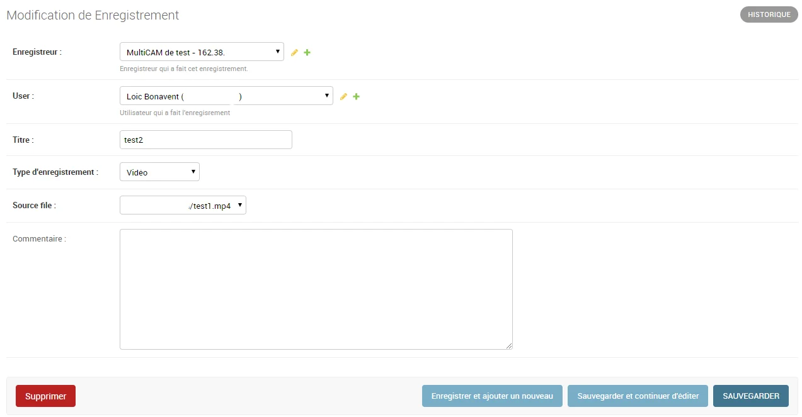
