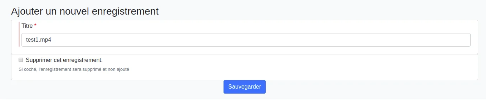

# Mise en place de la publication de vidéos depuis des enregistreurs

Cette documentation permet de comprendre comment réaliser une publication de vidéos, semi automatisée, depuis un enregistreur - permettant à minima un _export FTP_ - vers la plateforme vidéo Pod.

A priori, de nombreux enregistreurs, de différentes sociétés - telles que Inwicast, Rapidmooc, Ubicast, Multicam, Kalizee, Extron... - permettent un export FTP des vidéos réalisées et pourraient alors bénéficier de cette fonctionnalité de Pod (_en nécessitant peut-être quelques adaptations_).

Le principe de publication est le suivant :

1. Une fois la vidéo réalisée, l'enregistreur publie la vidéo dans un répertoire spécifique sur le serveur FTP de Pod,
2. Une fois la copie réalisée, un script - qui s'exécute régulièrement grâce à la mise en place d'un CRON - traite ce fichier vidéo.
3. Selon le paramétrage en lien avec l'enregistreur, il existe 2 possibilités, à savoir :
    1. Soit le gestionnaire de l'enregistreur reçoit un email l'avertissant du dépôt de la vidéo, et clique sur le lien fourni,
    2. Soit un utilisateur peut prévisualiser et revendiquer l'enregistrement, directement dans le menu de la plateforme vidéo.
4. Dans les 2 cas, la vidéo est encodée et appartient à l'utilisateur concerné.

## Le système de publication

### Paramétrage côté enregistreur

Côté enregistreur, avant de réaliser une publication de vidéos vers un serveur FTP, il est nécessaire de réaliser la configuration adéquate, à savoir :

* le protocole à utiliser pour la copie du fichier vidéo,
* le nom,
* l'adresse du serveur
* le login du compte, qui a les droits de déposer le fichier vidéo sur le serveur Pod,
* le mot de passe associé à ce compte,
* le répertoire par défaut, sur le serveur Pod, dans lequel les fichiers vidéos seront transférés,

Par exemple, voici à quoi ressemble cet écran de paramétrage pour un enregistreur de type MultiCAM Systems :


Paramétrage côté Pod
--------------------

Côté Pod, il est également nécessaire de réaliser le paramétrage via :

### Le fichier de configuration custom/settings_local.py

Plusieurs propriétés sont indispensables pour le paramétrage dans le fichier de configuration :

* ALLOW_MANUAL_RECORDING_CLAIMING : si True, un lien apparaîtra dans le menu du profil de l'utilisateur autorisé permettant de s'attribuer un enregistrement.

* ALLOW_RECORDER_MANAGER_CHOICE_VID_OWNER : si True, le gestionnaire de l'enregistreur pourra choisir un propriétaire de l'enregistrement.

* DEFAULT_RECORDER_ID : ajoute un enregistreur par défaut à un enregistrement non identifiable (mauvais chemin dans le dépôt FTP).
    > ⚠️ Utile si le plugin Recorder était déjà utilisé auparavant.

* DEFAULT_RECORDER_PATH : répertoire - de base - utilisé par les enregistreurs pour publier les vidéos
    > ⚠️ Chaque enregistreur devra publier les vidéos dans un sous-répertoire de ce répertoire de base (cf. explications ci-dessous).

* DEFAULT_RECORDER_TYPE_ID : identifiant du type de vidéo par défaut (si non spécifié).
    > ⚠️ Il s'agit du type de la vidéo (_Exemple : _3 pour Colloque/conférence,_ 4 pour Cours..._) et non du type d'enregistrement.

* DEFAULT_RECORDER_USER_ID : identifiant du propriétaire par défaut (si non spécifié) des enregistrements déposés.

* RECORDER_SKIP_FIRST_IMAGE : permet de ne pas prendre en compte la 1° image lors du traitement d'une fichier d'enregistrement de type AudioVideoCast.

* RECORDER_TYPE : type d'enregistrement de la vidéo publiée par l'enregistreur.
    A l'heure actuelle, 2 types existent et sont traités :

    1. video = l'enregistreur envoie un fichier vidéo, au format MP4, sur le serveur FTP,
    2. audiovideocast = l'enregistreur envoie un fichier compressé, au format ZIP (normé et contenant la vidéo, un fichier SMIL, des images...), sur le serveur FTP

* USE_RECORD_PREVIEW : utiliser ou non la prévisualisation des fichiers sources des enregistrements dans l'interface de revendication.

* SELF_REQUESTS_PROXIES : Défini les proxy http et https qui seront utilisés pour la requête sur l'application en elle même. Par défaut on force la non utilisation de proxy

* ALLOW_INSECURE_REQUESTS : Autoriser la requête sur l'application en elle même sans vérifier le certificat SSL

* BASE_URL : sera nécessaire au job CRON (ci-dessous) afin d'envoyer la notification

Exemple de paramétrage :

```py
##
# Recorder settings
#
ALLOW_MANUAL_RECORDING_CLAIMING = True
ALLOW_RECORDER_MANAGER_CHOICE_VID_OWNER = True
DEFAULT_RECORDER_ID = 1
DEFAULT_RECORDER_PATH = '/data/www/%userpod%/uploads/'
DEFAULT_RECORDER_TYPE_ID = 3
DEFAULT_RECORDER_USER_ID = 1
RECORDER_SKIP_FIRST_IMAGE = False
RECORDER_TYPE =(('video', ('Video')), ('audiovideocast', ('Audiovideocast')),)
USE_RECORD_PREVIEW = False
PUBLIC_RECORD_DIR = 'records'
SELF_REQUESTS_PROXIES = { "http": None, "https": None}
ALLOW_INSECURE_REQUESTS = False
BASE_URL = 'https://pod.univ.fr/'
```

#### L'interface d'administration

Après avoir fait la configuration adéquate et s'être connecté avec un compte super-utilisateur à l'interface d'administration, nous obtenons un menu Recorder supplémentaire :


Quelques informations concernant ce menu :

* Enregistrements : liste des enregistrements vidéos, publiés depuis le(s) enregistreur(s), traités et encodés.
* Enregistreurs : liste des enregistreurs disponibles.
* Fichiers d'enregistrement : liste des fichiers d'enregistrement, publiés via HTTP l'API Rest (et non en FTP).
* Traitements : liste des fichiers publiés depuis le(s) enregistreur(s) et traités par le CRON (cf. explications ci-dessous).

> 💡Techniquement, nous utilisons le modèle _**pod/recorder/models.py**_, classes _**Recorder**_, _**Recording et RecordingFileTreatment,**_ et la page d'administration _**pod/recorder/admin.py**_.

Avant de réaliser une publication de vidéo, il est nécessaire de définir - à minima - un enregistreur :


Voici les informations utiles à la saisie d'un enregistreur :

* Nom.
* Description: facultative.
* Adresse IP : adresse IP de l'enregistreur (_utile à des fins de sécurité, cf. explications ci-dessous_).
* Hash : clé de hachage _utile à des fins de sécurité, cf. explications ci-dessous_).
* Utilisateur : gestionnaire de cet enregistreur. Ce gestionnaire recevra les mails et sera le propriétaire des vidéos publiées. Si aucun utilisateur n'est sélectionné, cet enregistreur utilisera le mode manuel d'assignation.
* Type : le type par défaut des vidéos publiées par cet enregistreur.
* Type d'enregistrement : type d'enregistrement qu'exporte cet enregistreur (_à l'heure actuelle, Video ou AudioVideoCast_).
* Répertoire de publication : correspond au répertoire de base contenant les vidéos publiées par l'enregistreur.


## Communication entre l'enregistreur et Pod

L'enregistreur réalise une copie du fichier vidéo (ce qui peut-être long selon la taille de la vidéo) sur le serveur FTP paramétré, dans le répertoire de publication défini. Ce répertoire doit être positionné dans _DEFAULT_RECORDER_PATH_.

Par exemple, si nous avons le paramétrage suivant :

* DEFAULT_RECORDER_PATH = '_/data/www/%userpod%/uploads/_'
* répertoire de publication de l'enregistreur = _test_

Les vidéos seront déposées dans le répertoire : **_/data/www/%userpod%/uploads/test/_**

A ce niveau là, la publication de la vidéo par l'enregistreur est terminée : le fichier vidéo a été déposé sur le serveur Pod, dans un répertoire bien précis.

## Prise en compte de la vidéo sur Pod

Une fois la copie réalisée, un script - qui s'exécute régulièrement grâce à la mise d'un CRON - traite ce fichier vidéo.

Ce script correspond à une commande de gestion des vidéos. Techniquement, il s'agit du script _**pod/video/management/commands/recorder.py**_.

Il sera appelé via un CRON, mais si nécessaire, il est possible de l'exécuter manuellement via : _**python manage.py recorder checkDirectory**_

 _Il est possible d'exécuter ce script en mode débug en modifiant le paramètre DEBUG dans son settings_local._
 {: .alert .alert-info}

Pour réaliser le CRON, voici ce qui a été fait sous le user **pod** :

crontab -e

```sh
*/2 * * * * /usr/bin/bash -c 'export WORKON_HOME=/data/www/pod/.virtualenvs; export VIRTUALENVWRAPPER_PYTHON=/usr/bin/python3.11; cd /data/www/pod/django_projects/podv4; source /usr/bin/virtualenvwrapper.sh; workon django_pod; python manage.py recorder checkDirectory'
```

Pour ce faire, ce script :

1. Scanne l'arborescence et identifie les nouveaux fichiers vidéos transférés complètement (_💡grâce à l'utilisation de la table recorder_recordingfiletreatment et de la taille du fichier_).
2. Vérifie que ce fichier vidéo est positionné pour un enregistreur connu (_💡grâce au répertoire de publication défini précédemment_).
3. Selon le paramétrage de l'enregistreur :
    1. Soit envoie une notification au gestionnaire de l'enregistreur,
    2. Soit laissera les utilisateurs s'assigner cette vidéo via la revendication d'enregistrement.

### La notification et l'ajout par le gestionnaire de l'enregistreur

Cas d'un enregistreur paramétré avec un gestionnaire.

#### La notification

Pour permettre la notification au gestionnaire de l'enregistreur, le script va réaliser une requête HTTPS vers l'adresse suivante :

**https://[WEB_HOSTNAME]/mediacourses_notify/?recordingPlace=[IP_ADDRESS_UNDERSCORED]&mediapath=[FILENAME.MP4]&key=[HASHKEY]**

Exemple de requête :
_https:// xxxxx.umontpellier.fr/mediacourses_notify/? recordingPlace=192_168_1_1&mediapath=file.zip&key=77fac92a3f06....98187e50e5_

L'URL utilisée correspond à :

* WEB_HOSTNAME = adresse du serveur Pod (BASE_URL).
* IP_ADDRESS_UNDERSCORED = adresse IP de l'enregistreur, dont les points ont été remplacés par des underscores.
* FILENAME.MP4 = nom du fichier, au format mp4 ou zip, correspondant à la vidéo traitée; nom généré aléatoirement - avec notion de timestamp - par l'enregistreur.
* HASHKEY = clé MD5 générée à partir de l'adresse IP (avec points) de l'enregistreur et de la propriété "Hash" paramétrée.

A ce niveau là, le fichier vidéo a été déposé sur le serveur Pod et une requête HTTPS a été envoyé.

> 💡 Techniquement, la requête précédente est traitée par Pod via la vue **_pod/recorder/views.py_**, par la fonction _**recorder_notify()**_.

Cet email est de la forme suivante :

```txt
[Pod] Nouvel enregistrement ajouté

Bonjour,

un nouvel enregistrement est arrivé sur la plateforme "Pod" depuis l'enregistreur "MultiCAM de Polytech".
Pour l'ajouter, veuillez cliquer sur le lien suivant.
[https:// pod.universite.fr/sso-cas/login/? next=https%3A%2F%2Fpod.universite.fr%2Fmediacourses_add%2F%3Fmediapath%3De60e464d- d096-4388-91c2-7ac67a60176e.zip%26course_title%3DEnregistrement+2+juil. +2019%26recorder%3D1](https://pod.universite.fr/sso-cas/login/?next=https%3A%2F%2Fpod.universite.fr%2Fmediacourses_add%2F%3Fmediapath%3De60e464d-d096-4388-91c2-7ac67a60176e.zip%26course_title%3DEnregistrement+2+juil.+2019%26recorder%3D1)
_Si le lien n'est pas actif, il faut le copier-coller dans la barre d'adresse de votre navigateur._

Cordialement
```

⚠️ _Le lien présent dans cet email dépend de la configuration du CAS (USE_CAS) dans le fichier custom/settings_local.py._
{: .alert .alert-info}

#### L'ajout de la vidéo

Une fois l'email reçu, l'utilisateur concerné devra cliquer sur le lien dans cet email.

Ce lien renvoie l'utilisateur - _qui doit s'authentifier à ce moment là (si ce n'est déjà fait)_ - sur le formulaire d'ajout de la vidéo. A partir de ce formulaire il peut également supprimer l'enregistrement (si celui-ci est une erreur par exemple) en cochant la case et en validant le formulaire.

> 💡Techniquement, ce formulaire est défini grâce à la page _**pod/recorder/forms.py**_, par la classe _**RecordingForm()**_ ainsi que la vue _**pod/recorder/templates/recorder/add_recording.html****.**_

Pour un _**utilisateur de type "staff"****, avec le paramètre ALLOW_RECORDER_MANAGER_CHOICE_VID_OWNER = False**_, ce formulaire est de la forme suivante :


Pour un _**utilisateur de type "staff"****, avec le paramètre ALLOW_RECORDER_MANAGER_CHOICE_VID_OWNER = True**_, ce formulaire est de la forme suivante :


Dans ce cas là, le gestionnaire de l'enregistreur peut attribuer la vidéo à un autre utilisateur.
{: .alert .alert-info}

Pour un _**utilisateur de type "superadmin"**_, ce formulaire est de la forme suivante :


💡 _Un utilisateur de type "superadmin" peut, si nécessaire, réaliser le traitement de toutes les vidéos précédemment publiées sur n'importe quel enregistreur._

Le fait de sauvegarder ce formulaire permet le traitement et l'encodage du fichier fourni par l'enregistreur, et de le positionner à l'utilisateur concerné (selon le cas).

> 💡Techniquement, nous utilisons le modèle _**pod/recorder/models.py**_, classes _**Recorder**_, _**Recording** et_**RecordingFileTreatment**__, ainsi  que la fonction _**process_recording()**_.
Cette dernière utilise le plugin _**pod/recorder/plugins/type_audiovideocast.py**_ ou _**pod/recorder/plugins/type_video.py**_ qui permet la copie des slides (dans le cas de _type_audiovideocast.py_), ainsi que le traitement et l'encodage de la vidéo publiée par l'enregistreur.

### La revendication de l'enregistrement

Cas d'un enregistreur paramétré sans gestionnaire et avec utilisation de ALLOW_MANUAL_RECORDING_CLAIMING = True

Dans cas précis, les utilisateurs ont la possibilité de revendiquer un enregistrement depuis le menu de profil :


Le fait de revendiquer un enregistrement affiche la liste de toutes les vidéos non attribuées :


💡 _Un utilisateur de type "superadmin" peut, si nécessaire, supprimer des enregistrements à partir de cette interface._

💡 Si le mode de prévisualisation est activé un bouton apparaît (l’œil sur la capture) pour afficher une fenêtre qui va lire la vidéo source si le format est supporté._

⚠️ Si le mode de prévisualisation est activé (USE_RECORD_PREVIEW = True), il faut renseigner le chemin public _(PUBLIC_RECORD_DIR = 'records')_ du répertoire de dépôt des enregistrements (DEFAULT_RECORDER_PATH = '/data/www/%userpod%/uploads/') et ajouter dans la conf de NGINX :

```sh
vi pod/custom/pod_nginx.conf
...
location /records {
alias /data/www/%userpod%/uploads/;
}
...
```

En revendiquant une vidéo, un formulaire apparaît :



Le fait de sauvegarder ce formulaire permet le traitement et l'encodage du fichier fourni par l'enregistreur, et de se l'affecter.

### Le suivi des vidéos publiées

Une fois les vidéos publiées par l'enregistreur et une fois traitées par Pod, il est possible de suivre ces enregistrements via le module Enregistrements, accessible dans l'interface d'administration.

Il est également possible au super utilisateur d'ajouter manuellement un nouvel enregistrement, correspondant aux fichiers vidéos situés dans le répertoire défini par **DEFAULT_RECORDER_PATH** et le répertoire de l'enregistreur.

Cela peut être utile si la revendication n'est pas activée et qu'un utilisateur n'a pas cliqué sur le lien dans le mail de notification (_ce qui signifie que le fichier MP4 (ou ZIP) contenant la vidéo (et les slides) se trouve sur le serveur Pod, mais la vidéo n'a pas été traitée ni encodée_).


