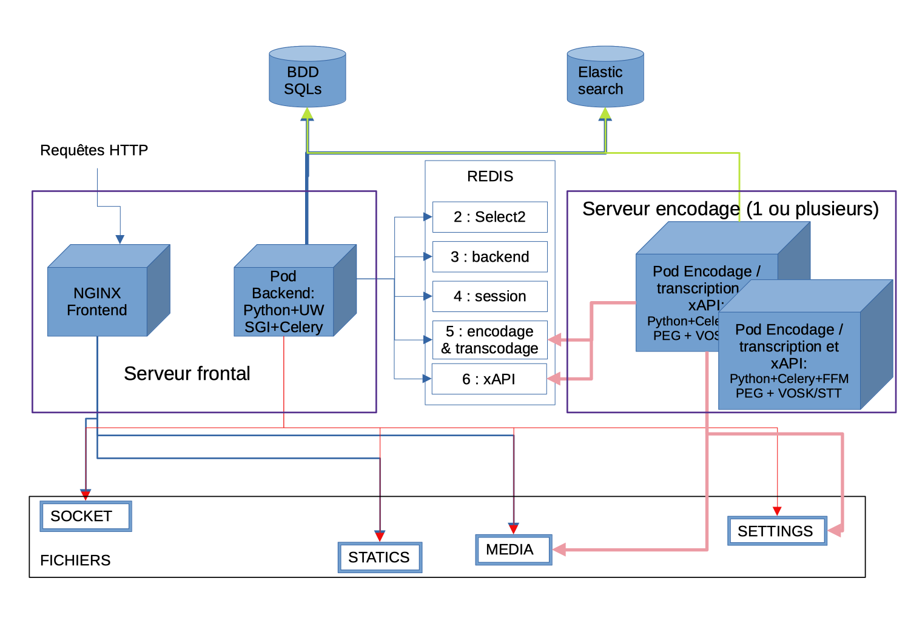

# Remote encoding on one or more servers

>In the rest of this documentation, we will refer to the **front-end server** as the server where the web server is installed and the **encoding server** as the server where the encoding is deported.

## Operating principle diagram



> ⚠️ Rabbitmq was used for queue management, it has now been replaced by Redis.

## Prerequisites

- Your **MEDIA_ROOT** directory (``~/django_projects/podv4/pod/media``) must be shared between your servers (NFS mount for example),
- You need to use a database of the **Mysql/MariaDB** type so that it can be shared between the front-end and encoding Pod servers,
- The **Elasticsearch** database installed on one of your servers must be used on the encoding servers.
- The **REDIS** broker installed on one of your servers must be used on the encoding servers.

## Installation on the front-end server(s)

ffmpeg, ffmpegthumbnailer and imagemagick must not have been installed. If you have, uninstall them:

```bash
(django_pod4) pod@pod:~/django_projects/podv4$ sudo apt-get purge ffmpeg ffmpegthumbnailer imagemagick
```

You can use the same REDIS as for front-end cache management, see [Configuring and using REDIS](redis_en)

Add the Celery/REDIS configuration to the `settings_local.py` file:

```bash
(django_pod4) pod@pod:/usr/local/django_projects/podv4$ vim pod/custom/settings_local.py
```

```python
# Configuration to be carried out on the front-end server
# To use traditional remote encoding
CELERY_TO_ENCODE = True
# REDIS broker URL
CELERY_BROKER_URL = "redis://127.0.0.1:6379/5"
# Allows only one task to be processed at a time
CELERY_TASK_ACKS_LATE = True
```

> ⚠️ Depending on your architecture, remember to replace _127.0.0.1_ with the **IP address of the REDIS server**.

---

## Installation on the encoding server(s)

Pod must be installed **without reinitialising or migrating the database** and **without Nginx /uWsgi /Elasticsearch**.
You can follow the Installation of the Pod platform doc.
Add the configuration of all this in the configuration file

You now need to tell the encoding server :

* That you want to use CELERY
* Give the address of the server with REDIS (the CELERY BROKER)
* Connect the common database
* Connect the common ElasticSearch

```bash
(django_pod4) pod@pod-encodage:/usr/local/django_projects/podv4$ vim pod/custom/settings_local.py
```

```python
# Configuration to be carried out on the encoding server
# To use traditional remote encoding
CELERY_TO_ENCODE = True
# URL of the REDIS broker
CELERY_BROKER_URL = "redis://127.0.0.1:6379/5"
# Allows only one task to be processed at a time
CELERY_TASK_ACKS_LATE = True
# DB configuration
TIME_ZONE = 'Europe/Paris'
DATABASES = {
 'default': {
 'ENGINE': 'django.db.backends. mysql',
 'NAME': 'database_name',
 'USER': 'user_anme',
 'PASSWORD': 'password',
 'HOST': 'mysql_host_ip',
 'PORT': '3306',
 'OPTIONS': {
 'init_command': "SET storage_engine=INNODB, sql_mode='STRICT_TRANS_TABLES', innodb_strict_mode=1",
 },
 }
}
ES_URL = ['http://elastic. domaine.fr:9200/']
EMAIL_HOST = 'smtp.domaine.fr'
EMAIL_PORT = 25
DEFAULT_FROM_EMAIL = 'noreply@pod.domaine.fr'
SERVER_EMAIL = 'noreply@pod.domaine.fr'
ADMINS = ( ('Bob', 'bob@domaine.fr'), )
LANGUAGES = (
 ('fr', 'Français'),
 ('en', 'English')
)
MODELTRANSLATION_FALLBACK_LANGUAGES = ('fr', 'en')
USE_PODFILE = True
```

> ⚠️ Check that your database, REDIS and ElasticSearch accept incoming communications with your encoding servers (bind and others).

> ⚠️ Depending on your architecture, remember to replace _127.0.0.1_ with the **IP address of the REDIS server**.

> 💡Personally, my `settings_local.py` file is identical on all my **encoding or front-end servers**. You just need to leave out the local address _127.0.0.1_ and manage the **configuration for the database, REDIS and Elasticsearch**.
{: .alert .alert-warning}
---

### Activate Celery on the encoding server(s)

Put the contents of [https://raw.githubusercontent.com/celery/celery/main/extra/generic-init.d/celeryd](https://raw.githubusercontent.com/celery/celery/main/extra/generic-init.d/celeryd) in `/etc/init.d/celeryd` :

```bash
(root) cd /etc/init.d
(root) wget https://raw.githubusercontent.com/celery/celery/main/extra/generic-init.d/celeryd
```

Then assign the appropriate rights:

```bash
(root) cd /etc/init.d
(root) wget https://raw.githubusercontent.com/celery/celery/main/extra/generic-init.d/celeryd
(django_pod4) pod@pod-enc:~/django_projects/podv4$ sudo vim /etc/init.d/celeryd
(django_pod4) pod@pod-enc:~/django_projects/podv4$ sudo chmod u+x /etc/init.d/celeryd
```

Create the associated default file :

```bash
(django_pod4) pod@pod-enc:/usr/local/django_projects/podv4$ sudo vim /etc/default/celeryd
```

```bash
CELERYD_NODES="worker1"                                               # Name of the worker(s). Add as many workers as there are tasks to execute in parallel.
DJANGO_SETTINGS_MODULE="pod.settings"                                 # settings of your Pod
CELERY_BIN="/home/pod/.virtualenvs/django_pod4/bin/celery"            # source directory of celery
CELERY_APP="pod.main"                                                 # application where celery is located
CELERYD_CHDIR="/usr/local/django_projects/podv4"                      # directory of the Pod project (where manage. py)
CELERYD_OPTS="--time-limit=86400 --concurrency=1 --max-tasks-per-child=1 --prefetch-multiplier=1" # options to apply to the behaviour of the worker(s)
CELERYD_LOG_FILE="/var/log/celery/%N. log"                            # log file
CELERYD_PID_FILE="/var/run/celery/%N.pid"                             # pid file
CELERYD_USER="pod"                                                    # system user using celery
CELERYD_GROUP="www-data"                                              # system group using celery
CELERY_CREATE_DIRS=1                                                  # if celery has folder creation rights
CELERYD_LOG_LEVEL="INFO"                                              # level of information which will be written in the logs
```

> Please check the configuration of this file. For example, it is also possible to set `CELERYD_GROUP=‘pod’` depending on your system environment.
{: .alert .alert-warning}

Start Celeryd

```bash
(django_pod4) pod@pod-enc:~/django_projects/podv4$ sudo /etc/init.d/celeryd start
```

> ⚠️ If you get an error like `consumer: Cannot connect to redis://:6379/: Error 111 connecting to :6379. Connection refused`, this is typically due to the REDIS configuration. Edit the `/etc/redis/redis.conf` file to set **protected-mode no** (or manage protected-mode with a password).

To check if Celery is working properly:

```bash
celery -A pod.main worker -l info
```
