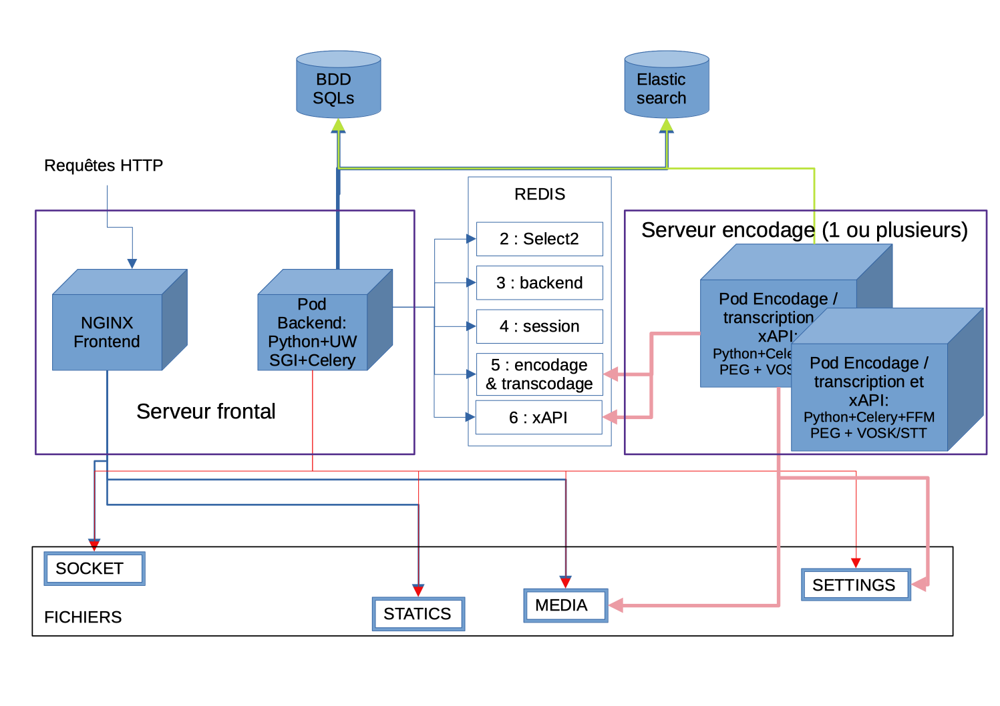

# Déporter l'encodage sur un ou plusieurs serveurs

>💡Nous appellerons dans la suite de cette documentation, **serveur frontal** le serveur où la partie web serveur est installée et **serveur d'encodage** le serveur où est déporté l'encodage.

## Schéma de principe de fonctionnement



> ⚠️ Rabbitmq était utilisé comme gestion de file d'attente, il est remplacé maintenant par Redis.

## Pré-requis

- Il faut que votre répertoire **MEDIA_ROOT** (```~/django_projects/podv4/pod/media```) soit partagé entre vos serveurs (montage NFS par exemple),
- Il faut utiliser une base de données du type **Mysql/MariaDB** pour qu'elle soit partageable entre les serveurs Pod frontaux et encodages,
- Il faut utiliser sur les serveurs d'encodage, la base **Elasticsearch** installé sur l'un de vos serveurs.
- Il faut utiliser sur les serveurs d'encodage, le broker **REDIS** installé sur l'un de vos serveurs.

## Installation sur le ou les serveur(s) en frontal

Il ne faut pas avoir installé ffmpeg, ffmpegthumbnailer et imagemagick. Si c'est le cas, les désinstaller :

```bash
(django_pod4) pod@pod:~/django_projects/podv4$ sudo apt-get purge ffmpeg ffmpegthumbnailer imagemagick
```

On peut utiliser le même REDIS que pour la gestion du cache du frontal, cf. [Configuration et usage de REDIS](redis_fr)

Rajouter la configuration Celery/REDIS dans le fichier `settings_local.py` :

```bash
(django_pod4) pod@pod:/usr/local/django_projects/podv4$ vim pod/custom/settings_local.py
```

```python
# Configuration à réaliser sur le serveur frontal
# Pour utiliser l'encodage traditionnel déporté
CELERY_TO_ENCODE = True
# URL du broker REDIS
CELERY_BROKER_URL = "redis://127.0.0.1:6379/5"
# Permet de ne traiter qu'une tâche à la fois
CELERY_TASK_ACKS_LATE = True
```

> ⚠️ Selon votre architecture, pensez à remplacer _127.0.0.1_ par l'**adresse IP du serveur REDIS**.

---

## Installation sur le ou les serveur(s) d’encodage

### FFMPEG

Pour l’encodage des vidéos et la creation des vignettes, il faut installer ffmpeg, ffmpegthumbnailer et imagemagick :

```sh
(django_pod4) pod@pod:~/django_projects/podv4$ sudo apt install -y ffmpeg ffmpegthumbnailer imagemagick
```

### Installation de Pod

Il faut installer Pod **sans réinitialiser ou migrer la base** et **sans Nginx /uWsgi /Elasticsearch**.
Vous pouvez suivre la doc Installation de la plateforme Pod.
Rajouter la configuration de tout ça dans le fichier de configuration

Il faut maintenant dire au serveur d’encodage :

* Que l’on souhaite utiliser CELERY
* Donner l’adresse du serveur avec REDIS (le CELERY BROKER)
* De connecter la base de données commune
* De connecter l'ElasticSearch commun

```bash
(django_pod4) pod@pod-encodage:/usr/local/django_projects/podv4$ vim pod/custom/settings_local.py
```

```python
# Configuration à réaliser sur le serveur d'encodage
# Pour utiliser l'encodage traditionnel déporté
CELERY_TO_ENCODE = True
# URL du broker REDIS
CELERY_BROKER_URL = "redis://127.0.0.1:6379/5"
# Permet de ne traiter qu'une tâche à la fois
CELERY_TASK_ACKS_LATE = True
# Configuration de la BD
TIME_ZONE = 'Europe/Paris'
DATABASES = {
  'default': {
    'ENGINE': 'django.db.backends.mysql',
    'NAME': 'database_name',
    'USER': 'user_anme',
    'PASSWORD': 'password',
    'HOST': 'mysql_host_ip',
    'PORT': '3306',
    'OPTIONS': {
      'init_command': "SET storage_engine=INNODB, sql_mode='STRICT_TRANS_TABLES', innodb_strict_mode=1",
    },
  }
}
ES_URL = ['http://elastic.domaine.fr:9200/']
EMAIL_HOST = 'smtp.domaine.fr'
EMAIL_PORT = 25
DEFAULT_FROM_EMAIL = 'noreply@pod.domaine.fr'
SERVER_EMAIL = 'noreply@pod.domaine.fr'
ADMINS = ( ('Bob', 'bob@domaine.fr'), )
LANGUAGES = (
  ('fr', 'Français'),
  ('en', 'English')
)
MODELTRANSLATION_FALLBACK_LANGUAGES = ('fr', 'en')
USE_PODFILE = True
```

> ⚠️ Vérifiez que votre base de données, REDIS et ElasticSearch acceptent les communications entrantes avec vos serveurs d'encodage (bind et autres).

> ⚠️ Selon votre architecture, pensez à remplacer _127.0.0.1_ par l'**adresse IP du serveur REDIS**.

> 💡Personnellement, mon fichier `settings_local.py` est identique sur tous mes **serveurs d'encodage ou en frontal**. Il faut juste ne pas mettre d'adresse locale _127.0.0.1_ et gérer la **configuration pour la base de données, REDIS et Elasticsearch**.
{: .alert .alert-warning}

---

### Activer Celery sur le ou les serveur(s) d'encodage

Mettre le contenu de [https://raw.githubusercontent.com/celery/celery/main/extra/generic-init.d/celeryd](https://raw.githubusercontent.com/celery/celery/main/extra/generic-init.d/celeryd) dans `/etc/init.d/celeryd` :

```bash
(root) cd /etc/init.d
(root) wget https://raw.githubusercontent.com/celery/celery/main/extra/generic-init.d/celeryd
```

Puis donner les droits adéquats :

```bash
(root) cd /etc/init.d
(root) wget https://raw.githubusercontent.com/celery/celery/main/extra/generic-init.d/celeryd
(django_pod4) pod@pod-enc:~/django_projects/podv4$ sudo vim /etc/init.d/celeryd
(django_pod4) pod@pod-enc:~/django_projects/podv4$ sudo chmod u+x /etc/init.d/celeryd
```

Créer le fichier default associé :

```bash
(django_pod4) pod@pod-enc:/usr/local/django_projects/podv4$ sudo vim /etc/default/celeryd
```

```bash
CELERYD_NODES="worker1"                                                # Nom du/des worker(s). Ajoutez autant de workers que de tache à executer en paralelle.
DJANGO_SETTINGS_MODULE="pod.settings"                                  # settings de votre Pod
CELERY_BIN="/home/pod/.virtualenvs/django_pod4/bin/celery"              # répertoire source de celery
CELERY_APP="pod.main"                                                  # application où se situe celery
CELERYD_CHDIR="/usr/local/django_projects/podv4"                       # répertoire du projet Pod (où se trouve manage.py)
CELERYD_OPTS="--time-limit=86400 --concurrency=1 --max-tasks-per-child=1  --prefetch-multiplier=1" # options à appliquer en plus sur le comportement du/des worker(s)
CELERYD_LOG_FILE="/var/log/celery/%N.log"                              # fichier log
CELERYD_PID_FILE="/var/run/celery/%N.pid"                              # fichier pid
CELERYD_USER="pod"                                                     # utilisateur système utilisant celery
CELERYD_GROUP="www-data"                                               # groupe système utilisant celery
CELERY_CREATE_DIRS=1                                                   # si celery dispose du droit de création de dossiers
CELERYD_LOG_LEVEL="INFO"                                               # niveau d'information qui seront inscrit dans les logs
```

> Veuillez bien vérifier la configuration de ce fichier. Par exemple, il est aussi possible de positionner `CELERYD_GROUP="pod"` selon votre environnement système.
{: .alert .alert-warning}

Démarrer Celeryd

```bash
(django_pod4) pod@pod-enc:~/django_projects/podv4$ sudo /etc/init.d/celeryd start
```

> ⚠️ En cas d'erreur du type `consumer: Cannot connect to redis://:6379/: Error 111 connecting to :6379. Connection refused`, cela vient typiquement de la configuration de REDIS. Editer le fichier `/etc/redis/redis.conf` pour y positionner **protected-mode no** (ou gérer le protected-mode avec un mot de passe).

Pour vérifier si Celery fonctionne bien :

```bash
celery -A pod.main worker -l info
```
